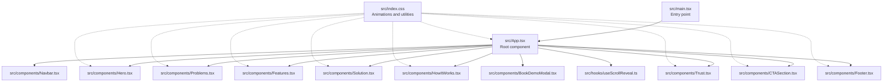
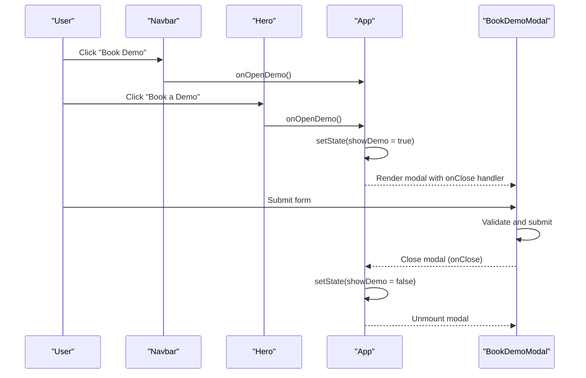
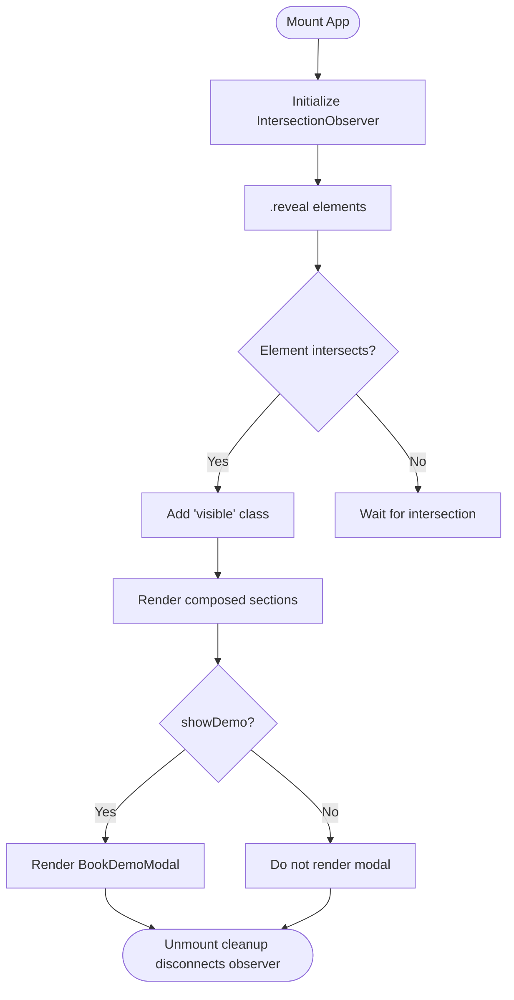
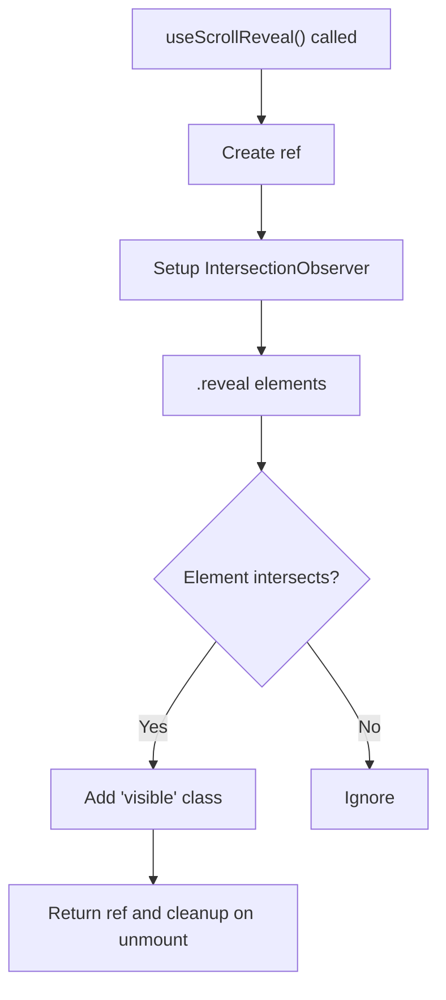
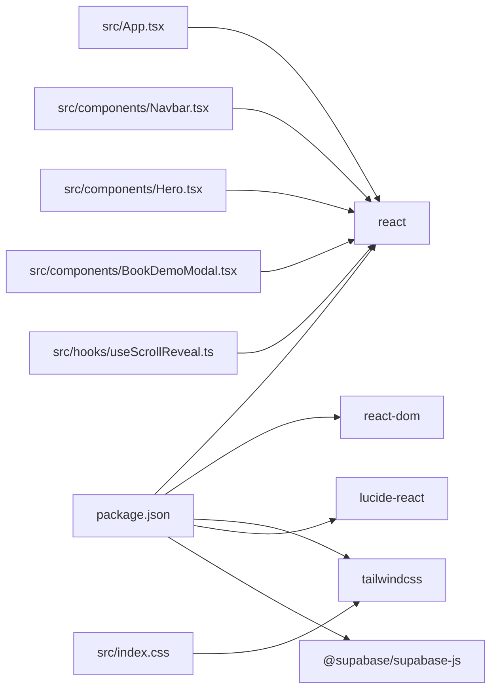

# Architecture Overview

<cite>
**Referenced Files in This Document**
- [src/App.tsx](file://src/App.tsx)
- [src/main.tsx](file://src/main.tsx)
- [src/hooks/useScrollReveal.ts](file://src/hooks/useScrollReveal.ts)
- [src/components/Navbar.tsx](file://src/components/Navbar.tsx)
- [src/components/Hero.tsx](file://src/components/Hero.tsx)
- [src/components/Problems.tsx](file://src/components/Problems.tsx)
- [src/components/Solution.tsx](file://src/components/Solution.tsx)
- [src/components/Features.tsx](file://src/components/Features.tsx)
- [src/components/HowItWorks.tsx](file://src/components/HowItWorks.tsx)
- [src/components/Trust.tsx](file://src/components/Trust.tsx)
- [src/components/CTASection.tsx](file://src/components/CTASection.tsx)
- [src/components/Footer.tsx](file://src/components/Footer.tsx)
- [src/components/BookDemoModal.tsx](file://src/components/BookDemoModal.tsx)
- [src/index.css](file://src/index.css)
- [package.json](file://package.json)
</cite>

## Table of Contents
1. [Introduction](#introduction)
2. [Project Structure](#project-structure)
3. [Core Components](#core-components)
4. [Architecture Overview](#architecture-overview)
5. [Detailed Component Analysis](#detailed-component-analysis)
6. [Dependency Analysis](#dependency-analysis)
7. [Performance Considerations](#performance-considerations)
8. [Troubleshooting Guide](#troubleshooting-guide)
9. [Conclusion](#conclusion)

## Introduction
This document describes the architectural design of the Baerp-MW marketing website built with React, TypeScript, and Vite. The site follows a component-based architecture with:
- Functional components using React hooks
- Centralized state in the root App component
- Component composition patterns that promote reusability and maintainability
- A hook-based pattern for scroll-triggered animations
- Tailwind CSS for styling and animations

The goal is to explain how user interactions propagate through state updates to DOM rendering, how components communicate via props and state, and how the modular structure supports future feature extensions.

## Project Structure
The project is organized into a small, focused React application:
- Root entry renders the App component inside a strict React mode
- App composes multiple feature sections and a modal
- Each feature area is a self-contained functional component
- A shared custom hook encapsulates scroll-based reveal behavior
- Global styles define animations and theme tokens

**Diagram sources**
- [src/main.tsx:1-11](file://src/main.tsx#L1-L11)
- [src/App.tsx:1-51](file://src/App.tsx#L1-L51)
- [src/hooks/useScrollReveal.ts:1-26](file://src/hooks/useScrollReveal.ts#L1-L26)
- [src/index.css:1-125](file://src/index.css#L1-L125)

**Section sources**
- [src/main.tsx:1-11](file://src/main.tsx#L1-L11)
- [src/App.tsx:1-51](file://src/App.tsx#L1-L51)
- [src/index.css:1-125](file://src/index.css#L1-L125)

## Core Components
- App: Central orchestrator managing global state and composing child components. It sets up intersection observers for scroll reveals and controls the visibility of the demo modal.
- Feature components: Each section (Hero, Problems, Solution, Features, HowItWorks, Trust, CTASection, Footer) is a standalone functional component that renders UI and may include local effects for scroll reveals.
- Navbar: Handles scroll-aware styling and mobile menu state; exposes callbacks to open the demo modal.
- BookDemoModal: Self-contained modal with form state, submission logic, and loading/error feedback.

Communication patterns:
- Props: Parent App passes callbacks like onOpenDemo to children to trigger state changes in the parent.
- State: App holds showDemo state; children receive handlers to open/close the modal.
- Effects: Both App and some components use IntersectionObserver to toggle visibility classes for animations.

**Section sources**
- [src/App.tsx:13-51](file://src/App.tsx#L13-L51)
- [src/components/Navbar.tsx:11-106](file://src/components/Navbar.tsx#L11-L106)
- [src/components/BookDemoModal.tsx:14-208](file://src/components/BookDemoModal.tsx#L14-L208)

## Architecture Overview
The application follows a unidirectional data flow:
- User interactions occur in UI components (buttons, links).
- Handlers passed down via props update state in the nearest parent component (App).
- State changes cause re-renders; CSS animations respond to class toggles triggered by IntersectionObserver.

**Diagram sources**
- [src/App.tsx:34-48](file://src/App.tsx#L34-L48)
- [src/components/Navbar.tsx:61-66](file://src/components/Navbar.tsx#L61-L66)
- [src/components/Hero.tsx:61-67](file://src/components/Hero.tsx#L61-L67)
- [src/components/BookDemoModal.tsx:14-208](file://src/components/BookDemoModal.tsx#L14-L208)

## Detailed Component Analysis

### App Component
Responsibilities:
- Holds and manages showDemo state
- Sets up IntersectionObserver to reveal elements with the "reveal" class
- Composes all page sections and conditionally renders the modal

Key patterns:
- Centralized state management in a single component
- Effect cleanup to avoid leaks
- Composition of multiple feature components
- Passing callbacks to children to control modal visibility

**Diagram sources**
- [src/App.tsx:16-32](file://src/App.tsx#L16-L32)
- [src/App.tsx:34-48](file://src/App.tsx#L34-L48)

**Section sources**
- [src/App.tsx:13-51](file://src/App.tsx#L13-L51)

### Hook: useScrollReveal
Responsibilities:
- Encapsulate IntersectionObserver setup and teardown
- Provide a ref to attach to elements that should be revealed on scroll
- Return the ref for consumers to apply

Usage pattern:
- Components that need scroll-triggered reveals can call this hook and attach the returned ref to DOM nodes
- The hook itself observes elements with the "reveal" class globally

**Diagram sources**
- [src/hooks/useScrollReveal.ts:3-25](file://src/hooks/useScrollReveal.ts#L3-L25)

**Section sources**
- [src/hooks/useScrollReveal.ts:1-26](file://src/hooks/useScrollReveal.ts#L1-L26)

### Navbar Component
Responsibilities:
- Manage scroll-aware styling and mobile menu state
- Expose onOpenDemo callback to open the demo modal
- Provide navigation links and responsive layout

Patterns:
- Local state for scroll and menu
- Event listeners attached and cleaned up in effects
- Callback prop to parent for modal control

**Section sources**
- [src/components/Navbar.tsx:11-106](file://src/components/Navbar.tsx#L11-L106)

### Hero Component
Responsibilities:
- Present hero content with animated entrance
- Provide a dashboard mockup visualization
- Expose onOpenDemo callback for demo initiation

Patterns:
- Uses animation utilities from global CSS
- Renders a composite visualization component internally

**Section sources**
- [src/components/Hero.tsx:9-191](file://src/components/Hero.tsx#L9-L191)

### BookDemoModal Component
Responsibilities:
- Capture user information via a form
- Submit data to an external webhook
- Provide loading, success, and error states
- Accept onClose callback to close the modal

Patterns:
- Controlled form state
- Async submission with error handling
- Modal overlay with click-to-dismiss

**Section sources**
- [src/components/BookDemoModal.tsx:14-208](file://src/components/BookDemoModal.tsx#L14-L208)

### Other Feature Sections
- Problems, Solution, Features, HowItWorks, Trust, CTASection, Footer: Each is a functional component that:
  - Uses "reveal" and optional "reveal-delay-N" classes for scroll-triggered animations
  - Receives onOpenDemo callback when applicable
  - Implements minimal internal state and effects (when needed)

**Section sources**
- [src/components/Problems.tsx:31-100](file://src/components/Problems.tsx#L31-L100)
- [src/components/Solution.tsx:21-131](file://src/components/Solution.tsx#L21-L131)
- [src/components/Features.tsx:77-146](file://src/components/Features.tsx#L77-L146)
- [src/components/HowItWorks.tsx:91-198](file://src/components/HowItWorks.tsx#L91-L198)
- [src/components/Trust.tsx:49-135](file://src/components/Trust.tsx#L49-L135)
- [src/components/CTASection.tsx:3-100](file://src/components/CTASection.tsx#L3-L100)
- [src/components/Footer.tsx:14-54](file://src/components/Footer.tsx#L14-L54)

## Dependency Analysis
External dependencies relevant to architecture:
- React and React DOM: Core rendering and tree reconciliation
- Tailwind CSS: Utility-first styling and animation classes
- Lucide icons: Iconography used across components
- Supabase client: Included but not used in the current codebase

**Diagram sources**
- [package.json:13-34](file://package.json#L13-L34)
- [src/App.tsx:1-12](file://src/App.tsx#L1-L12)
- [src/index.css:1-3](file://src/index.css#L1-L3)

**Section sources**
- [package.json:13-34](file://package.json#L13-L34)

## Performance Considerations
- IntersectionObserver usage:
  - Efficiently triggers animations only when elements enter the viewport
  - Cleaned up on component unmount to prevent memory leaks
- Minimal state scope:
  - Only App maintains global state (showDemo), reducing unnecessary re-renders
- CSS-driven animations:
  - Smooth transitions and fade-ins handled by Tailwind utilities and CSS keyframes
- Component granularity:
  - Each section is self-contained, enabling targeted re-renders when props change
- Bundle size:
  - Small footprint with a single-page app architecture and minimal third-party dependencies

[No sources needed since this section provides general guidance]

## Troubleshooting Guide
Common areas to inspect:
- Modal visibility:
  - Verify that onOpenDemo is passed correctly from App to children and that onClose resets state appropriately
- Scroll animations:
  - Ensure "reveal" and "reveal-delay-N" classes are applied to elements
  - Confirm IntersectionObserver is initialized and not disconnected prematurely
- Form submission:
  - Check environment variable configuration for the webhook URL
  - Validate network errors and server responses during submission

**Section sources**
- [src/App.tsx:34-48](file://src/App.tsx#L34-L48)
- [src/index.css:61-77](file://src/index.css#L61-L77)
- [src/components/BookDemoModal.tsx:32-63](file://src/components/BookDemoModal.tsx#L32-L63)

## Conclusion
Baerp-MW demonstrates a clean, component-based architecture emphasizing:
- Functional components with hooks
- Centralized state in the root App component
- Scroll-triggered animations via a dedicated hook
- Clear component composition and communication through props and state
- Modular structure that simplifies extension and maintenance

This design balances simplicity and scalability, enabling straightforward additions of new sections or features while maintaining predictable data flow and performance characteristics.