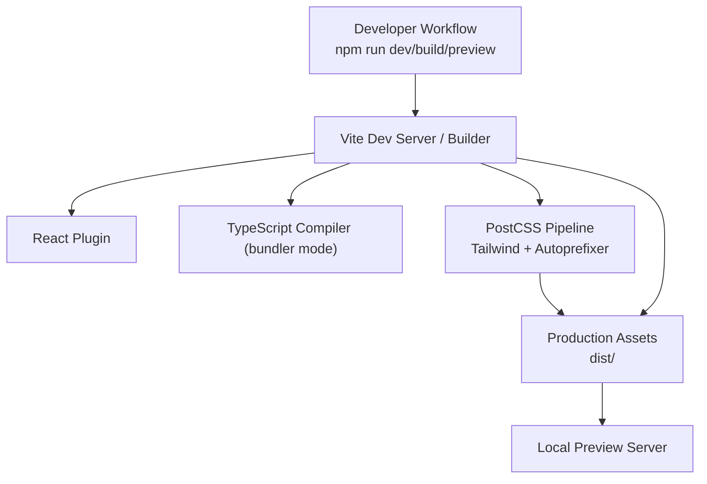
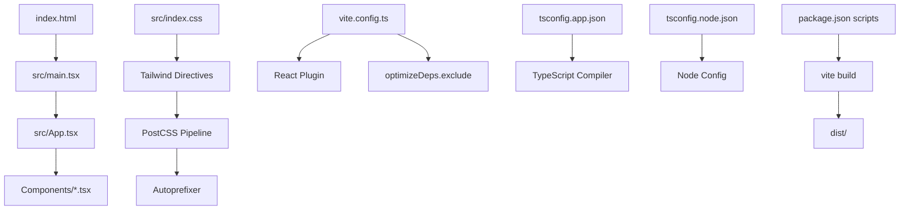
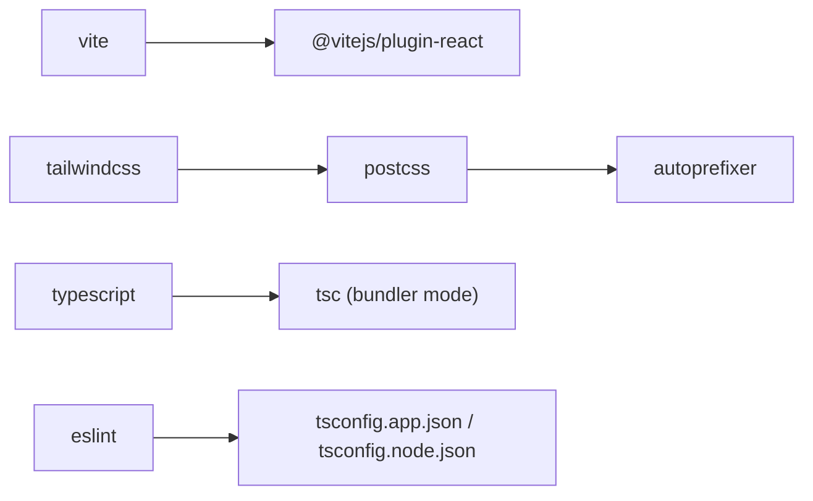

# Build and Deployment

<cite>
**Referenced Files in This Document**
- [vite.config.ts](file://vite.config.ts)
- [package.json](file://package.json)
- [postcss.config.js](file://postcss.config.js)
- [tailwind.config.js](file://tailwind.config.js)
- [tsconfig.json](file://tsconfig.json)
- [tsconfig.app.json](file://tsconfig.app.json)
- [tsconfig.node.json](file://tsconfig.node.json)
- [eslint.config.js](file://eslint.config.js)
- [index.html](file://index.html)
- [src/main.tsx](file://src/main.tsx)
- [src/App.tsx](file://src/App.tsx)
- [src/index.css](file://src/index.css)
- [src/vite-env.d.ts](file://src/vite-env.d.ts)
- [.bolt/config.json](file://.bolt/config.json)
</cite>

## Table of Contents
1. [Introduction](#introduction)
2. [Project Structure](#project-structure)
3. [Core Components](#core-components)
4. [Architecture Overview](#architecture-overview)
5. [Detailed Component Analysis](#detailed-component-analysis)
6. [Dependency Analysis](#dependency-analysis)
7. [Performance Considerations](#performance-considerations)
8. [Troubleshooting Guide](#troubleshooting-guide)
9. [Conclusion](#conclusion)
10. [Appendices](#appendices)

## Introduction
This document explains the build and deployment process for Baerp-MW. It covers the Vite build configuration, TypeScript compilation, Tailwind CSS and PostCSS integration, asset handling, production bundling, and deployment strategies. It also provides environment variable guidance, performance optimization tips, and troubleshooting advice tailored to the current repository setup.

## Project Structure
Baerp-MW is a React + TypeScript + Vite application with Tailwind CSS for styling. The build pipeline is driven by Vite, with PostCSS and Tailwind responsible for CSS processing. TypeScript configuration is split into app and node contexts. ESLint enforces code quality.

**Diagram sources**
- [vite.config.ts:1-11](file://vite.config.ts#L1-L11)
- [postcss.config.js:1-7](file://postcss.config.js#L1-L7)
- [tailwind.config.js:1-9](file://tailwind.config.js#L1-L9)
- [tsconfig.app.json:1-25](file://tsconfig.app.json#L1-L25)

**Section sources**
- [package.json:1-36](file://package.json#L1-L36)
- [index.html:1-23](file://index.html#L1-L23)
- [src/main.tsx:1-11](file://src/main.tsx#L1-L11)
- [src/App.tsx:1-51](file://src/App.tsx#L1-L51)
- [src/index.css:1-125](file://src/index.css#L1-L125)
- [tsconfig.json:1-8](file://tsconfig.json#L1-L8)
- [tsconfig.app.json:1-25](file://tsconfig.app.json#L1-L25)
- [tsconfig.node.json:1-23](file://tsconfig.node.json#L1-L23)
- [eslint.config.js:1-29](file://eslint.config.js#L1-L29)

## Core Components
- Vite configuration defines the React plugin and dependency optimization settings.
- TypeScript configurations separate app and node contexts for strictness and bundler-mode resolution.
- Tailwind CSS is configured via content globs and PostCSS pipeline with autoprefixer.
- ESLint configuration enforces recommended rules and React-specific linting.

Key build scripts:
- Development server: runs Vite dev server.
- Production build: compiles and bundles assets for distribution.
- Preview: serves built assets locally.
- Type checking: validates TypeScript without emitting files.

**Section sources**
- [vite.config.ts:1-11](file://vite.config.ts#L1-L11)
- [package.json:6-12](file://package.json#L6-L12)
- [tsconfig.app.json:1-25](file://tsconfig.app.json#L1-L25)
- [tsconfig.node.json:1-23](file://tsconfig.node.json#L1-L23)
- [tailwind.config.js:1-9](file://tailwind.config.js#L1-L9)
- [postcss.config.js:1-7](file://postcss.config.js#L1-L7)
- [eslint.config.js:1-29](file://eslint.config.js#L1-L29)

## Architecture Overview
The build pipeline integrates Vite, React, TypeScript, Tailwind CSS, and PostCSS. The HTML entry references the module script that boots the React root. Tailwind directives in CSS trigger utility generation during build. Vite optimizes dependencies and produces a static site suitable for hosting.

**Diagram sources**
- [index.html:18-21](file://index.html#L18-L21)
- [src/main.tsx:1-11](file://src/main.tsx#L1-L11)
- [src/App.tsx:1-51](file://src/App.tsx#L1-L51)
- [src/index.css:1-3](file://src/index.css#L1-L3)
- [postcss.config.js:1-7](file://postcss.config.js#L1-L7)
- [vite.config.ts:5-10](file://vite.config.ts#L5-L10)
- [tsconfig.app.json:1-25](file://tsconfig.app.json#L1-L25)
- [tsconfig.node.json:1-23](file://tsconfig.node.json#L1-L23)
- [package.json:6-12](file://package.json#L6-L12)

## Detailed Component Analysis

### Vite Build Configuration
- Plugin stack: React plugin enables JSX transforms and fast refresh.
- Dependency optimization: excludes specific packages from pre-bundling to avoid conflicts.
- Default server and build outputs align with standard Vite expectations.

Optimization highlights:
- Pre-optimization is handled by Vite’s internal mechanisms for supported packages.
- Excluding problematic dependencies prevents bundling issues.

Production bundling:
- Vite generates a static site under dist/.
- Asset hashing and minimal polyfills are enabled by default for modern browsers.

Environment variables:
- Vite exposes environment variables prefixed with VITE_ at build time.
- Non-prefixed variables are not injected into the client bundle.

**Section sources**
- [vite.config.ts:1-11](file://vite.config.ts#L1-L11)
- [package.json:6-12](file://package.json#L6-L12)
- [src/vite-env.d.ts:1-2](file://src/vite-env.d.ts#L1-L2)

### TypeScript Compilation
- App configuration targets modern ECMAScript and DOM APIs, using bundler module resolution.
- Strict compiler options enforce correctness and reduce runtime errors.
- Node configuration mirrors app but targets Node runtime needs.

Type checking:
- Separate tsconfig.json aggregates app and node configs.
- A dedicated script runs type checks against the app configuration.

Best practices:
- Keep moduleResolution in sync with bundler mode.
- Use isolatedModules and noEmit for build-time type checks without emitting.

**Section sources**
- [tsconfig.json:1-8](file://tsconfig.json#L1-L8)
- [tsconfig.app.json:1-25](file://tsconfig.app.json#L1-L25)
- [tsconfig.node.json:1-23](file://tsconfig.node.json#L1-L23)
- [package.json:11](file://package.json#L11)

### Tailwind CSS and PostCSS Processing
- Tailwind content globs scan HTML and TS/TSX sources to purge unused styles.
- PostCSS pipeline applies Tailwind directives followed by autoprefixer for vendor prefixes.
- CSS is processed and included via src/index.css.

Styling workflow:
- Add utility classes in components and templates.
- Tailwind directives at the top of the stylesheet trigger generation.
- Autoprefixer ensures compatibility across target browsers.

**Section sources**
- [tailwind.config.js:1-9](file://tailwind.config.js#L1-L9)
- [postcss.config.js:1-7](file://postcss.config.js#L1-L7)
- [src/index.css:1-125](file://src/index.css#L1-L125)

### Asset Handling and HTML Integration
- index.html provides metadata, fonts via preconnect, and the root div for React.
- The module script initializes the React root and loads the main entry.
- Static assets referenced in HTML (like the favicon) are copied into the output.

Asset optimization:
- Vite automatically hashes filenames for cache busting.
- Minification and tree-shaking occur during production builds.

**Section sources**
- [index.html:1-23](file://index.html#L1-L23)
- [src/main.tsx:1-11](file://src/main.tsx#L1-L11)

### Build Pipeline and Preview
- Development: npm run dev starts the Vite dev server with hot module replacement.
- Production: npm run build compiles and bundles the application to dist/.
- Preview: npm run preview serves the built assets locally to validate production output.

Quality gates:
- npm run lint executes ESLint across the project.
- npm run typecheck validates TypeScript configuration and sources.

**Section sources**
- [package.json:6-12](file://package.json#L6-L12)
- [eslint.config.js:1-29](file://eslint.config.js#L1-L29)

### Environment Variable Management
- Vite injects environment variables prefixed with VITE_ into the client bundle at build time.
- Examples include VITE_SUPABASE_URL and VITE_SUPABASE_ANON_KEY commonly used with Supabase.
- Non-prefixed variables are not exposed to client code.

Guidelines:
- Prefix all client-facing variables with VITE_.
- Store secrets in server-side configuration or platform-specific secret managers.
- Use .env files locally and configure CI/CD to inject environment variables during build.

**Section sources**
- [package.json:13-18](file://package.json#L13-L18)
- [src/vite-env.d.ts:1-2](file://src/vite-env.d.ts#L1-L2)

### Deployment Strategies
Note: The repository does not include platform-specific deployment manifests or configuration files. The following strategies describe how to deploy the built artifacts produced by Vite.

Static Hosting (Netlify, Vercel, GitHub Pages):
- Build the project locally or via CI using npm run build.
- Serve the dist/ folder as static assets.
- Configure custom domains and redirects as needed.

Serverless/Edge Platforms:
- Use platform-specific adapters or serverless functions to proxy API requests.
- Ensure environment variables are configured in the platform’s dashboard.

Containerized Deployment:
- Package dist/ into a lightweight Nginx or Caddy image.
- Mount the built assets and expose port 80.

CDN Integration:
- Host dist/ on a CDN with immutable caching headers.
- Enable compression and cache control policies.
- Consider origin pull or push depending on provider capabilities.

[No sources needed since this section provides general guidance]

### Performance Considerations
- Use modern browsers and rely on Vite’s default optimizations.
- Keep dependencies lean; exclude unnecessary packages from pre-bundling.
- Split large components and leverage React lazy loading where appropriate.
- Optimize images and fonts; defer non-critical resources.
- Monitor bundle size and remove unused CSS via Tailwind’s purging.

[No sources needed since this section provides general guidance]

## Dependency Analysis
The project’s build-time dependencies are declared in package.json. Vite orchestrates the build; React plugin powers JSX; PostCSS and Tailwind handle CSS; TypeScript provides type safety; ESLint enforces code quality.

**Diagram sources**
- [package.json:19-34](file://package.json#L19-L34)
- [postcss.config.js:1-7](file://postcss.config.js#L1-L7)
- [tailwind.config.js:1-9](file://tailwind.config.js#L1-L9)
- [tsconfig.app.json:1-25](file://tsconfig.app.json#L1-L25)
- [tsconfig.node.json:1-23](file://tsconfig.node.json#L1-L23)

**Section sources**
- [package.json:1-36](file://package.json#L1-L36)

## Performance Considerations
- Keep the React plugin and bundler-mode TypeScript configuration aligned for optimal performance.
- Tailwind purging relies on content globs; ensure all template paths are covered to minimize CSS size.
- Prefer native browser features and avoid polyfills where possible.
- Monitor and iterate on bundle size and runtime performance metrics.

[No sources needed since this section provides general guidance]

## Troubleshooting Guide
Common build and deployment issues:

- Missing Vite environment variables in client code:
  - Ensure variables are prefixed with VITE_.
  - Verify injection behavior in development and production builds.

- Tailwind utilities not generated:
  - Confirm content globs include all relevant files.
  - Run a clean build to regenerate CSS.

- PostCSS/Autoprefixer errors:
  - Validate PostCSS configuration and plugin versions.
  - Ensure Tailwind directive order is preserved.

- TypeScript errors in components:
  - Align tsconfig settings with bundler mode.
  - Use the typecheck script to catch issues early.

- Dependency conflicts during optimization:
  - Exclude problematic packages from pre-bundling if necessary.
  - Reinstall dependencies to resolve lockfile inconsistencies.

- Preview server not reflecting latest changes:
  - Stop and restart the preview server after rebuild.
  - Clear caches if stale assets persist.

**Section sources**
- [vite.config.ts:7-9](file://vite.config.ts#L7-L9)
- [tailwind.config.js:3](file://tailwind.config.js#L3)
- [postcss.config.js:1-7](file://postcss.config.js#L1-L7)
- [tsconfig.app.json:9-14](file://tsconfig.app.json#L9-L14)
- [package.json:11](file://package.json#L11)

## Conclusion
Baerp-MW’s build and deployment pipeline leverages Vite, React, TypeScript, Tailwind CSS, and PostCSS to produce a modern, optimized static site. By following the outlined configuration, environment variable management, and deployment strategies, teams can reliably build, preview, and ship the application across diverse hosting platforms while maintaining strong performance and developer experience.

[No sources needed since this section summarizes without analyzing specific files]

## Appendices

### Appendix A: Template Origin
The project was initialized from a Bolt template for Vite + React + TypeScript, which influences the default toolchain and configuration layout.

**Section sources**
- [.bolt/config.json:1-4](file://.bolt/config.json#L1-L4)