# Component System

<cite>
**Referenced Files in This Document**
- [App.tsx](file://src/App.tsx)
- [useScrollReveal.ts](file://src/hooks/useScrollReveal.ts)
- [Navbar.tsx](file://src/components/Navbar.tsx)
- [Hero.tsx](file://src/components/Hero.tsx)
- [Problems.tsx](file://src/components/Problems.tsx)
- [Solution.tsx](file://src/components/Solution.tsx)
- [Features.tsx](file://src/components/Features.tsx)
- [HowItWorks.tsx](file://src/components/HowItWorks.tsx)
- [Trust.tsx](file://src/components/Trust.tsx)
- [CTASection.tsx](file://src/components/CTASection.tsx)
- [Footer.tsx](file://src/components/Footer.tsx)
- [BookDemoModal.tsx](file://src/components/BookDemoModal.tsx)
- [index.css](file://src/index.css)
- [tailwind.config.js](file://tailwind.config.js)
- [package.json](file://package.json)
</cite>

## Table of Contents
1. [Introduction](#introduction)
2. [Project Structure](#project-structure)
3. [Core Components](#core-components)
4. [Architecture Overview](#architecture-overview)
5. [Detailed Component Analysis](#detailed-component-analysis)
6. [Dependency Analysis](#dependency-analysis)
7. [Performance Considerations](#performance-considerations)
8. [Troubleshooting Guide](#troubleshooting-guide)
9. [Conclusion](#conclusion)
10. [Appendices](#appendices)

## Introduction
This document describes the component-based architecture of the Baerp-MW marketing website. The site is structured as a single-page application composed of reusable, focused components that communicate via props and shared state. It emphasizes a mobile-first responsive design, scroll-triggered animations powered by IntersectionObserver, and a consistent visual language using Tailwind CSS and Lucide icons. The system demonstrates clear separation of concerns, enabling easy composition, customization, and extension.

## Project Structure
The application is organized around a small set of UI components under src/components, a shared hook for scroll animations under src/hooks, and global styles under src/index.css. The main entry point composes all components and orchestrates cross-component interactions such as opening the demo modal.

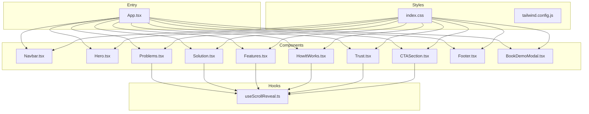

**Diagram sources**
- [App.tsx:13-47](file://src/App.tsx#L13-L47)
- [useScrollReveal.ts:3-25](file://src/hooks/useScrollReveal.ts#L3-L25)
- [index.css:1-125](file://src/index.css#L1-L125)
- [tailwind.config.js:1-9](file://tailwind.config.js#L1-L9)

**Section sources**
- [App.tsx:1-51](file://src/App.tsx#L1-L51)
- [index.css:1-125](file://src/index.css#L1-L125)
- [tailwind.config.js:1-9](file://tailwind.config.js#L1-L9)

## Core Components
This section outlines the primary components, their responsibilities, props, state, and behavior.

- Navbar
  - Purpose: Fixed header with branding, navigation links, and a “Book Demo” call-to-action button.
  - Props: onOpenDemo?: () => void
  - State: scrolled: boolean (derived from scroll position), menuOpen: boolean (mobile menu toggle).
  - Behavior: Adds/removes shadow and background blur on scroll; toggles mobile menu; forwards onOpenDemo to parent.
  - Interaction: Emits onOpenDemo to App, which manages modal visibility.

- Hero
  - Purpose: Hero section with headline, trust badges, and a dashboard mockup.
  - Props: onOpenDemo?: () => void
  - State: None.
  - Behavior: Renders animated hero content and a DashboardMockup subcomponent; triggers onOpenDemo on button click.

- Problems
  - Purpose: Presents pain points with animated reveal on scroll.
  - Props: None.
  - State: None.
  - Behavior: Uses IntersectionObserver to add a visible class to elements with the reveal class when in viewport.

- Solution
  - Purpose: Explains the solution with animated cards and a workflow visualization.
  - Props: None.
  - State: None.
  - Behavior: Uses IntersectionObserver for reveal animations.

- Features
  - Purpose: Feature showcase with grouped cards and a highlighted feature row.
  - Props: None.
  - State: None.
  - Behavior: Uses IntersectionObserver for reveal animations.

- HowItWorks
  - Purpose: Seven-step workflow visualization with desktop and mobile layouts.
  - Props: None.
  - State: None.
  - Behavior: Uses IntersectionObserver for reveal animations.

- Trust
  - Purpose: Trust highlights, statistics, and customer quote.
  - Props: None.
  - State: None.
  - Behavior: Uses IntersectionObserver for reveal animations.

- CTASection
  - Purpose: Strong call-to-action with gradient background and steps.
  - Props: onOpenDemo?: () => void
  - State: None.
  - Behavior: Renders gradient background and steps; triggers onOpenDemo on button click.

- Footer
  - Purpose: Site footer with navigation and contact info.
  - Props: onOpenDemo: () => void
  - State: None.
  - Behavior: Renders navigation links and contact info; forwards onOpenDemo to parent.

- BookDemoModal
  - Purpose: Modal for demo booking with form submission and Google Sheets webhook integration.
  - Props: onClose: () => void
  - State: submitted: boolean, loading: boolean, error: string | null, form: FormState.
  - Behavior: Manages form state, submits to a configured webhook, handles success/error states, and closes on demand.

**Section sources**
- [Navbar.tsx:11-105](file://src/components/Navbar.tsx#L11-L105)
- [Hero.tsx:9-93](file://src/components/Hero.tsx#L9-L93)
- [Problems.tsx:31-99](file://src/components/Problems.tsx#L31-L99)
- [Solution.tsx:21-74](file://src/components/Solution.tsx#L21-L74)
- [Features.tsx:77-145](file://src/components/Features.tsx#L77-L145)
- [HowItWorks.tsx:91-197](file://src/components/HowItWorks.tsx#L91-L197)
- [Trust.tsx:49-134](file://src/components/Trust.tsx#L49-L134)
- [CTASection.tsx:3-99](file://src/components/CTASection.tsx#L3-L99)
- [Footer.tsx:14-47](file://src/components/Footer.tsx#L14-L47)
- [BookDemoModal.tsx:14-207](file://src/components/BookDemoModal.tsx#L14-L207)

## Architecture Overview
The App component composes all sections and manages the demo modal lifecycle. Each section uses a consistent pattern of scroll-triggered animations via IntersectionObserver and Tailwind utility classes. Components communicate primarily through props and event handlers, maintaining low coupling.

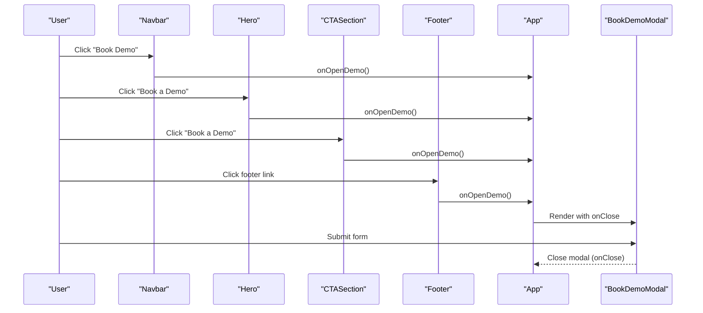

**Diagram sources**
- [App.tsx:34-47](file://src/App.tsx#L34-L47)
- [Navbar.tsx:61-66](file://src/components/Navbar.tsx#L61-L66)
- [Hero.tsx:61-67](file://src/components/Hero.tsx#L61-L67)
- [CTASection.tsx:32-39](file://src/components/CTASection.tsx#L32-L39)
- [Footer.tsx:37-43](file://src/components/Footer.tsx#L37-L43)
- [BookDemoModal.tsx:72-204](file://src/components/BookDemoModal.tsx#L72-L204)

## Detailed Component Analysis

### Navbar
- Props: onOpenDemo?: () => void
- State: scrolled, menuOpen
- Behavior: On scroll, toggles a shadow/backdrop effect; mobile menu toggles visibility; forwards onOpenDemo to parent.

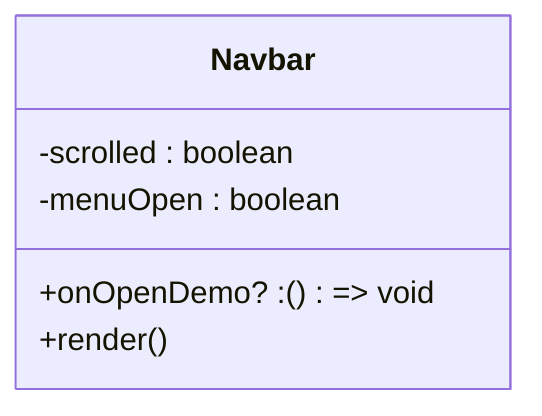

**Diagram sources**
- [Navbar.tsx:11-105](file://src/components/Navbar.tsx#L11-L105)

**Section sources**
- [Navbar.tsx:11-105](file://src/components/Navbar.tsx#L11-L105)

### Hero
- Props: onOpenDemo?: () => void
- State: None
- Behavior: Renders headline, trust badges, animated content, and a dashboard mockup; triggers onOpenDemo on button click.

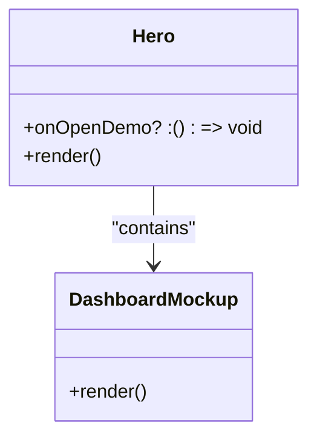

**Diagram sources**
- [Hero.tsx:9-93](file://src/components/Hero.tsx#L9-L93)
- [Hero.tsx:95-190](file://src/components/Hero.tsx#L95-L190)

**Section sources**
- [Hero.tsx:9-93](file://src/components/Hero.tsx#L9-L93)

### Problems
- Props: None
- State: None
- Behavior: Uses IntersectionObserver to reveal elements with the reveal class when they enter the viewport.

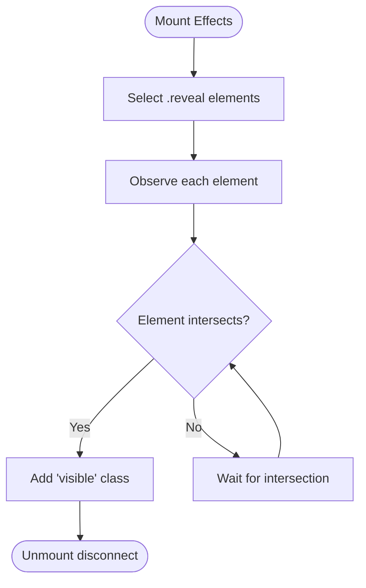

**Diagram sources**
- [Problems.tsx:31-39](file://src/components/Problems.tsx#L31-L39)

**Section sources**
- [Problems.tsx:31-39](file://src/components/Problems.tsx#L31-L39)

### Solution
- Props: None
- State: None
- Behavior: Renders pillars with icons and hover effects; uses IntersectionObserver for reveal animations.

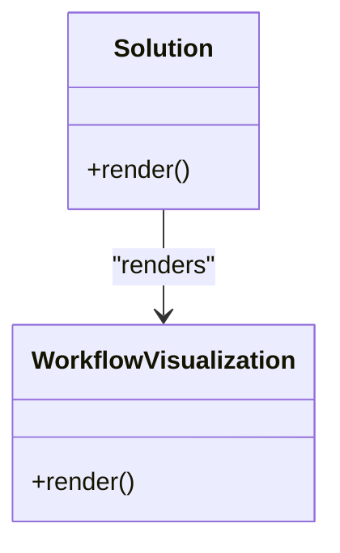

**Diagram sources**
- [Solution.tsx:21-74](file://src/components/Solution.tsx#L21-L74)
- [Solution.tsx:77-130](file://src/components/Solution.tsx#L77-L130)

**Section sources**
- [Solution.tsx:21-74](file://src/components/Solution.tsx#L21-L74)

### Features
- Props: None
- State: None
- Behavior: Grid of feature cards with tags and icon backgrounds; reveals on scroll with staggered delays.

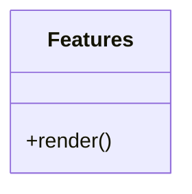

**Diagram sources**
- [Features.tsx:77-145](file://src/components/Features.tsx#L77-L145)

**Section sources**
- [Features.tsx:77-145](file://src/components/Features.tsx#L77-L145)

### HowItWorks
- Props: None
- State: None
- Behavior: Seven-step workflow visualization with desktop and mobile layouts; reveals on scroll.

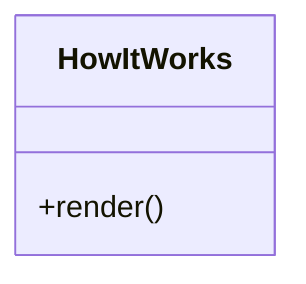

**Diagram sources**
- [HowItWorks.tsx:91-197](file://src/components/HowItWorks.tsx#L91-L197)

**Section sources**
- [HowItWorks.tsx:91-197](file://src/components/HowItWorks.tsx#L91-L197)

### Trust
- Props: None
- State: None
- Behavior: Trust highlights, statistics, and customer quote; reveals on scroll.

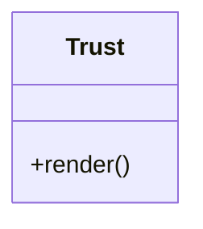

**Diagram sources**
- [Trust.tsx:49-134](file://src/components/Trust.tsx#L49-L134)

**Section sources**
- [Trust.tsx:49-134](file://src/components/Trust.tsx#L49-L134)

### CTASection
- Props: onOpenDemo?: () => void
- State: None
- Behavior: Gradient background CTA with steps; triggers onOpenDemo on button click.

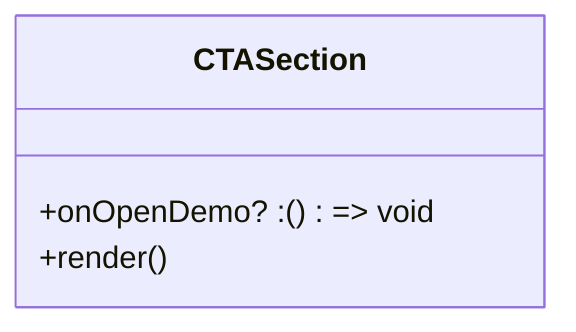

**Diagram sources**
- [CTASection.tsx:3-99](file://src/components/CTASection.tsx#L3-L99)

**Section sources**
- [CTASection.tsx:3-99](file://src/components/CTASection.tsx#L3-L99)

### Footer
- Props: onOpenDemo: () => void
- State: None
- Behavior: Renders navigation links and contact info; forwards onOpenDemo to parent.

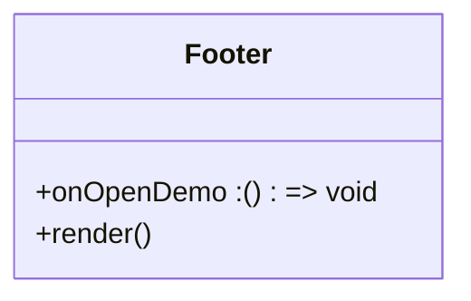

**Diagram sources**
- [Footer.tsx:14-47](file://src/components/Footer.tsx#L14-L47)

**Section sources**
- [Footer.tsx:14-47](file://src/components/Footer.tsx#L14-L47)

### BookDemoModal
- Props: onClose: () => void
- State: submitted, loading, error, form
- Behavior: Manages form state, posts to a Google Sheets webhook, shows success state, and closes on demand.

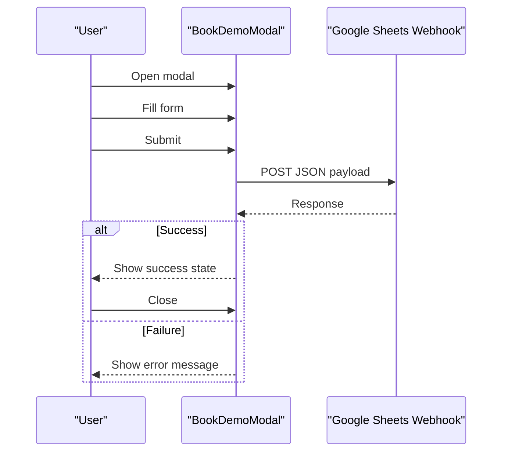

**Diagram sources**
- [BookDemoModal.tsx:32-63](file://src/components/BookDemoModal.tsx#L32-L63)
- [BookDemoModal.tsx:14-24](file://src/components/BookDemoModal.tsx#L14-L24)

**Section sources**
- [BookDemoModal.tsx:14-207](file://src/components/BookDemoModal.tsx#L14-L207)

## Dependency Analysis
- Component dependencies
  - App composes all sections and passes onOpenDemo to Navbar, Hero, CTASection, and Footer.
  - BookDemoModal is rendered conditionally by App based on showDemo state.
  - Each content section independently sets up its own IntersectionObserver for scroll-triggered animations.
  - useScrollReveal is a reusable hook that encapsulates the observer logic and returns a ref; however, the individual components implement their own observer instances.

- External dependencies
  - lucide-react for icons.
  - Tailwind CSS for styling and responsive utilities.
  - Environment variable VITE_GOOGLE_SHEET_WEBHOOK_URL for demo submission.

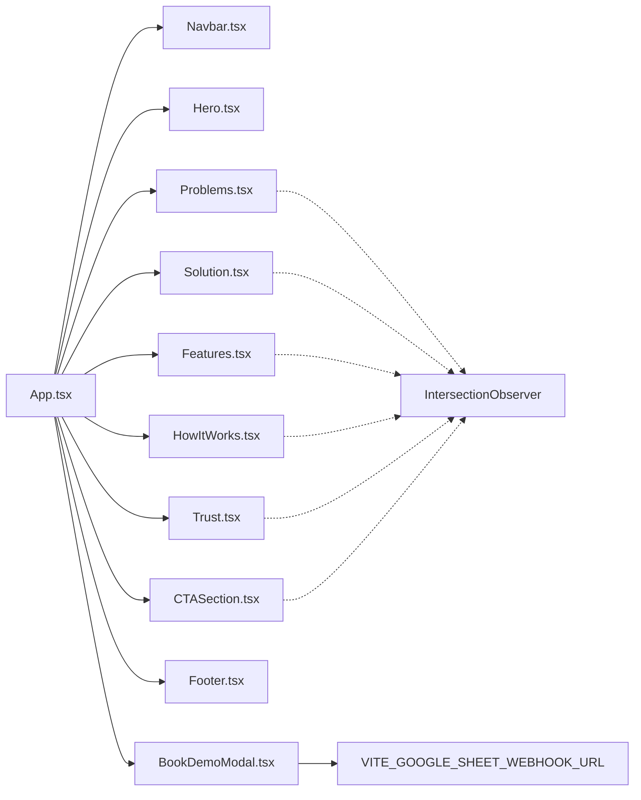

**Diagram sources**
- [App.tsx:34-47](file://src/App.tsx#L34-L47)
- [Problems.tsx:33-38](file://src/components/Problems.tsx#L33-L38)
- [Solution.tsx:21-21](file://src/components/Solution.tsx#L21-L21)
- [Features.tsx:77-77](file://src/components/Features.tsx#L77-L77)
- [HowItWorks.tsx:91-91](file://src/components/HowItWorks.tsx#L91-L91)
- [Trust.tsx:49-49](file://src/components/Trust.tsx#L49-L49)
- [CTASection.tsx:3-3](file://src/components/CTASection.tsx#L3-L3)
- [BookDemoModal.tsx:4-4](file://src/components/BookDemoModal.tsx#L4-L4)

**Section sources**
- [App.tsx:1-51](file://src/App.tsx#L1-L51)
- [useScrollReveal.ts:3-25](file://src/hooks/useScrollReveal.ts#L3-L25)
- [package.json:13-17](file://package.json#L13-L17)

## Performance Considerations
- IntersectionObserver usage
  - Each section initializes its own observer; consider consolidating to a single observer in App for potential performance gains and reduced overhead.
  - Threshold and rootMargin are tuned to trigger animations as content enters the viewport; adjust thresholds if needed to balance perceived performance and smoothness.

- CSS animations
  - Reveal animations use opacity and transform with transition-delay classes; ensure minimal layout thrashing by avoiding heavy transforms on large DOM subtrees.

- Modal rendering
  - BookDemoModal is conditionally rendered; keep it mounted only while open to avoid unnecessary re-renders.

- Image and asset sizes
  - DashboardMockup and hero visuals use gradients and pseudo-elements; maintain optimized assets for mobile networks.

[No sources needed since this section provides general guidance]

## Troubleshooting Guide
- Demo submission fails
  - Verify VITE_GOOGLE_SHEET_WEBHOOK_URL is set in the environment.
  - Check network connectivity and server response codes; the component displays a user-friendly error message on failure.

- Animations not triggering
  - Ensure elements have the reveal class and are within the viewport; IntersectionObserver thresholds and root margins are configured in each component’s effect.

- Mobile menu not closing after demo
  - Navbar’s mobile menu explicitly closes when selecting “Book Demo”; confirm the forwarded onOpenDemo handler updates App state accordingly.

**Section sources**
- [BookDemoModal.tsx:37-59](file://src/components/BookDemoModal.tsx#L37-L59)
- [Problems.tsx:33-38](file://src/components/Problems.tsx#L33-L38)
- [Navbar.tsx:95-99](file://src/components/Navbar.tsx#L95-L99)

## Conclusion
The Baerp-MW component system is a cohesive, mobile-first marketing site built with clear component boundaries and consistent animation patterns. Props-driven communication and IntersectionObserver-based reveals provide a smooth, accessible experience. The system is extensible: new components can reuse the same animation and prop patterns, and the App orchestrates cross-cutting concerns like modal management.

[No sources needed since this section summarizes without analyzing specific files]

## Appendices

### Responsive Design and Mobile-First Approach
- Breakpoints and grids
  - Components use lg: and sm: prefixes to adapt layouts from mobile to large screens.
  - Hero and Trust sections use lg:grid-cols to stack on mobile and expand on larger screens.

- Typography and spacing
  - Responsive font sizes and padding/margin scales with lg: variants for improved readability on larger screens.

- Navigation
  - Navbar switches to a mobile menu at medium breakpoints and adapts text colors for contrast.

**Section sources**
- [Hero.tsx:28-75](file://src/components/Hero.tsx#L28-L75)
- [Trust.tsx:51-131](file://src/components/Trust.tsx#L51-L131)
- [Navbar.tsx:29-78](file://src/components/Navbar.tsx#L29-L78)

### Scroll-Revealed Animation System
- Implementation patterns
  - Each component mounts an IntersectionObserver targeting elements with the reveal class.
  - Elements animate in when intersecting, using CSS transitions and delay classes for staggering.

- Hook reuse
  - A shared useScrollReveal hook encapsulates observer setup and teardown; however, components currently instantiate their own observers.

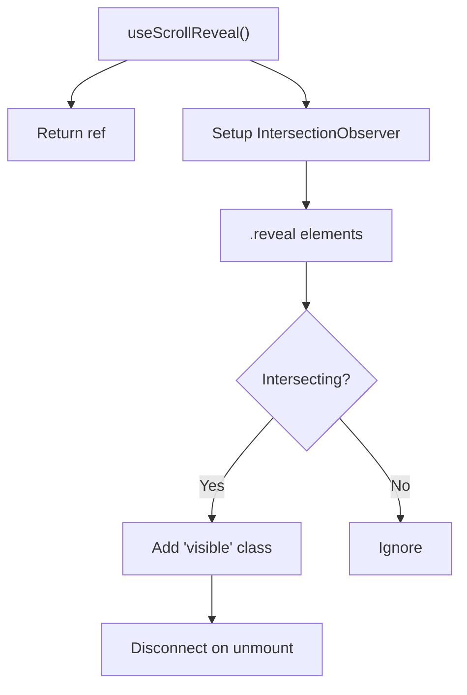

**Diagram sources**
- [useScrollReveal.ts:3-25](file://src/hooks/useScrollReveal.ts#L3-L25)

**Section sources**
- [useScrollReveal.ts:3-25](file://src/hooks/useScrollReveal.ts#L3-L25)
- [Problems.tsx:33-38](file://src/components/Problems.tsx#L33-L38)
- [Solution.tsx:21-21](file://src/components/Solution.tsx#L21-L21)
- [Features.tsx:77-77](file://src/components/Features.tsx#L77-L77)
- [HowItWorks.tsx:91-91](file://src/components/HowItWorks.tsx#L91-L91)
- [Trust.tsx:49-49](file://src/components/Trust.tsx#L49-L49)
- [CTASection.tsx:3-3](file://src/components/CTASection.tsx#L3-L3)

### Component Composition Patterns
- Parent-to-child props
  - App passes onOpenDemo to Navbar, Hero, CTASection, and Footer; App passes onClose to BookDemoModal.
- Conditional rendering
  - App controls modal visibility via state; BookDemoModal conditionally renders success or form content.
- Shared animation
  - Components independently manage reveal animations; consider a centralized observer for consistency.

**Section sources**
- [App.tsx:34-47](file://src/App.tsx#L34-L47)
- [Navbar.tsx:61-66](file://src/components/Navbar.tsx#L61-L66)
- [Hero.tsx:61-67](file://src/components/Hero.tsx#L61-L67)
- [CTASection.tsx:32-39](file://src/components/CTASection.tsx#L32-L39)
- [Footer.tsx:37-43](file://src/components/Footer.tsx#L37-L43)
- [BookDemoModal.tsx:72-204](file://src/components/BookDemoModal.tsx#L72-L204)

### Adding New Components
- Follow the established patterns
  - Accept onOpenDemo when relevant; use the reveal class and IntersectionObserver for animations.
  - Keep state minimal; forward events to the nearest orchestrator (App).
- Styling and responsiveness
  - Use Tailwind utilities with responsive prefixes; maintain consistent spacing and typography scales.
- Accessibility
  - Provide semantic markup and keyboard navigable elements; ensure sufficient color contrast.
- Testing and validation
  - Validate animations across devices; test modal flows and form submissions.

[No sources needed since this section provides general guidance]