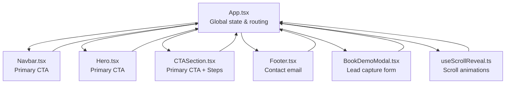
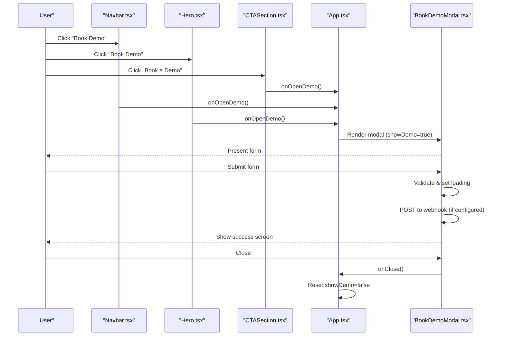
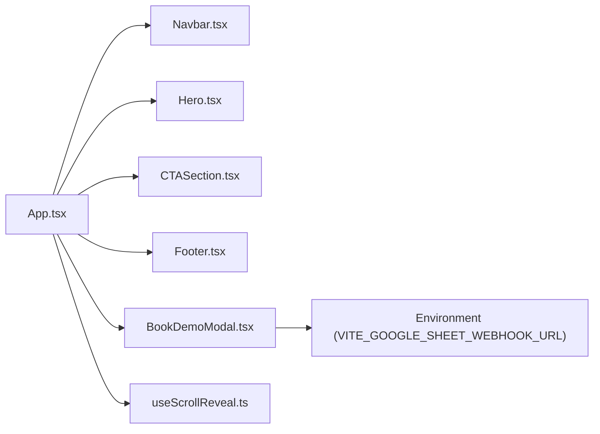

# Conversion & Call-to-Action

<cite>
**Referenced Files in This Document**
- [App.tsx](file://src/App.tsx)
- [CTASection.tsx](file://src/components/CTASection.tsx)
- [BookDemoModal.tsx](file://src/components/BookDemoModal.tsx)
- [Hero.tsx](file://src/components/Hero.tsx)
- [Navbar.tsx](file://src/components/Navbar.tsx)
- [Footer.tsx](file://src/components/Footer.tsx)
- [useScrollReveal.ts](file://src/hooks/useScrollReveal.ts)
- [index.html](file://index.html)
- [package.json](file://package.json)
</cite>

## Table of Contents
1. [Introduction](#introduction)
2. [Project Structure](#project-structure)
3. [Core Components](#core-components)
4. [Architecture Overview](#architecture-overview)
5. [Detailed Component Analysis](#detailed-component-analysis)
6. [Dependency Analysis](#dependency-analysis)
7. [Performance Considerations](#performance-considerations)
8. [Troubleshooting Guide](#troubleshooting-guide)
9. [Conclusion](#conclusion)
10. [Appendices](#appendices)

## Introduction
This document focuses on the conversion-centric call-to-action (CTA) system that drives demo bookings and leads across the marketing site. It explains how the CTASection component presents persuasive messaging and dual CTAs, how the BookDemoModal captures contact information and integrates with a backend webhook, and how navigation and footer CTAs reinforce conversion pathways. It also outlines visual design elements that create urgency and trust, persuasive copywriting techniques, form optimization strategies, and follow-up communication setup. Finally, it covers analytics visibility, performance measurement, and continuous improvement approaches tailored to the existing codebase.

## Project Structure
The conversion-focused CTA system spans several UI components and a shared state container:
- App orchestrates global state for the demo modal and scroll-reveal animations.
- CTASection provides the primary conversion surface with headline, subheadline, dual CTAs, trust signals, and a three-step process summary.
- BookDemoModal renders a compact, accessible form with validation, submission feedback, and success state.
- Hero and Navbar embed secondary CTAs to maximize touchpoints.
- Footer includes a contact email link to complement lead capture.
- useScrollReveal provides animated reveals for key conversion elements.

**Diagram sources**
- [App.tsx:13-47](file://src/App.tsx#L13-L47)
- [Navbar.tsx:11-66](file://src/components/Navbar.tsx#L11-L66)
- [Hero.tsx:9-68](file://src/components/Hero.tsx#L9-L68)
- [CTASection.tsx:3-98](file://src/components/CTASection.tsx#L3-L98)
- [Footer.tsx:14-44](file://src/components/Footer.tsx#L14-L44)
- [BookDemoModal.tsx:14-63](file://src/components/BookDemoModal.tsx#L14-L63)
- [useScrollReveal.ts:3-25](file://src/hooks/useScrollReveal.ts#L3-L25)

**Section sources**
- [App.tsx:13-47](file://src/App.tsx#L13-L47)
- [CTASection.tsx:3-98](file://src/components/CTASection.tsx#L3-L98)
- [BookDemoModal.tsx:14-63](file://src/components/BookDemoModal.tsx#L14-L63)
- [Hero.tsx:9-68](file://src/components/Hero.tsx#L9-L68)
- [Navbar.tsx:11-66](file://src/components/Navbar.tsx#L11-L66)
- [Footer.tsx:14-44](file://src/components/Footer.tsx#L14-L44)
- [useScrollReveal.ts:3-25](file://src/hooks/useScrollReveal.ts#L3-L25)

## Core Components
- CTASection: Central conversion hub featuring a strong headline, benefit-driven subheadline, primary “Book a Demo” button, secondary “Free Trial” option, trust micro-signals, and a three-step process summary to reduce friction and clarify next steps.
- BookDemoModal: Minimalist, accessible form capturing name, work email, company, optional phone, and additional info. Submits via a configured Google Sheets webhook and displays a success screen with a close action.
- Hero: Prominent hero with a primary CTA and trust badges to reinforce reliability and reduce hesitation.
- Navbar: Persistent header with a prominent “Book Demo” CTA and mobile-friendly menu.
- Footer: Includes a contact email link to complement lead capture and improve accessibility.
- App: Manages modal visibility and scroll-reveal animations for conversion elements.

Key conversion levers:
- Dual CTAs: Primary “Book a Demo” and secondary “Free Trial” to serve different buyer intents.
- Trust signals: Micro-badges and guarantees (“No credit card required,” “14-day free trial,” “Onboarding support included,” “Cancel anytime”) reduce perceived risk.
- Progressive disclosure: Three-step process summary communicates low-friction setup.
- Accessibility: Focus states, aria labels, and keyboard-friendly interactions.

**Section sources**
- [CTASection.tsx:3-98](file://src/components/CTASection.tsx#L3-L98)
- [BookDemoModal.tsx:14-63](file://src/components/BookDemoModal.tsx#L14-L63)
- [Hero.tsx:9-68](file://src/components/Hero.tsx#L9-L68)
- [Navbar.tsx:11-66](file://src/components/Navbar.tsx#L11-L66)
- [Footer.tsx:14-44](file://src/components/Footer.tsx#L14-L44)
- [App.tsx:13-47](file://src/App.tsx#L13-L47)

## Architecture Overview
The conversion flow begins with CTAs across the page (Hero, Navbar, CTASection) and converges into the BookDemoModal. The modal posts data to a webhook endpoint and transitions to a success state. Scroll animations reveal conversion elements progressively.

**Diagram sources**
- [App.tsx:36-45](file://src/App.tsx#L36-L45)
- [Navbar.tsx:61-66](file://src/components/Navbar.tsx#L61-L66)
- [Hero.tsx:60-68](file://src/components/Hero.tsx#L60-L68)
- [CTASection.tsx:32-46](file://src/components/CTASection.tsx#L32-L46)
- [BookDemoModal.tsx:32-63](file://src/components/BookDemoModal.tsx#L32-L63)

## Detailed Component Analysis

### CTASection: Conversion Hub
Responsibilities:
- Deliver headline and subheadline that position the product as a solution to pain points.
- Offer dual CTAs to capture different buyer intents.
- Display trust micro-signals to reduce risk.
- Present a three-step process to lower perceived complexity and increase completion.

Design and persuasion:
- Strong visual contrast (dark theme) with radial gradient overlay to draw attention.
- Animated reveal for progressive engagement.
- Benefit-driven copy (“See exactly how bwork maps to your company’s workflow.”).
- Trust cues (“No credit card required,” “14-day free trial,” “Onboarding support included,” “Cancel anytime”).
- Step-by-step process to normalize the journey.

Optimization opportunities:
- Add A/B-tested headlines and subheadlines.
- Include localized testimonials or logos near trust signals.
- Introduce dynamic urgency indicators (e.g., “Limited seats available”).
- Add micro-copy prompts (e.g., “Speak with a procurement specialist”).

**Section sources**
- [CTASection.tsx:3-98](file://src/components/CTASection.tsx#L3-L98)

### BookDemoModal: Lead Capture Engine
Responsibilities:
- Collect essential contact and company information.
- Validate required fields and present errors.
- Post submissions to a configurable webhook endpoint.
- Provide immediate feedback and a clear close action after submission.

Form integration:
- Controlled inputs for name, email, company, phone, and additional info.
- Required fields marked clearly.
- Loading state during submission and error messaging on failure.
- Success screen with acknowledgment and close action.

Follow-up communication setup:
- The form payload includes a timestamp field suitable for sorting and triage.
- The success screen instructs users to expect outreach within a defined timeframe.
- Consider integrating with a CRM or email automation platform by extending the webhook target.

Analytics and measurement:
- Track conversion rate from CTA click to successful submission.
- Measure form abandonment rate by exit points.
- Monitor submission latency and error rates.

**Section sources**
- [BookDemoModal.tsx:14-63](file://src/components/BookDemoModal.tsx#L14-L63)

### Hero: First-Touch CTA
Responsibilities:
- Establish value proposition quickly.
- Provide a prominent primary CTA aligned with the page goal.
- Reinforce trust with badges and social proof.

Optimization:
- Test variations of the headline and subheadline.
- Add dynamic badges or customer counts to increase credibility.
- Ensure CTA contrast and sizing meet accessibility guidelines.

**Section sources**
- [Hero.tsx:9-68](file://src/components/Hero.tsx#L9-L68)

### Navbar: Persistent CTA
Responsibilities:
- Keep the conversion pathway visible across pages.
- Provide a mobile-friendly CTA with clear affordances.
- Offer contextual navigation alongside conversion intent.

Optimization:
- Consider sticky positioning with scroll-aware styling.
- Add micro-animations to draw attention without distraction.

**Section sources**
- [Navbar.tsx:11-66](file://src/components/Navbar.tsx#L11-L66)

### Footer: Contact Complement
Responsibilities:
- Provide an alternative contact channel (email) to complement lead capture.
- Maintain brand presence and legal/compliance links.

Optimization:
- Ensure the email link is discoverable and clearly labeled.
- Consider adding a “Schedule a Call” link if appropriate.

**Section sources**
- [Footer.tsx:14-44](file://src/components/Footer.tsx#L14-L44)

### App: Orchestration and Animations
Responsibilities:
- Manage modal visibility state.
- Initialize scroll-reveal animations for conversion elements.
- Pass callbacks to child components to maintain separation of concerns.

Performance:
- IntersectionObserver is used efficiently to avoid layout thrashing.
- Modal rendering is conditional to minimize DOM overhead.

**Section sources**
- [App.tsx:13-47](file://src/App.tsx#L13-L47)
- [useScrollReveal.ts:3-25](file://src/hooks/useScrollReveal.ts#L3-L25)

## Dependency Analysis
High-level dependencies:
- App depends on all major components to coordinate state and events.
- CTASection, Hero, and Navbar depend on App for the open-demo callback.
- BookDemoModal depends on App for the close callback and on environment configuration for the webhook.
- useScrollReveal is used by App to animate elements with minimal overhead.

**Diagram sources**
- [App.tsx:13-47](file://src/App.tsx#L13-L47)
- [BookDemoModal.tsx:4](file://src/components/BookDemoModal.tsx#L4)
- [useScrollReveal.ts:3-25](file://src/hooks/useScrollReveal.ts#L3-L25)

**Section sources**
- [App.tsx:13-47](file://src/App.tsx#L13-L47)
- [BookDemoModal.tsx:4](file://src/components/BookDemoModal.tsx#L4)
- [useScrollReveal.ts:3-25](file://src/hooks/useScrollReveal.ts#L3-L25)

## Performance Considerations
- Lazy initialization of IntersectionObserver in App avoids unnecessary work until needed.
- Conditional rendering of the modal reduces DOM and reflow costs.
- Controlled form inputs minimize unnecessary re-renders; consider moving to a library if form complexity grows.
- Environment variable usage for the webhook ensures secure configuration without bundling secrets.
- Accessibility: Ensure focus management and keyboard navigation remain smooth during modal open/close.

[No sources needed since this section provides general guidance]

## Troubleshooting Guide
Common issues and resolutions:
- Webhook submission failures:
  - Symptom: Error message displayed after submission.
  - Cause: Network error or non-OK response from the webhook endpoint.
  - Resolution: Verify the environment variable is set and reachable; confirm server-side endpoint availability.
- Modal does not close:
  - Symptom: Success screen remains visible.
  - Cause: onClose callback not invoked.
  - Resolution: Ensure the close button triggers onClose and that App resets showDemo.
- Form not submitting:
  - Symptom: Clicking submit does nothing.
  - Cause: Missing or invalid environment variable for the webhook.
  - Resolution: Confirm VITE_GOOGLE_SHEET_WEBHOOK_URL is defined in the environment.
- Animation not triggering:
  - Symptom: Elements do not animate on scroll.
  - Cause: Missing “reveal” class or IntersectionObserver not observing.
  - Resolution: Ensure elements have the “reveal” class and App initializes the hook.

**Section sources**
- [BookDemoModal.tsx:32-63](file://src/components/BookDemoModal.tsx#L32-L63)
- [App.tsx:13-47](file://src/App.tsx#L13-L47)

## Conclusion
The conversion-focused CTA system leverages a multi-touchpoint approach: strong primary CTAs in Hero, Navbar, and CTASection, supported by trust signals and a streamlined BookDemoModal. The design emphasizes reducing friction, building trust, and delivering immediate feedback. By optimizing copy, form fields, and follow-up automation, and by measuring conversion metrics, the system can continuously improve demo request rates and lead quality.

[No sources needed since this section summarizes without analyzing specific files]

## Appendices

### Conversion Optimization Patterns
- Persuasive copywriting:
  - Benefit-first headlines and subheadlines.
  - Social proof and guarantees to reduce risk.
  - Action-oriented verbs and clear next steps.
- Visual design elements:
  - Dark theme with blue accents for contrast.
  - Radial gradients and animated reveals to draw attention.
  - Consistent spacing and typography hierarchy.
- Urgency and trust:
  - Micro-badges and guarantees.
  - Three-step process to normalize complexity.
  - Immediate feedback after submission.

[No sources needed since this section provides general guidance]

### Analytics Tracking and Measurement
- Track funnel metrics:
  - CTA click-through rate to modal open.
  - Modal open rate per CTA placement.
  - Form submission rate and abandonment points.
  - Success screen completion rate.
- Monitor health:
  - Submission latency and error rates.
  - Mobile vs. desktop conversion differences.
- Continuous improvement:
  - A/B test headline variants and subheadlines.
  - Experiment with trust signals and guarantees.
  - Optimize form length and required fields.

[No sources needed since this section provides general guidance]

### Environment Configuration
- Webhook endpoint:
  - Configure VITE_GOOGLE_SHEET_WEBHOOK_URL to route submissions to your preferred backend or CRM.
- SEO and metadata:
  - Page title and meta description are defined in the HTML head for improved search visibility.

**Section sources**
- [BookDemoModal.tsx:4](file://src/components/BookDemoModal.tsx#L4)
- [index.html:7-16](file://index.html#L7-L16)