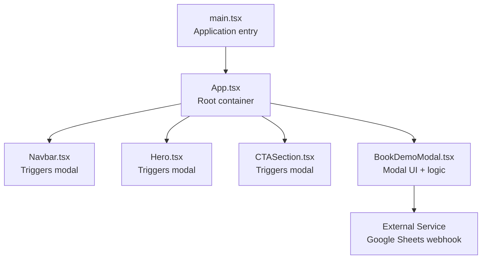
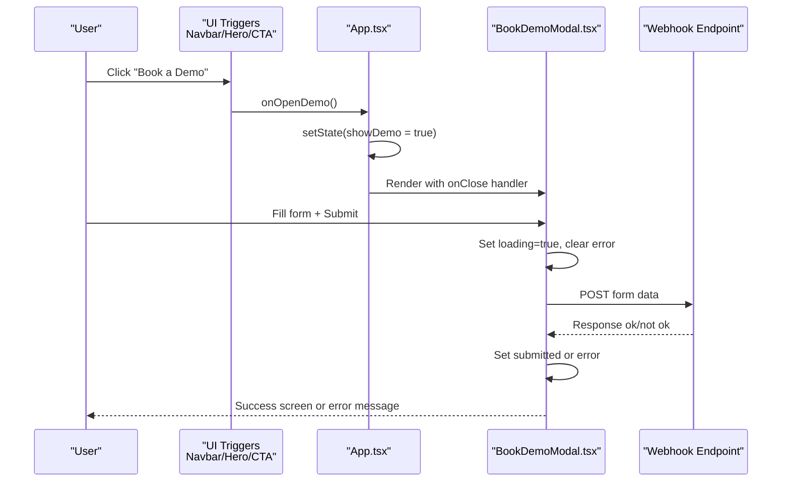
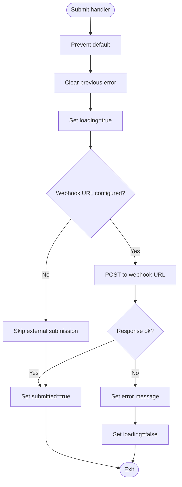
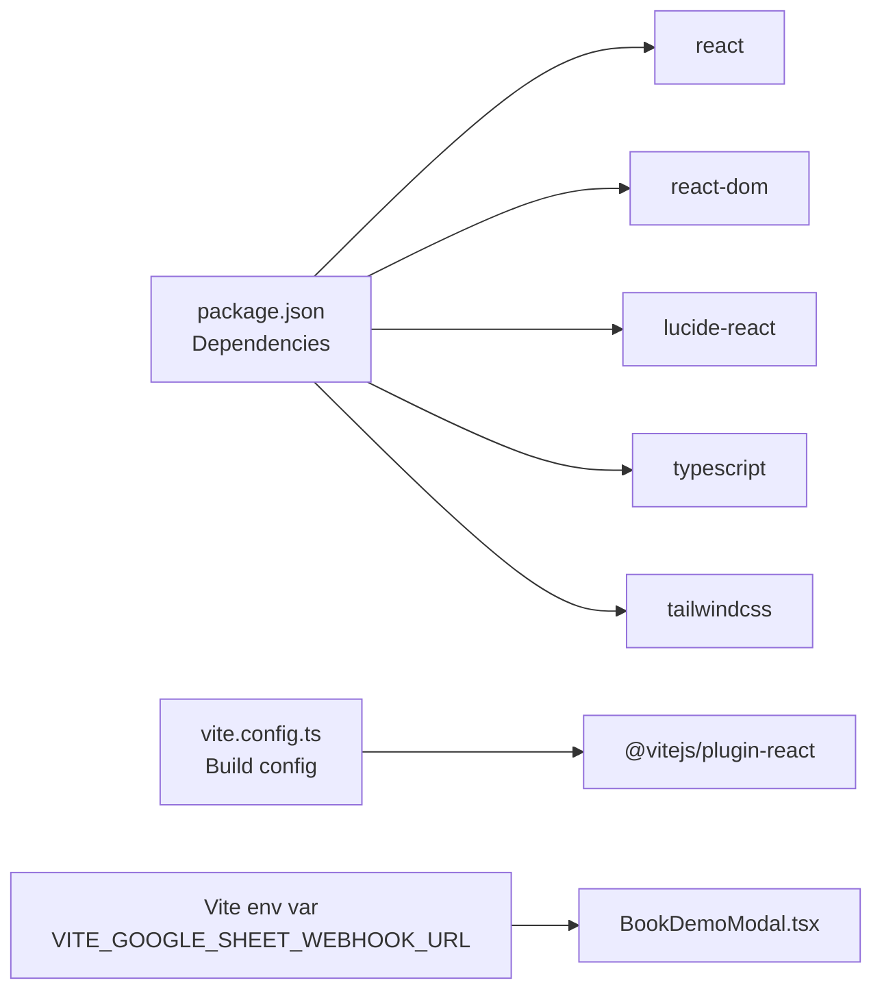

# Demo Modal System

<cite>
**Referenced Files in This Document**
- [BookDemoModal.tsx](file://src/components/BookDemoModal.tsx)
- [App.tsx](file://src/App.tsx)
- [CTASection.tsx](file://src/components/CTASection.tsx)
- [Navbar.tsx](file://src/components/Navbar.tsx)
- [Hero.tsx](file://src/components/Hero.tsx)
- [main.tsx](file://src/main.tsx)
- [package.json](file://package.json)
- [vite.config.ts](file://vite.config.ts)
- [index.html](file://index.html)
</cite>

## Table of Contents
1. [Introduction](#introduction)
2. [Project Structure](#project-structure)
3. [Core Components](#core-components)
4. [Architecture Overview](#architecture-overview)
5. [Detailed Component Analysis](#detailed-component-analysis)
6. [Dependency Analysis](#dependency-analysis)
7. [Performance Considerations](#performance-considerations)
8. [Troubleshooting Guide](#troubleshooting-guide)
9. [Conclusion](#conclusion)
10. [Appendices](#appendices)

## Introduction
This document explains the demo booking modal system used to capture leads and drive conversions. It covers the modal lifecycle, form validation and submission, success/error state management, integration with external services (Google Sheets via a webhook), and accessibility considerations. It also outlines how the modal fits into the conversion funnel, UX optimization strategies, and data collection approaches.

## Project Structure
The demo modal is implemented as a standalone React component integrated into the main application shell. The modal is conditionally rendered by the root App component and triggered by multiple UI surfaces (navigation bar, hero, CTA section, footer). The modal communicates with an external service via a Vite-time environment variable.

**Diagram sources**
- [main.tsx:1-11](file://src/main.tsx#L1-L11)
- [App.tsx:13-48](file://src/App.tsx#L13-L48)
- [Navbar.tsx:11-104](file://src/components/Navbar.tsx#L11-L104)
- [Hero.tsx:9-93](file://src/components/Hero.tsx#L9-L93)
- [CTASection.tsx:3-99](file://src/components/CTASection.tsx#L3-L99)
- [BookDemoModal.tsx:14-207](file://src/components/BookDemoModal.tsx#L14-L207)

**Section sources**
- [main.tsx:1-11](file://src/main.tsx#L1-L11)
- [App.tsx:13-48](file://src/App.tsx#L13-L48)
- [BookDemoModal.tsx:4-4](file://src/components/BookDemoModal.tsx#L4-L4)

## Core Components
- BookDemoModal: Renders the modal UI, manages form state, handles validation, submission, loading, and error states, and integrates with an external webhook.
- App: Controls visibility of the modal and passes callbacks to trigger it from various UI sections.
- Navbar, Hero, CTASection: Provide trigger buttons that open the modal.

Key responsibilities:
- Modal lifecycle: open via props, close on demand, overlay click closes, keyboard-friendly interactions.
- Validation: Required fields enforced via HTML attributes; submission guarded by loading state.
- Submission: Sends data to a configured webhook endpoint; sets success state after submission.
- External integration: Uses a Vite-time environment variable for the webhook URL.

**Section sources**
- [BookDemoModal.tsx:14-207](file://src/components/BookDemoModal.tsx#L14-L207)
- [App.tsx:14-45](file://src/App.tsx#L14-L45)
- [Navbar.tsx:61-66](file://src/components/Navbar.tsx#L61-L66)
- [Hero.tsx:61-67](file://src/components/Hero.tsx#L61-L67)
- [CTASection.tsx:32-39](file://src/components/CTASection.tsx#L32-L39)

## Architecture Overview
The modal participates in a conversion funnel that begins with awareness and ends with lead capture. The flow is initiated by user actions in the navigation bar, hero banner, or CTA section, and culminates in a successful submission or an error message.

**Diagram sources**
- [App.tsx:36-45](file://src/App.tsx#L36-L45)
- [BookDemoModal.tsx:32-63](file://src/components/BookDemoModal.tsx#L32-L63)
- [BookDemoModal.tsx:37-59](file://src/components/BookDemoModal.tsx#L37-L59)

## Detailed Component Analysis

### BookDemoModal.tsx
Responsibilities:
- Form state management for five fields: name, email, company, phone, additionalInfo.
- Controlled inputs with change handlers updating state.
- Submission pipeline:
  - Prevent default form submit.
  - Toggle loading state and clear previous errors.
  - Optional external submission via a configured webhook URL.
  - On success, set submitted state; on failure, set error message.
- UI states:
  - Loading spinner during submission.
  - Success screen with acknowledgment and close button.
  - Error message display when submission fails.
- Overlay behavior:
  - Clicking outside the modal content triggers close.
  - Close button present with accessible label.

Accessibility and UX:
- Required fields marked clearly in labels.
- Focus styles via Tailwind utilities on inputs.
- Disabled button during loading prevents duplicate submissions.
- Success screen includes a close button for easy dismissal.

External service integration:
- Reads the webhook URL from a Vite-time environment variable.
- Sends a JSON payload containing form values plus a timestamp.
- Handles network errors and server-side failures by setting an error message.

**Diagram sources**
- [BookDemoModal.tsx:32-63](file://src/components/BookDemoModal.tsx#L32-L63)
- [BookDemoModal.tsx:37-59](file://src/components/BookDemoModal.tsx#L37-L59)

**Section sources**
- [BookDemoModal.tsx:6-24](file://src/components/BookDemoModal.tsx#L6-L24)
- [BookDemoModal.tsx:26-30](file://src/components/BookDemoModal.tsx#L26-L30)
- [BookDemoModal.tsx:32-63](file://src/components/BookDemoModal.tsx#L32-L63)
- [BookDemoModal.tsx:65-207](file://src/components/BookDemoModal.tsx#L65-L207)

### App.tsx
Responsibilities:
- Tracks whether the modal is visible.
- Passes an onOpenDemo callback to Navbar, Hero, CTASection, and Footer.
- Conditionally renders the modal when visible.

Lifecycle:
- Initializes state to hidden.
- Propagates open/close actions to the modal component.

**Section sources**
- [App.tsx:14-14](file://src/App.tsx#L14-L14)
- [App.tsx:36-45](file://src/App.tsx#L36-L45)

### Navbar.tsx, Hero.tsx, CTASection.tsx
Responsibilities:
- Provide “Book a Demo” buttons.
- Invoke the onOpenDemo callback passed from App.
- Navbar additionally supports mobile menu integration.

Trigger behavior:
- Click handlers call onOpenDemo, which updates App state to show the modal.

**Section sources**
- [Navbar.tsx:61-66](file://src/components/Navbar.tsx#L61-L66)
- [Hero.tsx:61-67](file://src/components/Hero.tsx#L61-L67)
- [CTASection.tsx:32-39](file://src/components/CTASection.tsx#L32-L39)

## Dependency Analysis
Runtime dependencies:
- React and React DOM for UI rendering.
- lucide-react for icons.
- Tailwind CSS for styling.

Build-time dependencies:
- Vite for bundling and dev server.
- TypeScript for type checking.
- Tailwind CSS for styling utilities.

Environment configuration:
- Vite environment variable for the Google Sheets webhook URL.
- Build-time substitution ensures the URL is embedded at compile time.

**Diagram sources**
- [package.json:13-34](file://package.json#L13-L34)
- [vite.config.ts:1-10](file://vite.config.ts#L1-L10)
- [BookDemoModal.tsx:4-4](file://src/components/BookDemoModal.tsx#L4-L4)

**Section sources**
- [package.json:13-34](file://package.json#L13-L34)
- [vite.config.ts:1-10](file://vite.config.ts#L1-L10)
- [BookDemoModal.tsx:4-4](file://src/components/BookDemoModal.tsx#L4-L4)

## Performance Considerations
- Controlled inputs minimize re-renders by updating state incrementally.
- Loading state disables the submit button to prevent duplicate submissions.
- External submission is optional; if the environment variable is missing, the modal still transitions to the success state after local validation.
- Modal rendering is conditional, reducing unnecessary DOM overhead.

[No sources needed since this section provides general guidance]

## Troubleshooting Guide
Common issues and resolutions:
- Webhook URL not configured:
  - Symptom: Submission proceeds to success state immediately.
  - Cause: Environment variable not set; submission branch is skipped.
  - Resolution: Set VITE_GOOGLE_SHEET_WEBHOOK_URL in the environment.
- Network errors or server failures:
  - Symptom: Error message displayed; loading indicator stops.
  - Cause: Non-OK response from the webhook endpoint.
  - Resolution: Verify endpoint availability and CORS configuration; retry submission.
- Modal does not close:
  - Symptom: Overlay click does not dismiss the modal.
  - Cause: Event target mismatch or event propagation issues.
  - Resolution: Ensure overlay click handler targets the modal container and onClose is passed correctly.
- Accessibility labels:
  - Symptom: Screen reader issues with close button.
  - Resolution: Confirm aria-label is present on the close button element.

**Section sources**
- [BookDemoModal.tsx:68-70](file://src/components/BookDemoModal.tsx#L68-L70)
- [BookDemoModal.tsx:73-79](file://src/components/BookDemoModal.tsx#L73-L79)
- [BookDemoModal.tsx:54-58](file://src/components/BookDemoModal.tsx#L54-L58)

## Conclusion
The demo booking modal is a focused, accessible component that captures user intent early in the funnel. Its controlled form, clear feedback states, and optional external integration enable reliable data collection while maintaining a smooth user experience. Proper environment configuration and error handling ensure robust operation across environments.

[No sources needed since this section summarizes without analyzing specific files]

## Appendices

### A. Conversion Funnel and UX Optimization
- Placement: Multiple prominent “Book a Demo” CTAs across Navbar, Hero, and CTASection increase visibility and reduce friction.
- Micro-interactions: Hover effects and transitions improve perceived responsiveness.
- Accessibility: Clear labels, focus states, and an accessible close button support inclusive use.
- Feedback: Immediate success acknowledgment and a close action help users feel in control.

[No sources needed since this section provides general guidance]

### B. Environment Variable Configuration
- Variable name: VITE_GOOGLE_SHEET_WEBHOOK_URL
- Purpose: Configures the external webhook endpoint for form submissions.
- Usage: Read at runtime inside the modal’s submit handler.
- Notes: Ensure the variable is set in the deployment environment; otherwise, the modal will skip external submission but still show success.

**Section sources**
- [BookDemoModal.tsx:4-4](file://src/components/BookDemoModal.tsx#L4-L4)
- [BookDemoModal.tsx:37-59](file://src/components/BookDemoModal.tsx#L37-L59)

### C. Example: Google Sheets Webhook Integration
- Endpoint: Provided via VITE_GOOGLE_SHEET_WEBHOOK_URL.
- Payload: JSON object containing form fields and a timestamp.
- Behavior: On success, the modal transitions to the success state; on failure, an error message is shown.

**Section sources**
- [BookDemoModal.tsx:39-49](file://src/components/BookDemoModal.tsx#L39-L49)
- [BookDemoModal.tsx:51-58](file://src/components/BookDemoModal.tsx#L51-L58)

### D. Modal Lifecycle Reference
- Open: Triggered by Navbar, Hero, or CTASection buttons; App toggles visibility.
- Render: Modal appears with backdrop and overlay; user can interact with form or close.
- Close: Clicking the overlay or close button invokes onClose, hiding the modal.

**Section sources**
- [App.tsx:36-45](file://src/App.tsx#L36-L45)
- [BookDemoModal.tsx:66-79](file://src/components/BookDemoModal.tsx#L66-L79)