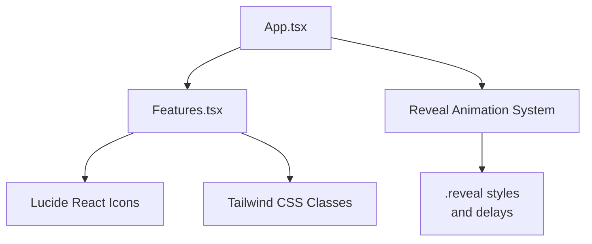
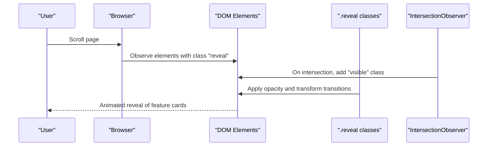
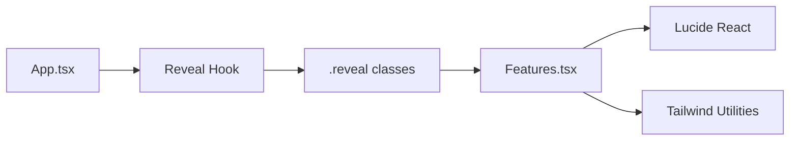

# Feature Showcase

<cite>
**Referenced Files in This Document**
- [Features.tsx](file://src/components/Features.tsx)
- [App.tsx](file://src/App.tsx)
- [index.css](file://src/index.css)
- [useScrollReveal.ts](file://src/hooks/useScrollReveal.ts)
- [package.json](file://package.json)
- [tailwind.config.js](file://tailwind.config.js)
- [HowItWorks.tsx](file://src/components/HowItWorks.tsx)
- [Solution.tsx](file://src/components/Solution.tsx)
</cite>

## Table of Contents
1. [Introduction](#introduction)
2. [Project Structure](#project-structure)
3. [Core Components](#core-components)
4. [Architecture Overview](#architecture-overview)
5. [Detailed Component Analysis](#detailed-component-analysis)
6. [Dependency Analysis](#dependency-analysis)
7. [Performance Considerations](#performance-considerations)
8. [Troubleshooting Guide](#troubleshooting-guide)
9. [Conclusion](#conclusion)

## Introduction
This document describes the Feature Showcase component that highlights ERP workflow enforcement, audit trail capabilities, and role-based access control features. It explains the feature card design pattern, icon integration using Lucide React, and feature description formatting. It also covers the responsive grid layout, feature categorization strategies, and emphasis techniques for key benefits. Finally, it demonstrates how the component communicates user benefits and positions the product’s competitive advantages.

## Project Structure
The Feature Showcase resides in the components directory and is integrated into the main application shell. It relies on Tailwind CSS for styling and Lucide React for icons. The component uses a reveal animation system to progressively show content as users scroll.

**Diagram sources**
- [App.tsx:34-47](file://src/App.tsx#L34-L47)
- [Features.tsx:77-145](file://src/components/Features.tsx#L77-L145)
- [index.css:61-77](file://src/index.css#L61-L77)

**Section sources**
- [App.tsx:13-51](file://src/App.tsx#L13-L51)
- [Features.tsx:77-145](file://src/components/Features.tsx#L77-L145)
- [index.css:61-77](file://src/index.css#L61-L77)

## Core Components
- Feature Showcase (Features.tsx): Presents a set of capability cards with icons, titles, descriptions, and category tags. It includes a prominent “Export & Reporting” feature highlighted in a blue accent card.
- Reveal Animation System: Progressive fade-in animations triggered by scroll intersection.
- Lucide React Icons: Consistent iconography for visual reinforcement of feature categories.
- Tailwind CSS: Utility-first styling for responsive grids, typography, and interactive states.

Key responsibilities:
- Render feature cards with consistent layout and spacing.
- Apply category tags and color-coded backgrounds for quick scanning.
- Emphasize a flagship feature with a distinct visual treatment.
- Integrate with the global reveal animation system for engaging UX.

**Section sources**
- [Features.tsx:11-75](file://src/components/Features.tsx#L11-L75)
- [Features.tsx:91-145](file://src/components/Features.tsx#L91-L145)
- [index.css:61-77](file://src/index.css#L61-L77)

## Architecture Overview
The Feature Showcase component is self-contained and composes reusable UI patterns:
- Data-driven feature list with structured metadata (icon, title, description, tag, tagColor, iconBg).
- Responsive grid layout using Tailwind’s grid utilities.
- Category tagging with color-coded badges.
- Highlighted feature variant with a contrasting background and white text.
- Scroll-triggered reveal animations.

**Diagram sources**
- [App.tsx:16-32](file://src/App.tsx#L16-L32)
- [index.css:61-77](file://src/index.css#L61-L77)

## Detailed Component Analysis

### Feature Card Design Pattern
The component defines a consistent card pattern for each feature:
- Layout: Flex container with icon-badge area and title-description area.
- Icon area: Square badge with a colored background and white icon.
- Tag area: Small uppercase badge indicating feature category.
- Typography: Bold title and readable description with relaxed line height.
- Interactive state: Subtle hover lift and shadow for tactile feedback.

Responsive behavior:
- Grid layout adapts from 1 column on small screens to 3 columns on large screens.
- Spacing and padding adjust across breakpoints for readability.

Emphasis technique:
- A single feature is rendered in a full-width blue card with white text and a large icon for prominence.

**Section sources**
- [Features.tsx:91-112](file://src/components/Features.tsx#L91-L112)
- [Features.tsx:114-141](file://src/components/Features.tsx#L114-L141)
- [index.css:93-100](file://src/index.css#L93-L100)

### Icon Integration Using Lucide React
Icons are imported from Lucide React and rendered inside colored badges. Each feature specifies:
- The icon component to render.
- A background color for the icon badge.
- A tag color for the category badge.

This ensures visual consistency and reduces coupling to specific icon libraries.

**Section sources**
- [Features.tsx:1-9](file://src/components/Features.tsx#L1-L9)
- [Features.tsx:11-75](file://src/components/Features.tsx#L11-L75)

### Feature Description Formatting
Descriptions are concise, benefit-focused statements that communicate:
- What the feature does.
- Why it matters to procurement operations.
- How it improves outcomes (e.g., compliance, visibility, efficiency).

Formatting guidelines:
- Short paragraphs with relaxed leading for readability.
- Consistent font size and color for body copy.
- Clear contrast against backgrounds (white vs. blue).

**Section sources**
- [Features.tsx:15-71](file://src/components/Features.tsx#L15-L71)
- [index.css:103-100](file://src/index.css#L93-L100)

### Responsive Grid Layout
The grid uses Tailwind’s responsive utilities:
- Mobile-first: Single column layout.
- Tablet: Two-column layout.
- Desktop: Three-column layout.

Spacing and gutters are standardized to maintain visual rhythm across devices.

**Section sources**
- [Features.tsx:91](file://src/components/Features.tsx#L91)

### Feature Categorization Strategies
Categories are represented by small, uppercase tags with:
- Distinct color schemes per category.
- Light background and border combinations for legibility.
- Consistent sizing and typography.

Examples of categories present:
- Core, Security, Finance, Vendors, Compliance, Collaboration, Reports.

These help users quickly scan and locate relevant capabilities.

**Section sources**
- [Features.tsx:17-73](file://src/components/Features.tsx#L17-L73)

### Emphasis Techniques for Key Benefits
The component emphasizes a flagship feature by:
- Rendering it in a full-width card with a strong brand color.
- Using white text and a large icon for high contrast.
- Placing it after the standard grid to draw attention.

This technique highlights the most compelling capability while maintaining the overall card pattern.

**Section sources**
- [Features.tsx:114-141](file://src/components/Features.tsx#L114-L141)

### Examples of Feature Content Creation
Feature content is structured consistently:
- Icon: Select an icon that visually represents the capability.
- Title: Concise and benefit-oriented.
- Description: Explains the “what” and “why.”
- Tag: Reflects the functional domain.
- Tag color and icon background: Choose colors aligned with brand and category.

Example patterns:
- Workflow Engine: Enforced step-by-step transitions.
- Role-Based Access: Defined permissions per role.
- Budget Enforcement: Automatic validation against budgets.
- Supplier Intelligence: Vendor ratings from QC outcomes.
- Full Audit Logs: Immutable, searchable records.
- Real-Time Notifications: Instant alerts for actions.
- Export & Reporting: One-click PDF and Excel exports.

**Section sources**
- [Features.tsx:11-75](file://src/components/Features.tsx#L11-L75)

### Technical Specification Presentation
While the component focuses on user benefits, it can be extended to include:
- A “See how it works” link to the How It Works section.
- Additional metadata such as performance metrics or compliance indicators.
- Hover states that reveal extra details (e.g., tooltips or expandable sections).

Integration points:
- Link to the How It Works section to demonstrate workflow enforcement.
- Reference to Solution pillars for role-based access and audit trails.

**Section sources**
- [HowItWorks.tsx:91-197](file://src/components/HowItWorks.tsx#L91-L197)
- [Solution.tsx:21-75](file://src/components/Solution.tsx#L21-L75)

### User Benefit Communication
The component communicates benefits through:
- Clear, jargon-free descriptions.
- Visual cues (icons, colors, layout).
- Strategic emphasis on the most impactful feature.
- Consistent spacing and typography for easy scanning.

This approach helps procurement teams quickly understand how the system improves their daily operations.

**Section sources**
- [Features.tsx:77-145](file://src/components/Features.tsx#L77-L145)

### Competitive Advantage Positioning
The Feature Showcase positions the product by:
- Highlighting enforceable workflows that eliminate exceptions.
- Demonstrating robust role-based access control.
- Emphasizing comprehensive audit trails and reporting.
- Communicating measurable outcomes (e.g., cycle time, compliance rate) through adjacent sections.

**Section sources**
- [HowItWorks.tsx:164-193](file://src/components/HowItWorks.tsx#L164-L193)
- [Solution.tsx:21-75](file://src/components/Solution.tsx#L21-L75)

## Dependency Analysis
External dependencies and integrations:
- Lucide React: Provides icons used in feature cards and other components.
- Tailwind CSS: Provides responsive grid utilities, color systems, and interactive states.
- IntersectionObserver: Drives the reveal animation system.

**Diagram sources**
- [Features.tsx:1-9](file://src/components/Features.tsx#L1-L9)
- [package.json:13-18](file://package.json#L13-L18)
- [tailwind.config.js:1-9](file://tailwind.config.js#L1-L9)
- [App.tsx:16-32](file://src/App.tsx#L16-L32)
- [index.css:61-77](file://src/index.css#L61-L77)

**Section sources**
- [package.json:13-18](file://package.json#L13-L18)
- [tailwind.config.js:1-9](file://tailwind.config.js#L1-L9)
- [index.css:61-77](file://src/index.css#L61-L77)

## Performance Considerations
- Lazy loading: The reveal animation uses IntersectionObserver to avoid unnecessary computations during initial render.
- Minimal DOM: Cards are lightweight with simple layouts and minimal nesting.
- CSS transitions: Smooth animations are handled by CSS, reducing JavaScript overhead.
- Grid responsiveness: Tailwind’s responsive utilities ensure efficient rendering across breakpoints.

[No sources needed since this section provides general guidance]

## Troubleshooting Guide
Common issues and resolutions:
- Cards not animating: Ensure elements have the “reveal” class and that the IntersectionObserver is initialized. Verify thresholds and margins.
- Icons not rendering: Confirm Lucide React is installed and icons are imported correctly.
- Color mismatches: Adjust tagColor and iconBg values to match desired palette.
- Layout breaks: Check grid classes and spacing utilities; ensure adequate padding and margin for readability.

**Section sources**
- [App.tsx:16-32](file://src/App.tsx#L16-L32)
- [Features.tsx:11-75](file://src/components/Features.tsx#L11-L75)
- [index.css:61-77](file://src/index.css#L61-L77)

## Conclusion
The Feature Showcase component effectively communicates ERP workflow enforcement, audit trail capabilities, and role-based access control through a consistent, visually appealing card pattern. By leveraging Lucide React icons, Tailwind CSS utilities, and a scroll-triggered reveal animation, it delivers a compelling demonstration of product capabilities and competitive advantages. The component’s responsive design and emphasis techniques ensure that key benefits are clearly communicated across devices and contexts.