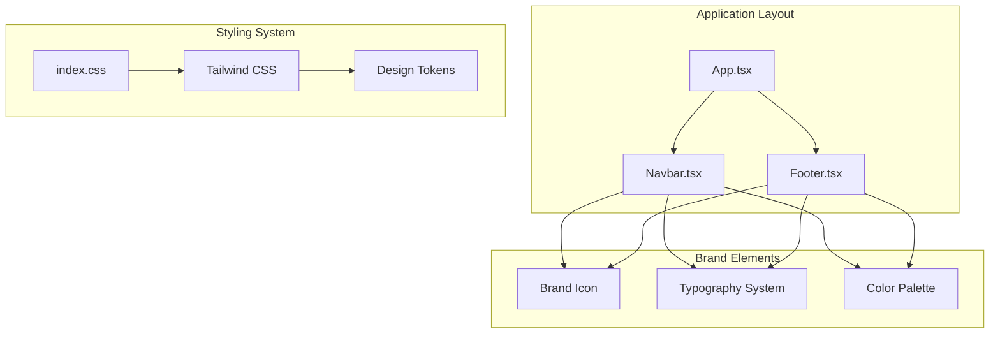
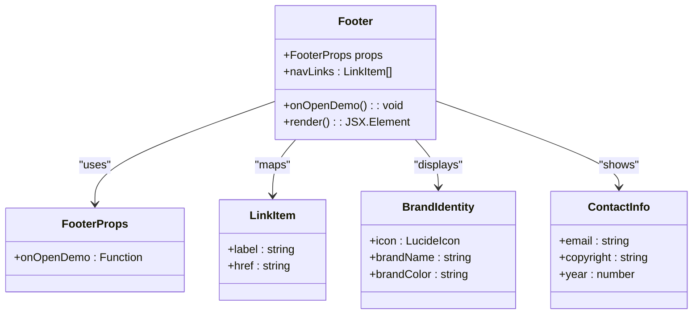
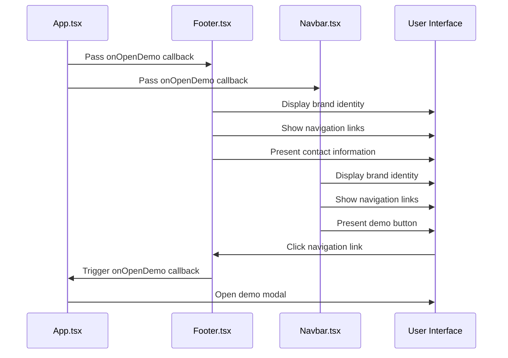
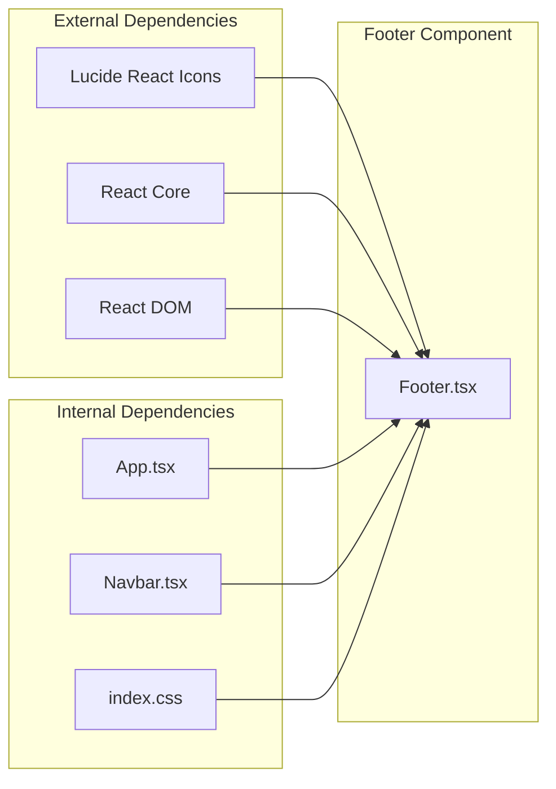

# Footer & Branding

<cite>
**Referenced Files in This Document**
- [Footer.tsx](file://src/components/Footer.tsx)
- [Navbar.tsx](file://src/components/Navbar.tsx)
- [App.tsx](file://src/App.tsx)
- [index.css](file://src/index.css)
- [tailwind.config.js](file://tailwind.config.js)
- [package.json](file://package.json)
</cite>

## Table of Contents
1. [Introduction](#introduction)
2. [Project Structure](#project-structure)
3. [Core Components](#core-components)
4. [Architecture Overview](#architecture-overview)
5. [Detailed Component Analysis](#detailed-component-analysis)
6. [Dependency Analysis](#dependency-analysis)
7. [Performance Considerations](#performance-considerations)
8. [Troubleshooting Guide](#troubleshooting-guide)
9. [Conclusion](#conclusion)

## Introduction
This document provides comprehensive documentation for the footer and branding component, focusing on legal links integration, support resources, social media connections, and brand consistency maintenance. The footer serves as a critical touchpoint for navigation continuity, legal compliance information, and brand identity reinforcement across the application. It maintains visual and functional consistency with the primary navigation while providing essential contact and compliance information.

## Project Structure
The footer component is part of a cohesive React application architecture that emphasizes brand consistency and user experience continuity. The component integrates seamlessly with the main application layout and maintains design system alignment through shared styling and typography.

**Diagram sources**
- [App.tsx:34-47](file://src/App.tsx#L34-L47)
- [Footer.tsx:14-46](file://src/components/Footer.tsx#L14-L46)
- [Navbar.tsx:11-104](file://src/components/Navbar.tsx#L11-L104)

**Section sources**
- [App.tsx:13-51](file://src/App.tsx#L13-L51)
- [Footer.tsx:14-46](file://src/components/Footer.tsx#L14-L46)
- [Navbar.tsx:11-104](file://src/components/Navbar.tsx#L11-L104)

## Core Components
The footer component implements a minimalist yet comprehensive approach to brand presentation and navigation continuity. It features a brand identity element, internal navigation links, and essential contact information positioned for optimal visibility and accessibility.

### Component Architecture
The footer utilizes a responsive two-column layout that transforms from a stacked mobile arrangement to a flexible desktop layout. This design ensures optimal information hierarchy across device sizes while maintaining brand consistency.

**Diagram sources**
- [Footer.tsx:3-5](file://src/components/Footer.tsx#L3-L5)
- [Footer.tsx:7-12](file://src/components/Footer.tsx#L7-L12)
- [Footer.tsx:14-46](file://src/components/Footer.tsx#L14-L46)

**Section sources**
- [Footer.tsx:3-5](file://src/components/Footer.tsx#L3-L5)
- [Footer.tsx:7-12](file://src/components/Footer.tsx#L7-L12)
- [Footer.tsx:14-46](file://src/components/Footer.tsx#L14-L46)

## Architecture Overview
The footer component participates in a broader architectural pattern that emphasizes design system consistency and cross-component communication. The component receives the demo booking callback from the parent application and maintains visual parity with the primary navigation system.

**Diagram sources**
- [App.tsx:34-47](file://src/App.tsx#L34-L47)
- [Footer.tsx:14-46](file://src/components/Footer.tsx#L14-L46)
- [Navbar.tsx:11-104](file://src/components/Navbar.tsx#L11-L104)

**Section sources**
- [App.tsx:34-47](file://src/App.tsx#L34-L47)
- [Footer.tsx:14-46](file://src/components/Footer.tsx#L14-L46)
- [Navbar.tsx:11-104](file://src/components/Navbar.tsx#L11-L104)

## Detailed Component Analysis

### Brand Identity Implementation
The footer establishes brand presence through a carefully crafted combination of visual elements that maintain consistency with the application's design system. The brand identity consists of a geometric icon paired with the brand name, positioned to create immediate recognition while preserving visual hierarchy.

#### Visual Hierarchy and Composition
The brand identity element employs a blue accent color (#3B82F6) that aligns with the application's primary color scheme. The icon maintains proportional relationships with the surrounding typography, ensuring readability across various screen sizes. The brand name "bwork" is presented in a bold, condensed font weight that conveys professionalism and reliability.

#### Responsive Typography System
The typography system applies a consistent scale across the footer component, utilizing relative units and fluid scaling principles. The brand name text maintains optimal legibility through careful consideration of font size, weight, and spacing relationships.

**Section sources**
- [Footer.tsx:18-24](file://src/components/Footer.tsx#L18-L24)
- [Footer.tsx:20-22](file://src/components/Footer.tsx#L20-L22)
- [Footer.tsx:23](file://src/components/Footer.tsx#L23)

### Navigation Continuity
The footer maintains navigation continuity by mirroring the primary navigation structure while adapting to footer-specific constraints. The navigation links provide direct access to key application sections, enabling users to quickly navigate between major content areas.

#### Internal Link Strategy
The navigation implementation uses anchor links that target specific sections within the application. This approach eliminates external dependencies while providing seamless navigation experiences. The link collection maintains consistency with the primary navigation, ensuring users can locate desired content regardless of their current position.

#### Accessibility and Usability
Navigation elements incorporate hover states and focus management that enhance usability across different interaction modes. The link styling provides sufficient contrast ratios and interactive feedback to support diverse user needs and preferences.

**Section sources**
- [Footer.tsx:25-35](file://src/components/Footer.tsx#L25-L35)
- [Footer.tsx:7-12](file://src/components/Footer.tsx#L7-L12)

### Legal Compliance Information
The footer incorporates essential legal compliance information through a structured presentation of contact details and copyright information. This implementation addresses fundamental legal requirements while maintaining aesthetic coherence with the overall design.

#### Contact Information Presentation
Contact information is presented through a clean, minimal interface that emphasizes accessibility and readability. The email address is formatted as a mailto link, enabling direct communication initiation from the footer context. The contact information maintains appropriate spacing and visual hierarchy to prevent overwhelming users.

#### Copyright and Legal Notice Integration
The copyright notice incorporates dynamic year calculation to ensure legal compliance across calendar years. The implementation follows standard legal formatting conventions while maintaining visual consistency with surrounding brand elements.

**Section sources**
- [Footer.tsx:37-43](file://src/components/Footer.tsx#L37-L43)
- [Footer.tsx:38-42](file://src/components/Footer.tsx#L38-L42)

### Support Resource Integration
The footer provides integrated support resource access through strategic placement of contact information and navigation elements. This approach ensures users can quickly access support channels while maintaining focus on core application content.

#### Multi-Channel Support Access
Support resource integration enables users to initiate contact through preferred communication channels. The implementation supports email-based communication while maintaining pathways for additional support resources through the main navigation system.

#### Demo Booking Continuity
The footer maintains continuity with the application's demo booking functionality through shared callback mechanisms. This integration ensures users can access demonstration opportunities regardless of their current location within the application.

**Section sources**
- [Footer.tsx:37-43](file://src/components/Footer.tsx#L37-L43)
- [App.tsx:34-47](file://src/App.tsx#L34-L47)

### Social Media Connections
While the current implementation focuses on core brand identity and legal compliance information, the component structure supports future expansion for social media connections. The layout accommodates additional elements without disrupting existing functionality.

#### Scalable Social Media Integration
The component architecture allows for seamless addition of social media icons and links. The current design maintains adequate spacing and visual hierarchy to accommodate additional elements while preserving the component's primary functionality.

#### Consistent Brand Expression
Any social media integration would maintain consistency with established brand guidelines, ensuring uniform visual treatment across all social platforms and communication channels.

### Brand Consistency Maintenance
The footer component implements comprehensive brand consistency measures through standardized design elements, color systems, and interaction patterns. These measures ensure uniform brand representation across all application contexts.

#### Color System Integration
The footer utilizes the established color palette with specific emphasis on the primary brand color (#3B82F6) for interactive elements. Background treatments employ subtle variations that maintain visual harmony while providing necessary contrast for readability.

#### Typography and Spacing Standards
Typography standards apply consistent font weights, sizes, and spacing relationships throughout the component. These standards ensure readability and visual coherence across different screen sizes and device orientations.

**Section sources**
- [Footer.tsx:16](file://src/components/Footer.tsx#L16)
- [Footer.tsx:30](file://src/components/Footer.tsx#L30)
- [Footer.tsx:31](file://src/components/Footer.tsx#L31)

## Dependency Analysis
The footer component maintains minimal external dependencies while leveraging the established application infrastructure. This approach ensures maintainability and reduces potential points of failure.

**Diagram sources**
- [Footer.tsx:1](file://src/components/Footer.tsx#L1)
- [package.json:13-18](file://package.json#L13-L18)

**Section sources**
- [Footer.tsx:1](file://src/components/Footer.tsx#L1)
- [package.json:13-18](file://package.json#L13-L18)

## Performance Considerations
The footer component implements performance-conscious design patterns that minimize rendering overhead while maximizing user experience quality. These considerations ensure optimal performance across diverse device capabilities and network conditions.

### Rendering Optimization
The component utilizes efficient rendering patterns that minimize DOM manipulation and reflow events. Static elements are rendered without unnecessary state updates, while interactive elements maintain appropriate event handlers for optimal responsiveness.

### Bundle Size Management
Dependency management ensures minimal bundle impact through selective import of icon libraries and React core functionality. This approach maintains application performance while providing necessary visual elements for brand representation.

### Accessibility Performance
Accessibility features are implemented through semantic HTML and proper ARIA attributes, ensuring optimal performance across assistive technologies without compromising visual presentation.

## Troubleshooting Guide
Common issues and solutions for the footer component implementation, focusing on responsive behavior, accessibility compliance, and cross-browser compatibility.

### Responsive Design Issues
- **Problem**: Navigation links collapse unexpectedly on specific screen sizes
- **Solution**: Verify breakpoint configurations in the responsive utility classes and adjust based on design requirements
- **Prevention**: Test responsive behavior across multiple viewport sizes during development

### Accessibility Compliance
- **Problem**: Screen reader compatibility issues with interactive elements
- **Solution**: Ensure proper ARIA labeling and keyboard navigation support for all interactive elements
- **Verification**: Test with assistive technologies and automated accessibility testing tools

### Cross-Browser Compatibility
- **Problem**: Visual inconsistencies across different browser environments
- **Solution**: Validate CSS property support and implement appropriate fallbacks for older browser versions
- **Testing**: Conduct compatibility testing across target browser versions and device combinations

**Section sources**
- [Footer.tsx:16-46](file://src/components/Footer.tsx#L16-L46)
- [index.css:1-125](file://src/index.css#L1-L125)

## Conclusion
The footer and branding component represents a well-architected solution for maintaining brand consistency and providing essential navigation continuity within the application. Through careful attention to design system integration, responsive behavior, and accessibility requirements, the component delivers a professional user experience that reinforces brand identity while meeting legal and compliance obligations.

The component's modular design and minimal dependencies ensure maintainability and scalability, while the responsive architecture supports diverse user contexts and device capabilities. Future enhancements can be implemented with confidence in the established architectural patterns and design system foundations.