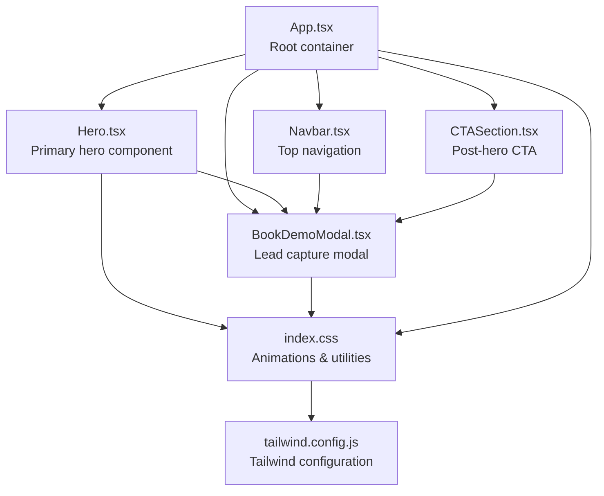
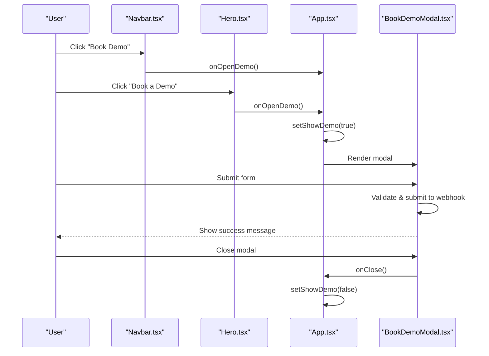
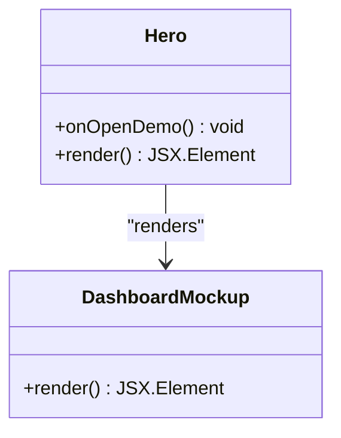
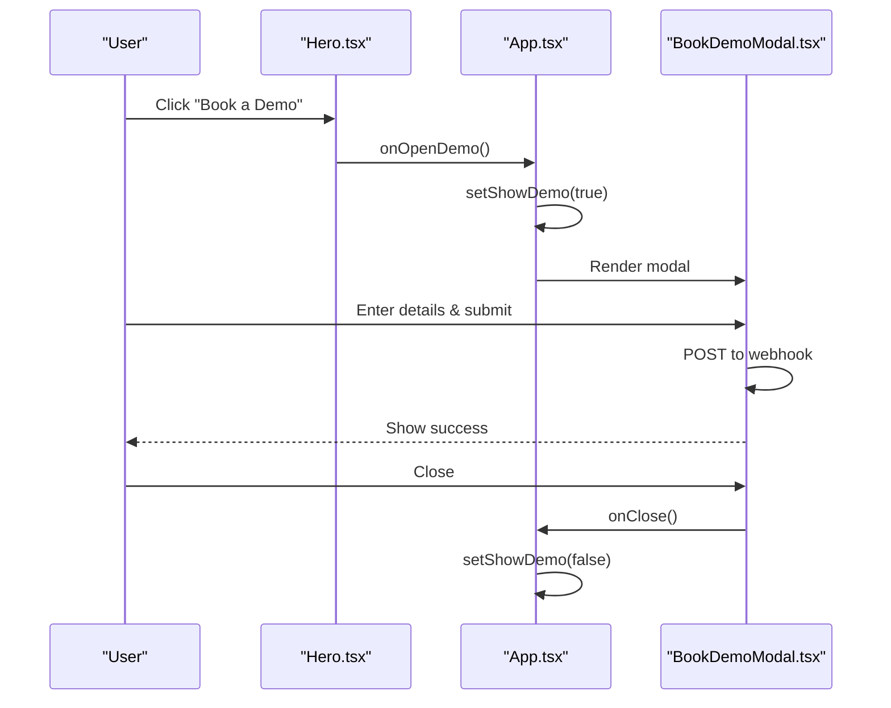
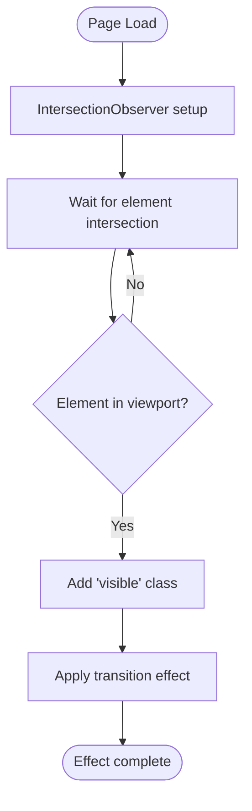
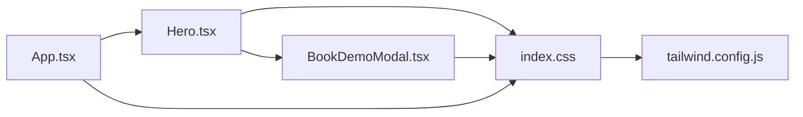

# Hero Section

<cite>
**Referenced Files in This Document**
- [Hero.tsx](file://src/components/Hero.tsx)
- [BookDemoModal.tsx](file://src/components/BookDemoModal.tsx)
- [App.tsx](file://src/App.tsx)
- [useScrollReveal.ts](file://src/hooks/useScrollReveal.ts)
- [index.css](file://src/index.css)
- [tailwind.config.js](file://tailwind.config.js)
- [Navbar.tsx](file://src/components/Navbar.tsx)
- [CTASection.tsx](file://src/components/CTASection.tsx)
</cite>

## Table of Contents
1. [Introduction](#introduction)
2. [Project Structure](#project-structure)
3. [Core Components](#core-components)
4. [Architecture Overview](#architecture-overview)
5. [Detailed Component Analysis](#detailed-component-analysis)
6. [Dependency Analysis](#dependency-analysis)
7. [Performance Considerations](#performance-considerations)
8. [Troubleshooting Guide](#troubleshooting-guide)
9. [Conclusion](#conclusion)
10. [Appendices](#appendices)

## Introduction
The hero section is the primary user engagement point and conversion funnel entry for the procurement workflow product. It establishes the core value proposition through headline messaging, demonstrates trust signals, and drives immediate action via call-to-action buttons. This documentation explains how the hero component communicates the product’s benefits, integrates with the demo booking system, and optimizes lead capture through strategic visual hierarchy, typography scaling, and responsive design patterns.

## Project Structure
The hero section is implemented as a standalone React component and integrates with the application via the main App container. It coordinates with the BookDemoModal for lead capture and uses shared animations and styles from the global stylesheet.

**Diagram sources**
- [App.tsx:13-47](file://src/App.tsx#L13-L47)
- [Hero.tsx:9-93](file://src/components/Hero.tsx#L9-L93)
- [BookDemoModal.tsx:14-207](file://src/components/BookDemoModal.tsx#L14-L207)
- [index.css:13-125](file://src/index.css#L13-L125)
- [tailwind.config.js:1-9](file://tailwind.config.js#L1-L9)

**Section sources**
- [App.tsx:13-47](file://src/App.tsx#L13-L47)
- [Hero.tsx:9-93](file://src/components/Hero.tsx#L9-L93)
- [BookDemoModal.tsx:14-207](file://src/components/BookDemoModal.tsx#L14-L207)
- [index.css:13-125](file://src/index.css#L13-L125)
- [tailwind.config.js:1-9](file://tailwind.config.js#L1-L9)

## Core Components
- Hero component: Displays the headline messaging, trust badges, dashboard mockup, and primary call-to-action button. It also renders a client trust section below the fold.
- BookDemoModal: Handles lead capture via a form submission to a Google Sheets webhook, with loading states and success feedback.
- App container: Orchestrates state for modal visibility and passes callbacks to trigger the demo flow.
- Shared animations and utilities: Provide fade-in, slide-in, and reveal effects for scroll-based engagement.

Key responsibilities:
- Establish visual hierarchy and typography scaling for maximum readability and impact.
- Drive conversions through prominent, accessible CTAs aligned with the product’s workflow-driven positioning.
- Integrate seamlessly with the demo booking system and lead capture optimization.

**Section sources**
- [Hero.tsx:9-93](file://src/components/Hero.tsx#L9-L93)
- [BookDemoModal.tsx:14-207](file://src/components/BookDemoModal.tsx#L14-L207)
- [App.tsx:13-47](file://src/App.tsx#L13-L47)
- [index.css:13-125](file://src/index.css#L13-L125)

## Architecture Overview
The hero section participates in a conversion funnel that begins with the headline and trust signals, progresses through the dashboard mockup, and culminates in the primary CTA. The modal-based demo booking system captures leads and transitions users into the next stage of engagement.

**Diagram sources**
- [App.tsx:14-45](file://src/App.tsx#L14-L45)
- [Hero.tsx:60-68](file://src/components/Hero.tsx#L60-L68)
- [BookDemoModal.tsx:32-63](file://src/components/BookDemoModal.tsx#L32-L63)

## Detailed Component Analysis

### Hero Component
The Hero component is responsible for:
- Presenting the headline messaging with gradient text for emphasis.
- Communicating core value propositions through trust badges.
- Providing a primary call-to-action button that opens the demo modal.
- Displaying a dashboard mockup to illustrate workflow enforcement.
- Rendering a client trust section to reinforce social proof.

Visual hierarchy and typography scaling:
- Headline uses extra-large text sizes with tight leading and reduced tracking for readability.
- Subheadings and paragraphs scale down while maintaining strong contrast and line-height.
- Gradient text highlights key brand messaging for visual emphasis.

Responsive design patterns:
- Grid layout adapts from single-column on small screens to two-column layout on larger screens.
- Flexbox and gap utilities ensure spacing remains consistent across breakpoints.
- Hidden elements on smaller screens prevent visual clutter while preserving content importance.

Call-to-action implementation:
- Primary button uses elevated styling with hover effects and arrow icon animation.
- Button triggers the onOpenDemo callback passed from the parent container.

Integration with demo booking:
- The primary CTA invokes the demo flow, aligning with the overall conversion funnel.
- The modal handles form submission and success feedback, closing automatically upon completion.

Trust signals and dashboard mockup:
- Trust badges communicate reliability and compliance.
- Dashboard mockup visually demonstrates workflow stages and progress tracking.

**Section sources**
- [Hero.tsx:9-93](file://src/components/Hero.tsx#L9-L93)
- [Hero.tsx:95-190](file://src/components/Hero.tsx#L95-L190)

#### Hero Component Class Diagram

**Diagram sources**
- [Hero.tsx:9-93](file://src/components/Hero.tsx#L9-L93)
- [Hero.tsx:95-190](file://src/components/Hero.tsx#L95-L190)

### BookDemoModal Component
The BookDemoModal component manages:
- Form state for name, email, company, phone, and additional information.
- Submission to a configurable Google Sheets webhook endpoint.
- Loading states, error handling, and success feedback.
- Accessibility features including aria labels and keyboard navigation.

Lead capture optimization:
- Minimal form fields reduce friction and increase completion rates.
- Clear success messaging encourages closure and reduces bounce.
- Disabled states during submission improve perceived reliability.

Integration with hero conversion funnel:
- Modal appears immediately after clicking the hero CTA.
- On successful submission, the modal closes and the parent container resets state.

**Section sources**
- [BookDemoModal.tsx:14-207](file://src/components/BookDemoModal.tsx#L14-L207)

#### Demo Booking Sequence

**Diagram sources**
- [Hero.tsx:60-68](file://src/components/Hero.tsx#L60-L68)
- [App.tsx:14-45](file://src/App.tsx#L14-L45)
- [BookDemoModal.tsx:32-63](file://src/components/BookDemoModal.tsx#L32-L63)

### Scroll-Based Effects and Reveal Patterns
The application uses IntersectionObserver to reveal elements as they enter the viewport. The hero component applies fade-in and fade-in-up animations to content blocks, while the App-level hook ensures consistent reveal behavior across sections.

Animation triggers:
- Fade-in-up animations stagger content entrance for visual rhythm.
- Reveal class combined with IntersectionObserver creates smooth, performance-friendly entrance effects.
- Pulse animation on badge indicates activity and reinforces trust.

Styling approaches:
- Tailwind utility classes provide consistent spacing, typography, and color scales.
- Custom animations and gradients enhance visual interest without heavy JavaScript.

**Section sources**
- [useScrollReveal.ts:3-25](file://src/hooks/useScrollReveal.ts#L3-L25)
- [App.tsx:16-32](file://src/App.tsx#L16-L32)
- [index.css:13-78](file://src/index.css#L13-L78)

#### Scroll Reveal Flowchart

**Diagram sources**
- [useScrollReveal.ts:6-22](file://src/hooks/useScrollReveal.ts#L6-L22)
- [index.css:61-70](file://src/index.css#L61-L70)

### Content Customization, Brand Positioning, and Messaging Strategies
Brand positioning:
- Headline messaging emphasizes eliminating chaos through enforced workflow steps.
- Trust badges highlight zero skipped steps, full audit trail, and role-based control.
- Gradient text and blue color scheme convey technology-forwardness and reliability.

Messaging strategies:
- Value-first headlines focus on outcomes (e.g., “Procurement Without the Chaos”).
- Subheadings explain the mechanism behind the benefit.
- Trust badges provide social proof and reassurance.

Content customization examples:
- Headline: Replace with industry-specific pain points or outcomes.
- Trust badges: Adapt to regulatory or compliance contexts.
- Dashboard mockup: Customize workflow stages to match customer processes.

**Section sources**
- [Hero.tsx:35-68](file://src/components/Hero.tsx#L35-L68)
- [Hero.tsx:95-190](file://src/components/Hero.tsx#L95-L190)

## Dependency Analysis
The hero section depends on:
- Parent container for state management and callback propagation.
- Global animations and utilities for visual effects.
- Modal component for lead capture integration.

**Diagram sources**
- [App.tsx:13-47](file://src/App.tsx#L13-L47)
- [Hero.tsx:9-93](file://src/components/Hero.tsx#L9-L93)
- [BookDemoModal.tsx:14-207](file://src/components/BookDemoModal.tsx#L14-L207)
- [index.css:13-125](file://src/index.css#L13-L125)
- [tailwind.config.js:1-9](file://tailwind.config.js#L1-L9)

**Section sources**
- [App.tsx:13-47](file://src/App.tsx#L13-L47)
- [Hero.tsx:9-93](file://src/components/Hero.tsx#L9-L93)
- [BookDemoModal.tsx:14-207](file://src/components/BookDemoModal.tsx#L14-L207)
- [index.css:13-125](file://src/index.css#L13-L125)
- [tailwind.config.js:1-9](file://tailwind.config.js#L1-L9)

## Performance Considerations
- IntersectionObserver-based reveals minimize layout thrashing and improve scroll performance.
- Utility-first Tailwind classes reduce CSS bundle size and enable efficient bundling.
- SVG icons are lightweight and scalable for crisp rendering across devices.
- Staggered animations avoid simultaneous heavy DOM updates, improving perceived performance.

## Troubleshooting Guide
Common issues and resolutions:
- Modal does not open: Verify onOpenDemo callback is passed correctly from the parent container and invoked on hero CTA click.
- Form submission fails: Confirm the Google Sheets webhook URL is configured and reachable; check network errors and server responses.
- Animations not triggering: Ensure elements have the reveal class and IntersectionObserver thresholds are appropriate for the viewport.
- Gradient text not visible: Confirm vendor prefixes and background-clip properties are applied in the stylesheet.

**Section sources**
- [App.tsx:34-45](file://src/App.tsx#L34-L45)
- [Hero.tsx:60-68](file://src/components/Hero.tsx#L60-L68)
- [BookDemoModal.tsx:32-63](file://src/components/BookDemoModal.tsx#L32-L63)
- [index.css:86-91](file://src/index.css#L86-L91)

## Conclusion
The hero section effectively establishes the primary engagement point and conversion funnel by combining compelling headline messaging, trust signals, and a prominent call-to-action. Its integration with the demo booking system streamlines lead capture, while thoughtful visual hierarchy, typography scaling, and responsive design ensure optimal user experience across devices. The use of scroll-based animations and utility-first styling maintains performance and accessibility.

## Appendices
- Animation reference: Fade-in, fade-in-up, slide-in-left, and pulse-slow are defined in the global stylesheet and applied via utility classes.
- Tailwind configuration: The build scans the application for Tailwind directives and utilities, enabling consistent styling across components.

**Section sources**
- [index.css:13-125](file://src/index.css#L13-L125)
- [tailwind.config.js:1-9](file://tailwind.config.js#L1-L9)