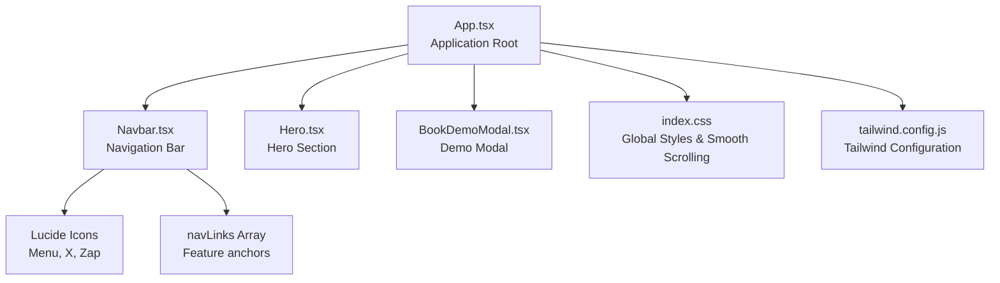
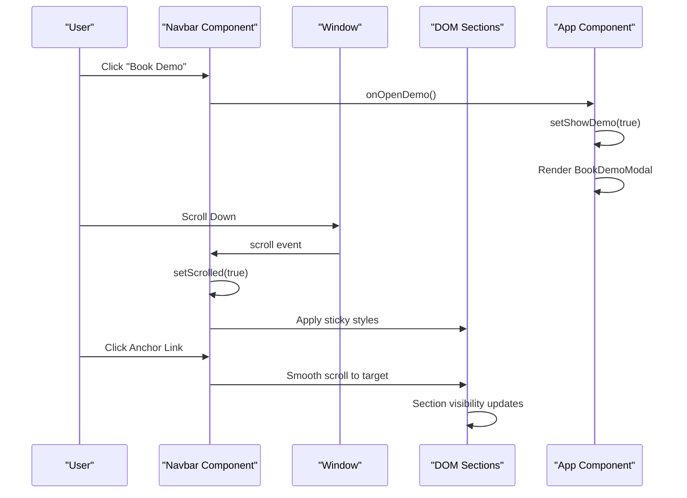
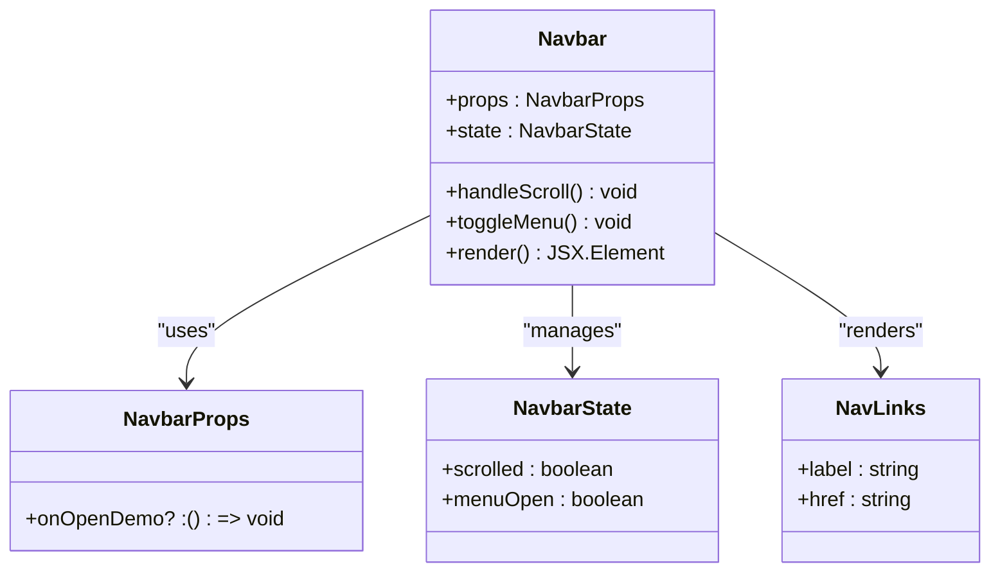
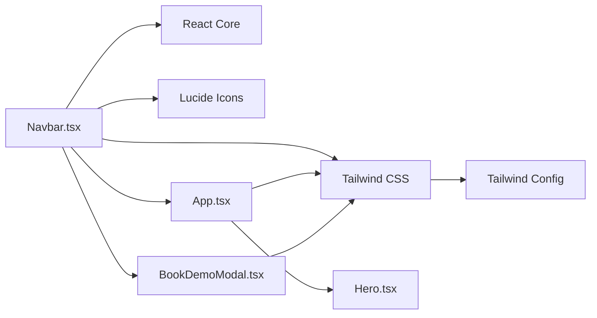

# Navigation System

<cite>
**Referenced Files in This Document**
- [Navbar.tsx](file://src/components/Navbar.tsx)
- [App.tsx](file://src/App.tsx)
- [Hero.tsx](file://src/components/Hero.tsx)
- [BookDemoModal.tsx](file://src/components/BookDemoModal.tsx)
- [useScrollReveal.ts](file://src/hooks/useScrollReveal.ts)
- [index.css](file://src/index.css)
- [tailwind.config.js](file://tailwind.config.js)
- [package.json](file://package.json)
</cite>

## Table of Contents
1. [Introduction](#introduction)
2. [Project Structure](#project-structure)
3. [Core Components](#core-components)
4. [Architecture Overview](#architecture-overview)
5. [Detailed Component Analysis](#detailed-component-analysis)
6. [Dependency Analysis](#dependency-analysis)
7. [Performance Considerations](#performance-considerations)
8. [Troubleshooting Guide](#troubleshooting-guide)
9. [Conclusion](#conclusion)
10. [Appendices](#appendices)

## Introduction
This document provides comprehensive documentation for the navigation system component, focusing on the Navbar implementation. It covers sticky header behavior, scroll detection, responsive mobile menu, smooth scrolling functionality, component props interface, state management with React hooks, scroll event handling, mobile-responsive design with hamburger menu toggle, backdrop blur effects, conditional styling based on scroll position, accessibility considerations, keyboard navigation support, screen reader compatibility, and customization options using Tailwind CSS classes.

## Project Structure
The navigation system is primarily implemented in the Navbar component and integrates with the application layout and other components. The Navbar is rendered at the top of the page and coordinates with the BookDemoModal for demo requests.

**Diagram sources**
- [App.tsx:13-48](file://src/App.tsx#L13-L48)
- [Navbar.tsx:11-106](file://src/components/Navbar.tsx#L11-L106)
- [Hero.tsx:9-93](file://src/components/Hero.tsx#L9-L93)
- [BookDemoModal.tsx:14-207](file://src/components/BookDemoModal.tsx#L14-L207)
- [index.css:1-125](file://src/index.css#L1-L125)
- [tailwind.config.js:1-9](file://tailwind.config.js#L1-L9)

**Section sources**
- [App.tsx:13-48](file://src/App.tsx#L13-L48)
- [Navbar.tsx:11-106](file://src/components/Navbar.tsx#L11-L106)
- [Hero.tsx:9-93](file://src/components/Hero.tsx#L9-L93)
- [BookDemoModal.tsx:14-207](file://src/components/BookDemoModal.tsx#L14-L207)
- [index.css:1-125](file://src/index.css#L1-L125)
- [tailwind.config.js:1-9](file://tailwind.config.js#L1-L9)

## Core Components
The navigation system centers around the Navbar component, which manages:
- Sticky header behavior with scroll detection
- Responsive mobile menu with hamburger toggle
- Backdrop blur effects and conditional styling
- Smooth scrolling to anchor targets
- Demo request integration via modal

Key implementation aspects:
- Scroll detection using window scroll events
- State management with useState and useEffect hooks
- Conditional Tailwind CSS classes for visual states
- Integration with Lucide icons for menu and close actions
- Anchor-based navigation to sections within the page

**Section sources**
- [Navbar.tsx:11-106](file://src/components/Navbar.tsx#L11-L106)
- [index.css:9-11](file://src/index.css#L9-L11)

## Architecture Overview
The Navbar integrates with the application through prop-based callbacks and global CSS for smooth scrolling. The component listens to scroll events to adjust its appearance and provides navigation anchors that trigger smooth scrolling.

**Diagram sources**
- [Navbar.tsx:11-106](file://src/components/Navbar.tsx#L11-L106)
- [App.tsx:14-48](file://src/App.tsx#L14-L48)
- [index.css:9-11](file://src/index.css#L9-L11)

## Detailed Component Analysis

### Navbar Component Implementation
The Navbar component implements a fixed-position navigation bar with dynamic styling based on scroll position and responsive behavior for mobile devices.

#### Props Interface
- onOpenDemo?: () => void - Optional callback for demo requests

#### State Management
- scrolled: boolean - Tracks whether the user has scrolled past a threshold
- menuOpen: boolean - Controls mobile menu visibility

#### Scroll Detection Logic
The component sets up a scroll event listener during mount and cleans it up on unmount. Scroll threshold is configured at 20 pixels.

#### Mobile Menu Behavior
- Hamburger menu appears on medium screens and below
- Toggle button switches between Menu and X icons
- Mobile menu overlays content with backdrop styling
- Menu items include anchor links to page sections

#### Smooth Scrolling Integration
Smooth scrolling is enabled globally via CSS, allowing seamless navigation between sections when clicking anchor links.

#### Accessibility Considerations
- Close button in modal includes aria-label for screen readers
- Menu toggle button uses semantic button elements
- Focus management remains standard for interactive elements

**Diagram sources**
- [Navbar.tsx:11-106](file://src/components/Navbar.tsx#L11-L106)

**Section sources**
- [Navbar.tsx:11-106](file://src/components/Navbar.tsx#L11-L106)
- [index.css:9-11](file://src/index.css#L9-L11)

### Mobile-Responsive Design
The Navbar implements responsive behavior through Tailwind CSS breakpoints:
- Desktop: Hidden menu with horizontal navigation links
- Mobile: Hamburger menu with vertical overlay
- Conditional styling based on scroll position affects both desktop and mobile states

#### Backdrop Blur Effects
The component applies backdrop blur to the navbar when scrolled, creating a frosted glass effect using Tailwind utilities.

#### Conditional Styling
Styling changes include:
- Background transitions from transparent to white with backdrop blur
- Text color adjustments for contrast in different states
- Border styling for visual separation from content

**Section sources**
- [Navbar.tsx:22-27](file://src/components/Navbar.tsx#L22-L27)
- [Navbar.tsx:69-76](file://src/components/Navbar.tsx#L69-L76)

### Smooth Scrolling Functionality
Smooth scrolling is implemented through CSS configuration:
- Global smooth scrolling behavior for all anchor navigations
- Automatic scroll snapping to section boundaries
- Seamless transitions between navigation states

**Section sources**
- [index.css:9-11](file://src/index.css#L9-L11)

### Demo Integration
The Navbar integrates with the BookDemoModal through prop callbacks:
- Demo button triggers modal opening
- Mobile menu includes demo option with automatic menu closure
- Consistent styling and behavior across desktop and mobile views

**Section sources**
- [App.tsx:36-45](file://src/App.tsx#L36-L45)
- [BookDemoModal.tsx:14-207](file://src/components/BookDemoModal.tsx#L14-L207)

## Dependency Analysis
The navigation system relies on several external libraries and internal components:

**Diagram sources**
- [Navbar.tsx:1-2](file://src/components/Navbar.tsx#L1-L2)
- [App.tsx:1-11](file://src/App.tsx#L1-L11)
- [BookDemoModal.tsx:1-2](file://src/components/BookDemoModal.tsx#L1-L2)
- [tailwind.config.js:1-9](file://tailwind.config.js#L1-L9)

**Section sources**
- [Navbar.tsx:1-2](file://src/components/Navbar.tsx#L1-L2)
- [App.tsx:1-11](file://src/App.tsx#L1-L11)
- [BookDemoModal.tsx:1-2](file://src/components/BookDemoModal.tsx#L1-L2)
- [tailwind.config.js:1-9](file://tailwind.config.js#L1-L9)
- [package.json:13-17](file://package.json#L13-L17)

## Performance Considerations
- Scroll event listeners are efficiently cleaned up on component unmount
- Minimal re-renders through targeted state updates
- CSS-based animations and transitions for smooth visual changes
- Lazy loading considerations for icon components

## Troubleshooting Guide
Common issues and solutions:
- Scroll event not firing: Verify component is mounted and cleanup occurs properly
- Mobile menu not closing: Ensure menuOpen state is toggled correctly
- Smooth scrolling not working: Check global CSS configuration for scroll-behavior
- Icon rendering issues: Confirm Lucide icons are properly installed and imported
- Modal not appearing: Verify onOpenDemo prop is passed correctly from parent component

**Section sources**
- [Navbar.tsx:15-19](file://src/components/Navbar.tsx#L15-L19)
- [index.css:9-11](file://src/index.css#L9-L11)
- [package.json:13-17](file://package.json#L13-L17)

## Conclusion
The navigation system provides a robust, accessible, and visually appealing navigation experience. Its implementation demonstrates clean separation of concerns, efficient state management, and seamless integration with other application components. The responsive design ensures optimal usability across device sizes, while the smooth scrolling functionality enhances user experience.

## Appendices

### Customization Options
The Navbar can be customized through Tailwind CSS classes for:
- Colors: text-slate-900, bg-blue-600, backdrop-blur-md
- Typography: text-xl, font-extrabold, tracking-tight
- Spacing: px-6, py-2, gap-3
- Borders: border-slate-100, border-b
- Shadows: shadow-sm, shadow-lg

### Integration Patterns
- Pass onOpenDemo callback from parent component to handle demo requests
- Use anchor links (#features, #how-it-works, #why-bwork, #pricing) for section navigation
- Combine with other components through the App component layout
- Leverage global CSS for consistent smooth scrolling behavior

### Accessibility Best Practices
- Maintain semantic HTML structure with proper heading hierarchy
- Ensure sufficient color contrast in both scrolled and unscrolled states
- Provide clear focus indicators for interactive elements
- Use descriptive labels for buttons and links
- Test keyboard navigation and screen reader compatibility