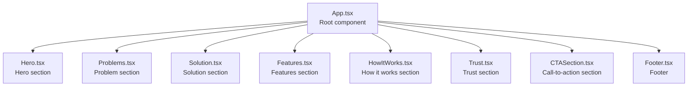
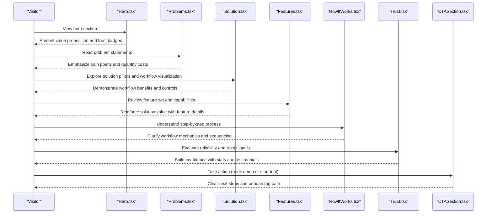
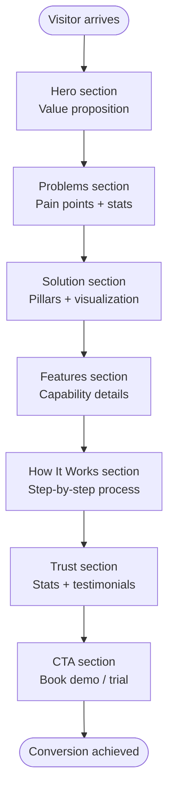
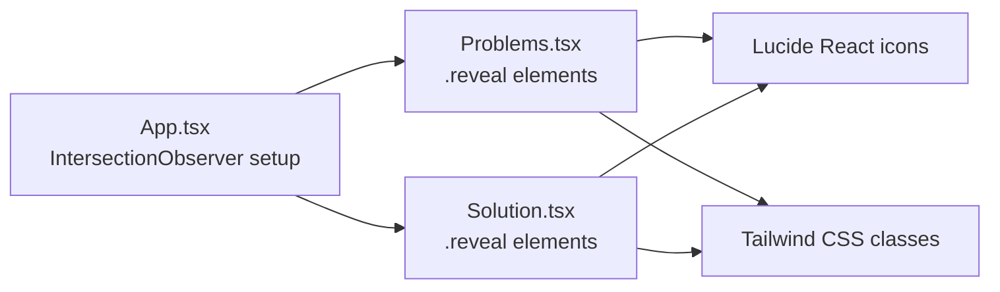

# Problem & Solution Sections

<cite>
**Referenced Files in This Document**
- [Problems.tsx](file://src/components/Problems.tsx)
- [Solution.tsx](file://src/components/Solution.tsx)
- [App.tsx](file://src/App.tsx)
- [Hero.tsx](file://src/components/Hero.tsx)
- [Features.tsx](file://src/components/Features.tsx)
- [HowItWorks.tsx](file://src/components/HowItWorks.tsx)
- [CTASection.tsx](file://src/components/CTASection.tsx)
- [Trust.tsx](file://src/components/Trust.tsx)
- [Footer.tsx](file://src/components/Footer.tsx)
</cite>

## Table of Contents
1. [Introduction](#introduction)
2. [Project Structure](#project-structure)
3. [Core Components](#core-components)
4. [Architecture Overview](#architecture-overview)
5. [Detailed Component Analysis](#detailed-component-analysis)
6. [Dependency Analysis](#dependency-analysis)
7. [Performance Considerations](#performance-considerations)
8. [Troubleshooting Guide](#troubleshooting-guide)
9. [Conclusion](#conclusion)

## Introduction
This document provides comprehensive documentation for the Problem and Solution components that drive the procurement conversion funnel. It explains how the Problems component effectively communicates procurement challenges and pain points to target audiences, and how the Solution component presents ERP workflow benefits while addressing those problems. It also covers comparative content strategy, problem-solution storytelling patterns, and value proposition articulation, including examples of problem statement construction, solution feature highlighting, and differentiation messaging. Finally, it documents the integration between these components and their role in the overall conversion funnel.

## Project Structure
The application is structured as a React single-page application with a clear conversion funnel. The Problems and Solution components are positioned early in the page flow to establish the problem-solution narrative and guide users toward engagement.

**Diagram sources**
- [App.tsx:13-48](file://src/App.tsx#L13-L48)
- [Problems.tsx:31-99](file://src/components/Problems.tsx#L31-L99)
- [Solution.tsx:21-75](file://src/components/Solution.tsx#L21-L75)

**Section sources**
- [App.tsx:13-48](file://src/App.tsx#L13-L48)

## Core Components
This section focuses on the Problem and Solution components and their role in the conversion funnel.

- Problems component:
  - Purpose: Establishes the problem landscape by enumerating procurement pain points and demonstrating their real-world impact.
  - Structure: A headline and introductory paragraph, followed by four problem cards with icons, titles, and descriptions. It concludes with a statistics panel that quantifies the problem’s business impact.
  - Visual design: Uses red accents and subtle animations to draw attention to the problem statements and statistics.

- Solution component:
  - Purpose: Presents the ERP workflow solution with three pillars that directly address the problems enumerated in the Problems component.
  - Structure: A headline and explanatory paragraph, followed by three solution pillars with icons, titles, and descriptions. It includes a workflow visualization and a call-to-action link.
  - Visual design: Blue-themed layout with interactive hover states and a live workflow visualization to demonstrate the solution in action.

**Section sources**
- [Problems.tsx:4-29](file://src/components/Problems.tsx#L4-L29)
- [Problems.tsx:31-99](file://src/components/Problems.tsx#L31-L99)
- [Solution.tsx:3-19](file://src/components/Solution.tsx#L3-L19)
- [Solution.tsx:21-75](file://src/components/Solution.tsx#L21-L75)

## Architecture Overview
The Problems and Solution components are integrated into the overall conversion funnel. They work together to create a compelling narrative that moves prospects from awareness of problems to understanding of solutions and finally to engagement.

**Diagram sources**
- [Hero.tsx:9-93](file://src/components/Hero.tsx#L9-L93)
- [Problems.tsx:31-99](file://src/components/Problems.tsx#L31-L99)
- [Solution.tsx:21-75](file://src/components/Solution.tsx#L21-L75)
- [Features.tsx:77-145](file://src/components/Features.tsx#L77-L145)
- [HowItWorks.tsx:91-197](file://src/components/HowItWorks.tsx#L91-L197)
- [Trust.tsx:49-134](file://src/components/Trust.tsx#L49-L134)
- [CTASection.tsx:3-99](file://src/components/CTASection.tsx#L3-L99)

## Detailed Component Analysis

### Problems Component Analysis
The Problems component establishes the problem-solution narrative by presenting four distinct procurement pain points, each with a visual icon, title, and description. It then reinforces the business impact with a statistics panel that quantifies the problem’s cost.

Key characteristics:
- Problem enumeration: Four problems are presented with clear, relatable titles and descriptions that mirror common procurement challenges.
- Visual reinforcement: Each problem is accompanied by a relevant icon and a colored container to visually distinguish each issue.
- Business impact: The statistics panel highlights measurable costs associated with the problems, such as approval record gaps, cycle time increases, and audit failure rates.
- Progressive disclosure: The component uses a reveal effect to animate content as the user scrolls into view.

Content strategy:
- Problem statement construction: Each problem statement is concise, actionable, and framed around a specific pain point (e.g., approvals in email threads, lack of visibility, budget surprises, zero audit trail).
- Comparative content: The statistics panel provides comparative data that contrasts current reality with potential outcomes, emphasizing the cost of inaction.
- Value proposition articulation: The component positions the solution as a way to regain control and reduce risk.

Integration with conversion funnel:
- Awareness: The Problems component raises awareness of procurement inefficiencies and their consequences.
- Anticipation: The statistics panel builds urgency by quantifying the cost of problems.
- Foundation: The component sets the stage for the Solution component by clearly defining the issues the solution addresses.

**Section sources**
- [Problems.tsx:4-29](file://src/components/Problems.tsx#L4-L29)
- [Problems.tsx:31-99](file://src/components/Problems.tsx#L31-L99)

### Solution Component Analysis
The Solution component presents the ERP workflow solution through three pillars that directly address the problems outlined in the Problems component. It includes a workflow visualization to demonstrate how the solution operates in practice.

Key characteristics:
- Solution pillars: Three pillars—enforced workflow, role-based gates, and data at every step—provide a clear framework for understanding the solution’s benefits.
- Workflow visualization: A live workflow visualization illustrates the step-by-step process, showing roles, actions, and metrics to reinforce the solution’s effectiveness.
- Call-to-action: The component invites users to explore how the workflow engine works, guiding them deeper into the product narrative.
- Visual design: Blue-themed layout with hover effects and a live indicator to emphasize the dynamic nature of the solution.

Content strategy:
- Solution feature highlighting: Each pillar emphasizes a specific benefit that directly counters a problem from the Problems component.
- Differentiation messaging: The solution differentiates itself by focusing on determinism, accountability, and workflow enforcement rather than generic tools.
- Value proposition articulation: The component frames the solution as a procurement engine that runs by the rules, ensuring consistency and compliance.

Integration with conversion funnel:
- Understanding: The Solution component helps visitors understand how the product solves the problems they identified.
- Engagement: The workflow visualization and call-to-action encourage deeper engagement with the product.
- Preparation: The component prepares users for subsequent sections that provide more details and reassurance.

**Section sources**
- [Solution.tsx:3-19](file://src/components/Solution.tsx#L3-L19)
- [Solution.tsx:21-75](file://src/components/Solution.tsx#L21-L75)
- [Solution.tsx:77-130](file://src/components/Solution.tsx#L77-L130)

### Comparative Content Strategy and Storytelling Patterns
The Problems and Solution components employ a comparative content strategy that contrasts current pain points with potential benefits. The storytelling pattern follows a clear arc:
- Recognition: Problems component identifies specific issues.
- Consequences: Statistics illustrate the cost of inaction.
- Resolution: Solution component proposes a structured, deterministic approach.
- Validation: Subsequent sections (Features, How It Works, Trust) provide evidence and reassurance.

Examples:
- Problem statement construction: Each problem statement is framed around a specific pain point and includes a quantified impact.
- Solution feature highlighting: Each solution pillar directly addresses a problem from the Problems component.
- Differentiation messaging: The solution emphasizes workflow enforcement, role-based controls, and data-driven insights as differentiators.

**Section sources**
- [Problems.tsx:4-29](file://src/components/Problems.tsx#L4-L29)
- [Problems.tsx:82-93](file://src/components/Problems.tsx#L82-L93)
- [Solution.tsx:3-19](file://src/components/Solution.tsx#L3-L19)

### Integration Between Components and Conversion Funnel
The Problems and Solution components are strategically placed to guide users through the conversion funnel:
- Problems component: Establishes the problem and quantifies its cost, creating a sense of urgency.
- Solution component: Introduces the solution and demonstrates its benefits through pillars and a workflow visualization.
- Supporting sections: Features, How It Works, Trust, and CTA sections reinforce the narrative and provide additional evidence and next steps.

**Diagram sources**
- [Hero.tsx:9-93](file://src/components/Hero.tsx#L9-L93)
- [Problems.tsx:31-99](file://src/components/Problems.tsx#L31-L99)
- [Solution.tsx:21-75](file://src/components/Solution.tsx#L21-L75)
- [Features.tsx:77-145](file://src/components/Features.tsx#L77-L145)
- [HowItWorks.tsx:91-197](file://src/components/HowItWorks.tsx#L91-L197)
- [Trust.tsx:49-134](file://src/components/Trust.tsx#L49-L134)
- [CTASection.tsx:3-99](file://src/components/CTASection.tsx#L3-L99)

## Dependency Analysis
The Problems and Solution components depend on shared design patterns and global scroll-reveal effects established in the root App component. Both components leverage:
- IntersectionObserver for scroll-triggered animations.
- Tailwind CSS classes for responsive layouts and visual consistency.
- Lucide React icons for visual reinforcement.

**Diagram sources**
- [App.tsx:16-32](file://src/App.tsx#L16-L32)
- [Problems.tsx:31-99](file://src/components/Problems.tsx#L31-L99)
- [Solution.tsx:21-75](file://src/components/Solution.tsx#L21-L75)

**Section sources**
- [App.tsx:16-32](file://src/App.tsx#L16-L32)
- [Problems.tsx:31-99](file://src/components/Problems.tsx#L31-L99)
- [Solution.tsx:21-75](file://src/components/Solution.tsx#L21-L75)

## Performance Considerations
- Scroll animations: The IntersectionObserver setup in the root App component triggers animations for all elements with the reveal class. This ensures smooth performance by limiting the number of observers and using efficient thresholds.
- Lazy loading: The workflow visualization in the Solution component is rendered as a separate component, reducing initial render overhead.
- Minimal re-renders: Both Problems and Solution components are pure functional components that rely on props and minimal state, minimizing unnecessary re-renders.

## Troubleshooting Guide
Common issues and resolutions:
- Animations not triggering: Ensure that elements have the reveal class and that the IntersectionObserver is initialized in the root App component.
- Icon rendering issues: Verify that Lucide React is installed and that icons are imported correctly in the respective components.
- Layout inconsistencies: Confirm that Tailwind CSS classes are applied consistently and that responsive breakpoints are configured as intended.

**Section sources**
- [App.tsx:16-32](file://src/App.tsx#L16-L32)
- [Problems.tsx:1-1](file://src/components/Problems.tsx#L1-L1)
- [Solution.tsx:1-1](file://src/components/Solution.tsx#L1-L1)

## Conclusion
The Problems and Solution components form the backbone of the conversion funnel by establishing a clear problem-solution narrative and demonstrating the value of the ERP workflow solution. Through comparative content, storytelling patterns, and visual reinforcement, these components guide users from awareness of procurement challenges to understanding of the solution and ultimately to engagement. Their integration with supporting sections ensures a cohesive, persuasive journey that drives conversions.