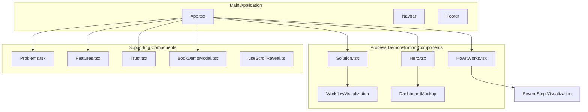
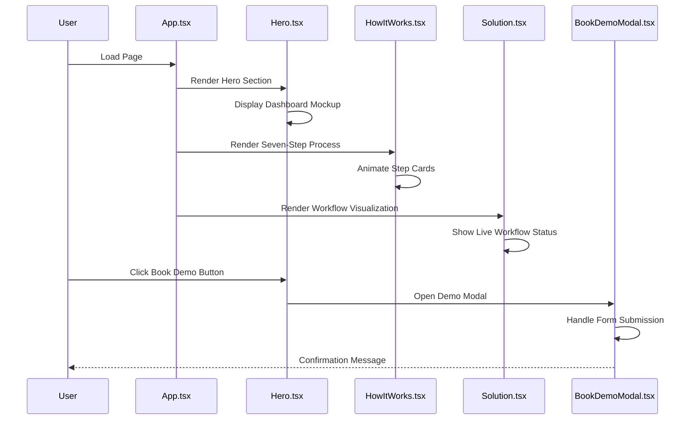
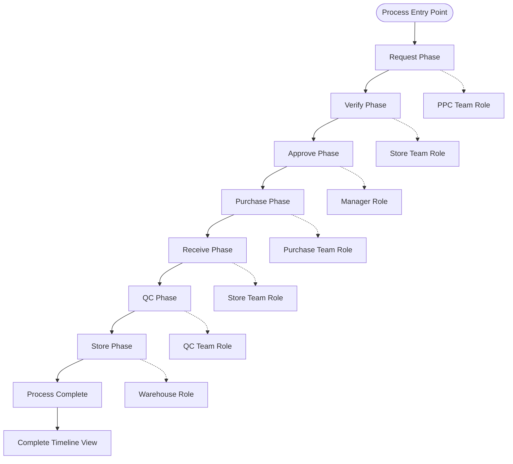
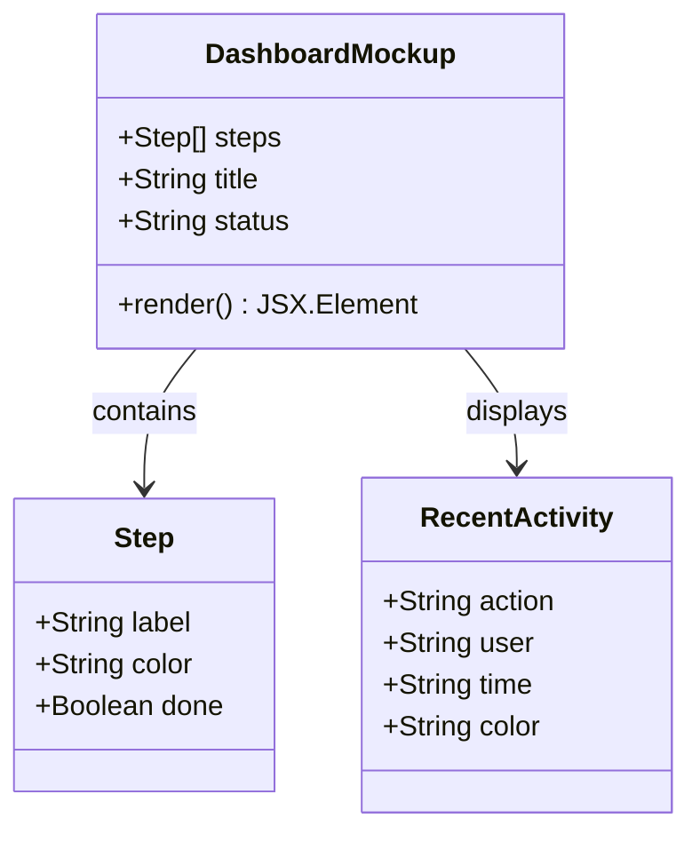
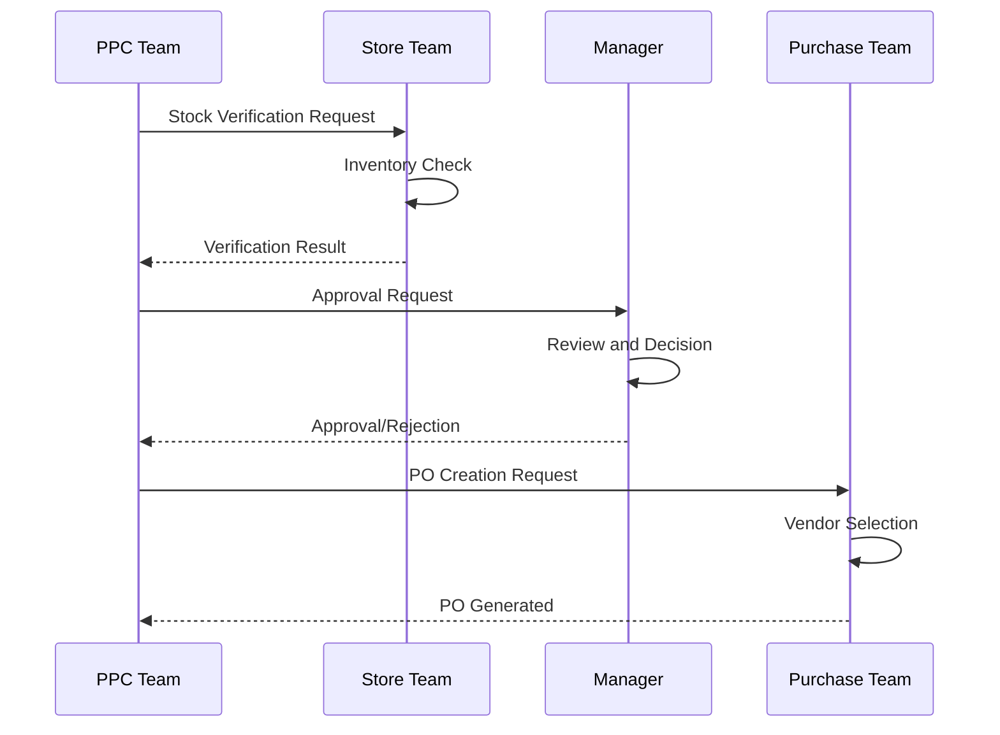

# Process & Workflow Demonstration

<cite>
**Referenced Files in This Document**
- [HowItWorks.tsx](file://src/components/HowItWorks.tsx)
- [Hero.tsx](file://src/components/Hero.tsx)
- [Solution.tsx](file://src/components/Solution.tsx)
- [App.tsx](file://src/App.tsx)
- [useScrollReveal.ts](file://src/hooks/useScrollReveal.ts)
- [BookDemoModal.tsx](file://src/components/BookDemoModal.tsx)
- [Features.tsx](file://src/components/Features.tsx)
- [Problems.tsx](file://src/components/Problems.tsx)
- [Trust.tsx](file://src/components/Trust.tsx)
</cite>

## Table of Contents
1. [Introduction](#introduction)
2. [Project Structure](#project-structure)
3. [Core Components](#core-components)
4. [Architecture Overview](#architecture-overview)
5. [Detailed Component Analysis](#detailed-component-analysis)
6. [Visual Design Elements](#visual-design-elements)
7. [Process Flow Implementation](#process-flow-implementation)
8. [Interactive Elements](#interactive-elements)
9. [Automation Benefits Communication](#automation-benefits-communication)
10. [Performance Considerations](#performance-considerations)
11. [Troubleshooting Guide](#troubleshooting-guide)
12. [Conclusion](#conclusion)

## Introduction

The Process & Workflow Demonstration component is a comprehensive visualization system designed to communicate the complexities of ERP (Enterprise Resource Planning) processes in an accessible, digestible format. This component transforms intricate procurement workflows into clear, step-by-step visualizations that reduce perceived complexity and build user confidence in adopting workflow-driven systems.

The demonstration focuses on seven core steps in the procurement process: Request, Verify, Approve, Purchase, Receive, QC (Quality Control), and Store. Each step is carefully designed to show not just what happens, but why it matters and how it fits into the larger organizational ecosystem.

## Project Structure

The process demonstration system is built as a cohesive React application with specialized components for different aspects of workflow communication:

**Diagram sources**
- [App.tsx:13-47](file://src/App.tsx#L13-L47)
- [Hero.tsx:95-190](file://src/components/Hero.tsx#L95-L190)
- [Solution.tsx:77-130](file://src/components/Solution.tsx#L77-L130)
- [HowItWorks.tsx:11-89](file://src/components/HowItWorks.tsx#L11-L89)

**Section sources**
- [App.tsx:1-51](file://src/App.tsx#L1-L51)
- [package.json:1-36](file://package.json#L1-L36)

## Core Components

The process demonstration system consists of several interconnected components, each serving a specific purpose in communicating workflow complexity and benefits:

### Seven-Step Workflow Visualization
The centerpiece of the demonstration, showcasing the complete procurement lifecycle through seven distinct phases, each with specific roles, responsibilities, and visual indicators.

### Dashboard Mockup
A realistic simulation of the live workflow interface, demonstrating real-time progress tracking, recent activity feeds, and status indicators.

### Workflow Visualization
A simplified representation focusing on the core four-stage workflow (PPC, Store, Manager, Purchase) to illustrate the enforcement mechanism.

### Problem-Awareness Components
Supporting components that establish the problem context and demonstrate the gap between current chaotic processes and the proposed solution.

**Section sources**
- [HowItWorks.tsx:11-89](file://src/components/HowItWorks.tsx#L11-L89)
- [Hero.tsx:95-190](file://src/components/Hero.tsx#L95-L190)
- [Solution.tsx:77-130](file://src/components/Solution.tsx#L77-L130)

## Architecture Overview

The process demonstration architecture follows a component-based approach with clear separation of concerns:

**Diagram sources**
- [App.tsx:34-47](file://src/App.tsx#L34-L47)
- [Hero.tsx:61-68](file://src/components/Hero.tsx#L61-L68)
- [BookDemoModal.tsx:14-63](file://src/components/BookDemoModal.tsx#L14-L63)

The architecture emphasizes progressive disclosure of information, starting with high-level concepts and gradually revealing more detailed process information. The system uses intersection observers for scroll-triggered animations and maintains a clean separation between demonstration content and functional components.

## Detailed Component Analysis

### Seven-Step Workflow Component

The seven-step workflow component serves as the primary demonstration vehicle, transforming complex ERP processes into digestible visual chunks:

**Diagram sources**
- [HowItWorks.tsx:11-89](file://src/components/HowItWorks.tsx#L11-L89)

Each step includes:
- **Visual Indicators**: Color-coded icons and badges representing the step number and responsible role
- **Role Assignment**: Clear identification of which team or individual handles each phase
- **Description Text**: Concise explanations of what occurs during each step
- **Progressive Disclosure**: Desktop shows detailed descriptions while mobile displays condensed information

**Section sources**
- [HowItWorks.tsx:91-197](file://src/components/HowItWorks.tsx#L91-L197)

### Dashboard Mockup Component

The dashboard mockup provides a realistic simulation of the live workflow interface, demonstrating real-time progress tracking and status indicators:

**Diagram sources**
- [Hero.tsx:95-190](file://src/components/Hero.tsx#L95-L190)

The mockup includes:
- **Progress Bars**: Visual indicators showing completion status across all seven steps
- **Recent Activity Feed**: Timestamped records of actions taken
- **Status Indicators**: Real-time updates on workflow state
- **Budget Tracking**: Visual indicators for compliance monitoring

**Section sources**
- [Hero.tsx:95-190](file://src/components/Hero.tsx#L95-L190)

### Workflow Visualization Component

The simplified workflow visualization focuses on the core enforcement mechanism, showing the logical progression from request to purchase:

**Diagram sources**
- [Solution.tsx:77-130](file://src/components/Solution.tsx#L77-L130)

**Section sources**
- [Solution.tsx:77-130](file://src/components/Solution.tsx#L77-L130)

## Visual Design Elements

The process demonstration employs a sophisticated visual design system that enhances comprehension and engagement:

### Color-Coded Progress System
Each step in the seven-step process uses a distinct color palette that conveys meaning and creates visual hierarchy:
- **Blue shades**: Initial request and approval phases
- **Cyan accents**: Purchase and transaction phases  
- **Teal/green**: Quality control and receipt phases
- **Gray/slate**: Final storage and archival phases

### Typography Hierarchy
The design establishes clear visual hierarchy through strategic typography:
- **Step Numbers**: Prominent 16-14px circular badges with white text
- **Step Labels**: Bold 14-16px text for primary identification
- **Role Badges**: Small, pill-shaped indicators with contextual colors
- **Descriptions**: Subtle 12px text optimized for readability

### Interactive Elements
The component incorporates subtle animations and interactions:
- **Hover Effects**: Scale transformations on step cards (110% on hover)
- **Progressive Animation**: Staggered entrance animations for sequential steps
- **Responsive Design**: Mobile-first approach with stacked layouts
- **Touch-Friendly**: Ample spacing and sizing for mobile interaction

### Layout Patterns
The design adapts seamlessly across screen sizes:
- **Desktop**: Seven-column grid with detailed descriptions
- **Tablet**: Optimized two-tier layout with reduced detail
- **Mobile**: Vertical stack with simplified information hierarchy

**Section sources**
- [HowItWorks.tsx:105-162](file://src/components/HowItWorks.tsx#L105-L162)

## Process Flow Implementation

The component implements a comprehensive process flow system that demonstrates workflow enforcement and automation benefits:

### Step Definition Structure
Each process step follows a standardized definition pattern:
- **Number**: Two-digit sequential identifier
- **Icon**: Lucide-react icon representing the step concept
- **Label**: Brief descriptive name
- **Role**: Responsible team or individual
- **Description**: Detailed explanation of activities
- **Color Scheme**: Consistent visual identity

### Timeline Presentation
The system presents process information through multiple temporal perspectives:
- **Sequential Timeline**: Seven-step progression showing logical order
- **Real-time Dashboard**: Live status updates and recent activity
- **Historical Trail**: Complete audit log of all process changes

### User Journey Mapping
The component maps the complete user journey from initial request to final storage:
- **Request Phase**: PPC team initiates material needs
- **Verification Phase**: Store team confirms availability
- **Approval Phase**: Manager reviews and authorizes
- **Execution Phase**: Purchase team completes transactions
- **Receipt Phase**: Store team validates deliveries
- **Quality Phase**: QC team ensures standards compliance
- **Archival Phase**: Warehouse stores materials

**Section sources**
- [HowItWorks.tsx:11-89](file://src/components/HowItWorks.tsx#L11-L89)

## Interactive Elements

The process demonstration includes several interactive elements designed to enhance user engagement and understanding:

### Scroll-Triggered Animations
The intersection observer system triggers animations as users scroll through the page:
- **Progressive Entrance**: Steps fade in sequentially as they come into view
- **Staggered Timing**: Each step enters after a brief delay (200-400ms)
- **Threshold Control**: Animations trigger when 10% of element is visible

### Hover Interactions
Subtle hover effects provide feedback and emphasis:
- **Scale Transforms**: Step cards expand slightly (110% scale)
- **Shadow Enhancements**: Depth increases with elevation
- **Color Adjustments**: Dynamic color changes on interaction

### Responsive Adaptations
The component gracefully adapts to different screen sizes:
- **Mobile Stack**: Vertical layout with simplified information
- **Tablet Optimization**: Two-column grid with reduced detail
- **Desktop Grid**: Seven-column layout with full descriptions

**Section sources**
- [App.tsx:16-32](file://src/App.tsx#L16-L32)
- [useScrollReveal.ts:3-25](file://src/hooks/useScrollReveal.ts#L3-L25)

## Automation Benefits Communication

The component effectively communicates the benefits of workflow automation through several key strategies:

### Process Enforcement Demonstration
The system visually illustrates how automation prevents common problems:
- **No Skipped Steps**: Visual indicators show mandatory progression
- **Role-Based Gates**: Clear boundaries prevent unauthorized actions
- **Automated Notifications**: Real-time alerts for pending actions

### Efficiency Metrics
The component showcases measurable improvements:
- **Cycle Time Reduction**: From days to hours for typical processes
- **Compliance Rate**: 100% adherence to established procedures
- **Error Reduction**: Elimination of manual tracking errors

### Risk Mitigation
The demonstration highlights risk reduction benefits:
- **Audit Trails**: Complete documentation of all actions
- **Budget Controls**: Automatic spending limits enforcement
- **Quality Assurance**: Integrated quality checkpoints

### Implementation Timeline Presentation
The component provides clear expectations for adoption:
- **Quick Wins**: Immediate improvements visible within first week
- **Full Deployment**: Complete process automation within 30 days
- **Continuous Improvement**: Ongoing optimization based on usage patterns

**Section sources**
- [HowItWorks.tsx:164-197](file://src/components/HowItWorks.tsx#L164-L197)
- [Problems.tsx:1-99](file://src/components/Problems.tsx#L1-L99)

## Performance Considerations

The process demonstration component is optimized for performance and accessibility:

### Rendering Optimization
- **Minimal Re-renders**: Static step definitions prevent unnecessary updates
- **Efficient Animations**: CSS transitions replace heavy JavaScript animations
- **Lazy Loading**: Components load only when needed in viewport

### Memory Management
- **Intersection Observer**: Efficient scroll detection without continuous polling
- **Clean Up**: Proper cleanup of event listeners and observers
- **Resource Cleanup**: Modal components properly dispose of resources

### Accessibility Features
- **Semantic HTML**: Proper heading hierarchy and structure
- **Keyboard Navigation**: Full keyboard accessibility support
- **Screen Reader**: Comprehensive ARIA labeling and descriptions
- **Color Contrast**: WCAG-compliant color schemes for visibility

### Mobile Performance
- **Responsive Images**: Optimized for various screen densities
- **Touch Targets**: Minimum 44px touch targets for accessibility
- **Reduced Complexity**: Simplified layouts for mobile devices

**Section sources**
- [App.tsx:16-32](file://src/App.tsx#L16-L32)
- [useScrollReveal.ts:3-25](file://src/hooks/useScrollReveal.ts#L3-L25)

## Troubleshooting Guide

Common issues and solutions for the process demonstration component:

### Animation Issues
**Problem**: Steps don't animate on scroll
**Solution**: Verify intersection observer is properly initialized and elements have `.reveal` class

**Problem**: Hover effects not working
**Solution**: Check CSS hover states and ensure proper z-index stacking

### Responsive Design Issues
**Problem**: Layout breaks on mobile devices
**Solution**: Verify Tailwind responsive classes and media query breakpoints

**Problem**: Touch interactions feel unresponsive
**Solution**: Ensure adequate tap target sizes and proper event handling

### Content Display Issues
**Problem**: Step descriptions not showing on desktop
**Solution**: Check grid layout classes and ensure sufficient screen width

**Problem**: Color inconsistencies across steps
**Solution**: Verify color scheme definitions match Tailwind utility classes

### Performance Issues
**Problem**: Slow initial load times
**Solution**: Optimize bundle size and consider code splitting for large components

**Problem**: Memory leaks in modal components
**Solution**: Ensure proper cleanup of event listeners and observers

**Section sources**
- [App.tsx:16-32](file://src/App.tsx#L16-L32)
- [BookDemoModal.tsx:14-63](file://src/components/BookDemoModal.tsx#L14-L63)

## Conclusion

The Process & Workflow Demonstration component successfully transforms complex ERP processes into accessible, engaging visual narratives. Through its seven-step visualization, real-time dashboard mockup, and comprehensive workflow enforcement demonstration, it effectively communicates the value proposition of automated workflow systems.

The component's strength lies in its ability to break down seemingly overwhelming processes into digestible, actionable steps while maintaining the essential complexity that makes the solution valuable. The visual design system, interactive elements, and responsive architecture work together to create an intuitive user experience that builds confidence in adopting workflow-driven solutions.

By focusing on concrete benefits—reduced cycle times, improved compliance, and enhanced visibility—the component addresses the core pain points that drive ERP adoption decisions. The demonstration serves as both education tool and conversion catalyst, helping potential users understand not just what the system does, but why it matters for their specific operational challenges.

The modular architecture ensures maintainability and extensibility, while the performance optimizations guarantee smooth operation across diverse device capabilities. This foundation provides an excellent template for demonstrating other complex business processes and systems within the broader ERP ecosystem.