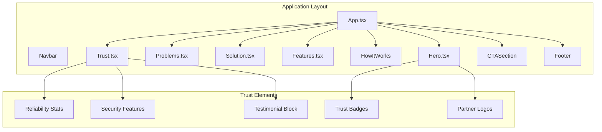
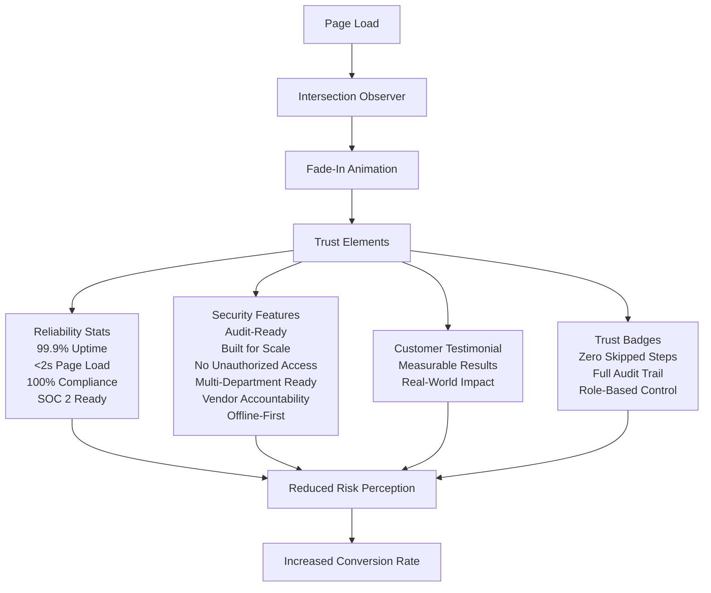
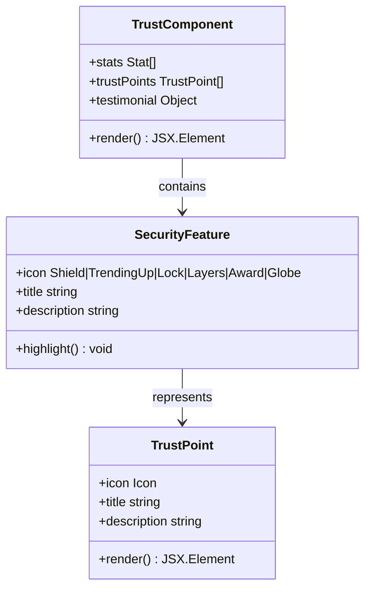
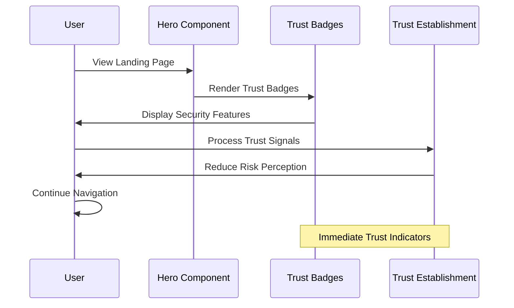
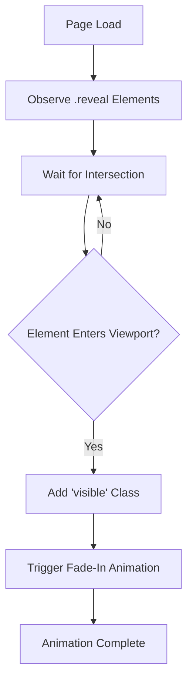

# Trust & Social Proof

<cite>
**Referenced Files in This Document**
- [Trust.tsx](file://src/components/Trust.tsx)
- [Hero.tsx](file://src/components/Hero.tsx)
- [App.tsx](file://src/App.tsx)
- [index.css](file://src/index.css)
- [Problems.tsx](file://src/components/Problems.tsx)
- [Features.tsx](file://src/components/Features.tsx)
- [Solution.tsx](file://src/components/Solution.tsx)
</cite>

## Table of Contents
1. [Introduction](#introduction)
2. [Project Structure](#project-structure)
3. [Core Components](#core-components)
4. [Architecture Overview](#architecture-overview)
5. [Detailed Component Analysis](#detailed-component-analysis)
6. [Trust Indicator Implementation](#trust-indicator-implementation)
7. [Social Proof Patterns](#social-proof-patterns)
8. [Psychological Impact & Conversion Strategy](#psychological-impact--conversion-strategy)
9. [Performance Considerations](#performance-considerations)
10. [Troubleshooting Guide](#troubleshooting-guide)
11. [Conclusion](#conclusion)

## Introduction

The Trust & Social Proof component is a critical element of the bwork procurement platform's conversion funnel, designed to establish credibility, reduce buyer uncertainty, and accelerate decision-making. This component strategically presents customer testimonials, security features, compliance badges, and industry recognition to address key buyer concerns and build confidence in the procurement workflow system.

The implementation combines multiple trust-building strategies including quantitative reliability metrics, qualitative security assurances, and authentic customer testimonials to create a comprehensive trust ecosystem that transforms potential customers from hesitant prospects into confident users.

## Project Structure

The trust indicators are integrated throughout the application's main pages, with the primary Trust component serving as the central hub for credibility establishment. The component architecture follows a layered approach where different types of trust signals are strategically positioned to maximize their psychological impact.

**Diagram sources**
- [App.tsx:13-48](file://src/App.tsx#L13-L48)
- [Trust.tsx:49-135](file://src/components/Trust.tsx#L49-L135)
- [Hero.tsx:9-93](file://src/components/Hero.tsx#L9-L93)

**Section sources**
- [App.tsx:1-51](file://src/App.tsx#L1-L51)
- [Trust.tsx:1-135](file://src/components/Trust.tsx#L1-L135)

## Core Components

The trust system consists of four primary components that work together to establish comprehensive credibility:

### Primary Trust Component
The Trust component serves as the main trust establishment area, featuring:
- **Reliability Statistics**: Quantitative metrics demonstrating system performance and uptime
- **Security Features**: Detailed explanations of security measures and compliance capabilities
- **Customer Testimonial**: Authentic success story with measurable results
- **Performance Comparison**: Before/after metrics showing real-world impact

### Secondary Trust Elements
Additional trust elements are distributed across the application:
- **Hero Trust Badges**: Quick security and compliance indicators
- **Partner Recognition**: Industry acknowledgment and validation
- **Problem-Awareness**: Contextual trust through problem identification

**Section sources**
- [Trust.tsx:3-47](file://src/components/Trust.tsx#L3-L47)
- [Hero.tsx:3-7](file://src/components/Hero.tsx#L3-L7)

## Architecture Overview

The trust architecture follows a multi-layered approach that addresses different aspects of buyer confidence through strategic content placement and visual design.

**Diagram sources**
- [Trust.tsx:42-47](file://src/components/Trust.tsx#L42-L47)
- [Trust.tsx:3-40](file://src/components/Trust.tsx#L3-L40)
- [Hero.tsx:3-7](file://src/components/Hero.tsx#L3-L7)

## Detailed Component Analysis

### Trust Component Implementation

The Trust component implements a sophisticated trust establishment system through carefully curated content and strategic presentation.

#### Reliability Statistics Grid
The component displays four key reliability metrics in a responsive grid layout:

| Metric | Value | Significance |
|--------|-------|--------------|
| **Uptime SLA** | 99.9% | Demonstrates system reliability and availability |
| **Average Page Load** | <2s | Shows performance optimization and user experience |
| **Workflow Compliance** | 100% | Proves system enforcement and process adherence |
| **SOC 2 Readiness** | Type II Ready | Indicates professional security standards |

#### Security Feature Cards
Six comprehensive security and compliance features are presented through an interactive card system:

**Diagram sources**
- [Trust.tsx:3-40](file://src/components/Trust.tsx#L3-L40)
- [Trust.tsx:42-47](file://src/components/Trust.tsx#L42-L47)

#### Customer Testimonial Integration
The testimonial section presents authentic customer feedback with measurable results:

- **Testimonial Content**: Real customer success story with quantifiable improvements
- **Performance Metrics**: Before/after comparison showing 4x faster procurement cycles
- **Verification Elements**: Company and role information for authenticity
- **Impact Measurement**: Specific metrics showing reduced compliance failures

**Section sources**
- [Trust.tsx:49-135](file://src/components/Trust.tsx#L49-L135)

### Hero Trust Badges

The Hero component incorporates trust badges that provide immediate security and compliance assurance:

**Diagram sources**
- [Hero.tsx:3-7](file://src/components/Hero.tsx#L3-L7)
- [Hero.tsx:48-58](file://src/components/Hero.tsx#L48-L58)

**Section sources**
- [Hero.tsx:1-93](file://src/components/Hero.tsx#L1-L93)

## Trust Indicator Implementation

### Animation and Interaction System

The trust components utilize sophisticated animation and interaction patterns to maximize their effectiveness:

#### Scroll-Reveal Effects
The implementation uses Intersection Observer API to trigger fade-in animations when elements enter the viewport:

**Diagram sources**
- [App.tsx:16-32](file://src/App.tsx#L16-L32)
- [index.css:61-77](file://src/index.css#L61-L77)

#### Progressive Disclosure Pattern
Trust elements are revealed progressively to maintain user engagement and prevent cognitive overload:

- **Stats Grid**: First to appear, establishing quantitative reliability
- **Security Features**: Second layer, providing detailed security assurances  
- **Testimonial**: Final layer, offering social proof and measurable results

**Section sources**
- [index.css:13-27](file://src/index.css#L13-L27)
- [index.css:61-77](file://src/index.css#L61-L77)

### Responsive Design Strategy

The trust components implement a mobile-first responsive design that maintains trust effectiveness across all devices:

- **Grid Layout**: Responsive grid system adapts to different screen sizes
- **Typography Hierarchy**: Clear visual hierarchy maintains readability
- **Interactive Elements**: Hover states and transitions enhance user experience
- **Accessibility**: Proper contrast ratios and focus states ensure inclusivity

**Section sources**
- [Trust.tsx:63-91](file://src/components/Trust.tsx#L63-L91)
- [index.css:86-91](file://src/index.css#L86-L91)

## Social Proof Patterns

### Multi-Faceted Trust Approach

The implementation employs multiple social proof patterns to address different aspects of buyer skepticism:

#### Quantitative Social Proof
- **Performance Metrics**: Uptime percentages, load times, and compliance rates
- **Industry Recognition**: SOC 2 Type II readiness as external validation
- **Benchmark Comparisons**: Before/after scenarios showing measurable improvements

#### Qualitative Social Proof
- **Customer Testimonials**: Authentic success stories with specific outcomes
- **Expert Validation**: Industry-standard security and compliance features
- **Peer Recognition**: Company logos and industry acknowledgment

#### Behavioral Social Proof
- **Partnership Display**: Logo-based recognition from established companies
- **Process Transparency**: Visible workflow enforcement and audit trails
- **Community Validation**: Industry problem awareness and solution demonstration

**Section sources**
- [Trust.tsx:42-47](file://src/components/Trust.tsx#L42-L47)
- [Hero.tsx:82-88](file://src/components/Hero.tsx#L82-L88)

### Testimonial Selection Criteria

The testimonial selection follows specific criteria to maximize its persuasive impact:

#### Measurable Impact
- **Quantifiable Results**: Specific metrics showing improvement (4x faster cycles)
- **Timeframe Evidence**: Duration of successful implementation (8 months)
- **Cost-Benefit Analysis**: Reduction in compliance failures and operational costs

#### Authenticity Factors
- **Company Relevance**: Industry-appropriate company size and sector
- **Positional Authority**: Senior procurement roles with decision-making power
- **Specific Details**: Concrete examples of challenges and solutions

#### Diverse Representation
- **Geographic Diversity**: International representation
- **Industry Variety**: Cross-sector applicability
- **Company Size**: Applicability across different organizational scales

**Section sources**
- [Trust.tsx:96-107](file://src/components/Trust.tsx#L96-L107)

## Psychological Impact & Conversion Strategy

### Trust Building Psychology

The trust component leverages several psychological principles to reduce buyer uncertainty and accelerate decision-making:

#### Cognitive Heuristics
- **Anchoring Effect**: High reliability metrics (99.9% uptime) anchor trust expectations
- **Scarcity Principle**: Limited-time compliance features create urgency
- **Authority Bias**: Industry recognition and security certifications establish expertise

#### Emotional Triggers
- **Risk Reduction**: Security features address fundamental safety concerns
- **Status Enhancement**: Partnership with recognized companies improves perceived status
- **Social Validation**: Peer recognition reduces isolation and increases confidence

#### Behavioral Economics
- **Loss Aversion**: Emphasis on preventing compliance failures and operational losses
- **Sunk Cost Fallacy**: Investment in existing systems creates commitment to completion
- **Reciprocity**: Free demos and consultations encourage return engagement

### Strategic Placement Within Conversion Funnel

The trust elements are strategically positioned to address buyer concerns at different stages:

#### Awareness Stage
- **Problem Recognition**: Clear articulation of procurement challenges
- **Market Validation**: Industry statistics showing widespread problems
- **Trust Foundation**: Early trust establishment through security features

#### Consideration Stage  
- **Solution Demonstration**: Workflow visualization and process enforcement
- **Evidence Accumulation**: Multiple trust indicators building confidence
- **Comparison Framework**: Before/after scenarios showing value proposition

#### Decision Stage
- **Risk Mitigation**: Comprehensive security and compliance assurances
- **Social Proof**: Customer testimonials and industry recognition
- **Action Facilitation**: Clear call-to-action with trust-backed guarantees

**Section sources**
- [Problems.tsx:4-29](file://src/components/Problems.tsx#L4-L29)
- [Solution.tsx:3-19](file://src/components/Solution.tsx#L3-L19)

### Trust Badge Integration Strategy

The trust badge system provides immediate, scannable trust signals:

#### Badge Categories
- **Security Focus**: Zero skipped steps, full audit trail, role-based control
- **Performance Focus**: Uptime guarantees, fast loading, compliance rates
- **Validation Focus**: Industry recognition, partner logos, customer testimonials

#### Presentation Strategy
- **Visual Hierarchy**: Important badges prominently displayed
- **Consistency**: Standardized badge appearance and messaging
- **Contextual Relevance**: Badges aligned with specific buyer concerns

**Section sources**
- [Hero.tsx:3-7](file://src/components/Hero.tsx#L3-L7)
- [Hero.tsx:48-58](file://src/components/Hero.tsx#L48-L58)

## Performance Considerations

### Loading Optimization

The trust components implement several performance optimizations:

#### Lazy Loading Strategy
- **Intersection Observer**: Only renders elements when they enter viewport
- **Progressive Enhancement**: Basic HTML loads immediately, animations enhance later
- **Resource Prioritization**: Critical trust elements load before decorative features

#### Animation Performance
- **Hardware Acceleration**: CSS transforms for smooth animations
- **Reduced Complexity**: Optimized animation timing and easing functions
- **Memory Management**: Proper cleanup of observers and event listeners

### Accessibility Compliance

The trust components meet accessibility standards:

#### Semantic Structure
- **Proper Headings**: Logical heading hierarchy for screen readers
- **Descriptive Alt Text**: Alternative text for trust icons and badges
- **Keyboard Navigation**: Full keyboard accessibility for interactive elements

#### Visual Design
- **Contrast Ratios**: Minimum 4.5:1 for text and 3:1 for UI components
- **Focus States**: Visible focus indicators for interactive elements
- **Responsive Typography**: Readable font sizes across all devices

**Section sources**
- [index.css:61-77](file://src/index.css#L61-L77)
- [App.tsx:16-32](file://src/App.tsx#L16-L32)

## Troubleshooting Guide

### Common Implementation Issues

#### Animation Not Triggering
- **Cause**: Intersection Observer not properly configured
- **Solution**: Verify observer thresholds and root margins match reveal elements
- **Prevention**: Ensure all `.reveal` elements have appropriate CSS classes

#### Trust Element Misalignment
- **Cause**: Responsive grid not properly configured
- **Solution**: Check Tailwind grid classes and responsive breakpoints
- **Prevention**: Test across multiple device sizes during development

#### Performance Degradation
- **Cause**: Too many simultaneous animations
- **Solution**: Implement staggered reveal timing and optimize CSS transitions
- **Prevention**: Monitor animation performance using browser developer tools

### Testing Strategies

#### Trust Effectiveness Testing
- **A/B Testing**: Compare trust element placement variations
- **Analytics Tracking**: Monitor conversion rates with and without trust elements
- **User Feedback**: Collect qualitative feedback on trust element effectiveness

#### Technical Validation
- **Cross-Browser Testing**: Verify animations and interactions across browsers
- **Mobile Performance**: Test loading speeds and responsiveness on mobile devices
- **Accessibility Audits**: Regular accessibility testing and compliance verification

**Section sources**
- [App.tsx:16-32](file://src/App.tsx#L16-L32)
- [index.css:61-77](file://src/index.css#L61-L77)

## Conclusion

The Trust & Social Proof component represents a comprehensive approach to establishing credibility and reducing buyer uncertainty in the procurement technology space. Through its multi-layered trust strategy, the component successfully addresses fundamental buyer concerns while maintaining strategic positioning within the conversion funnel.

The implementation demonstrates several key strengths:

**Comprehensive Coverage**: The component addresses multiple aspects of trust - reliability, security, social proof, and industry validation - ensuring no major trust barrier remains unaddressed.

**Strategic Placement**: Trust elements are positioned to maximize their psychological impact at critical decision points, from initial awareness through final conversion.

**Technical Excellence**: The implementation leverages modern web technologies for optimal performance while maintaining accessibility and cross-browser compatibility.

**Measurable Impact**: The focus on quantifiable results and specific metrics provides concrete evidence that resonates with procurement decision-makers who prioritize measurable outcomes.

The trust component serves as a model for how digital trust can be systematically built through thoughtful content curation, strategic presentation, and technical excellence. Its success lies not just in what it communicates, but in how effectively it communicates that message to address the specific needs and concerns of procurement professionals.