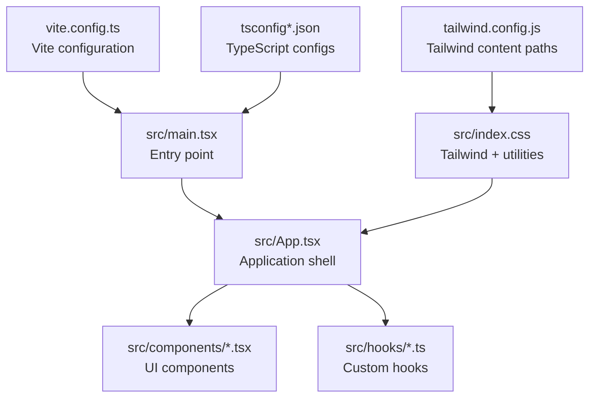
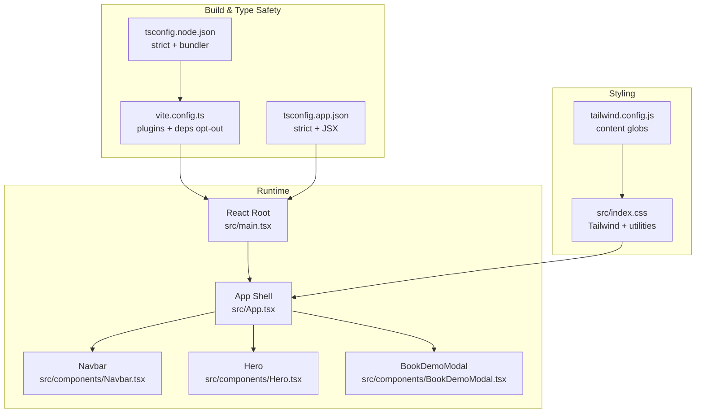
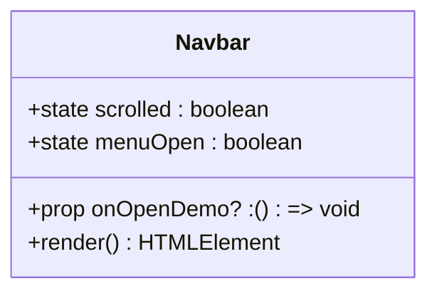
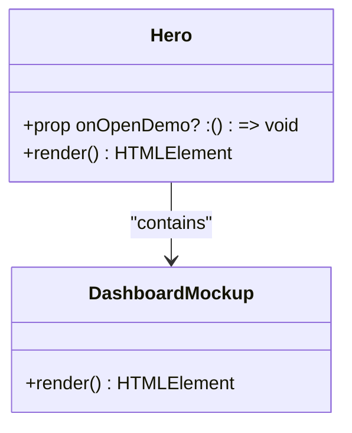
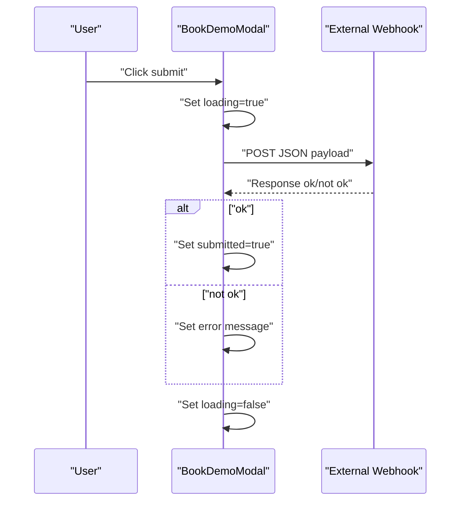
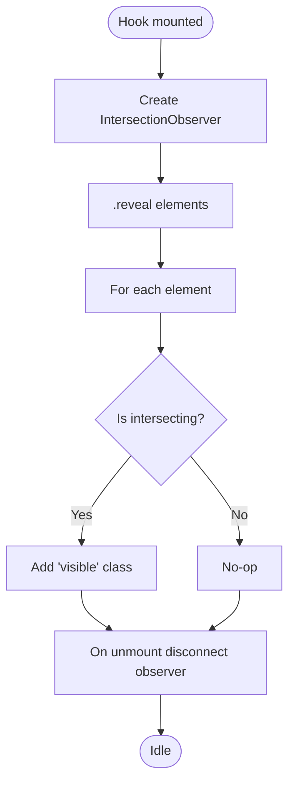
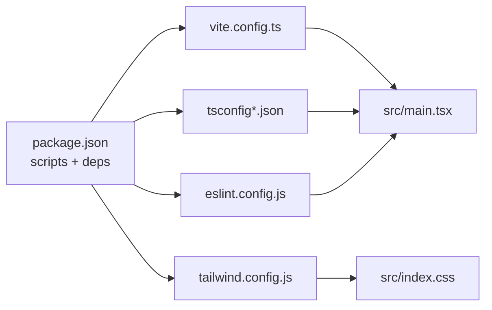

# Development Guidelines

<cite>
**Referenced Files in This Document**
- [package.json](file://package.json)
- [eslint.config.js](file://eslint.config.js)
- [tsconfig.json](file://tsconfig.json)
- [tsconfig.app.json](file://tsconfig.app.json)
- [tsconfig.node.json](file://tsconfig.node.json)
- [vite.config.ts](file://vite.config.ts)
- [tailwind.config.js](file://tailwind.config.js)
- [src/index.css](file://src/index.css)
- [src/main.tsx](file://src/main.tsx)
- [src/App.tsx](file://src/App.tsx)
- [src/hooks/useScrollReveal.ts](file://src/hooks/useScrollReveal.ts)
- [src/components/Navbar.tsx](file://src/components/Navbar.tsx)
- [src/components/Hero.tsx](file://src/components/Hero.tsx)
- [src/components/BookDemoModal.tsx](file://src/components/BookDemoModal.tsx)
- [README.md](file://README.md)
</cite>

## Table of Contents
1. [Introduction](#introduction)
2. [Project Structure](#project-structure)
3. [Core Components](#core-components)
4. [Architecture Overview](#architecture-overview)
5. [Detailed Component Analysis](#detailed-component-analysis)
6. [Dependency Analysis](#dependency-analysis)
7. [Performance Considerations](#performance-considerations)
8. [Testing Strategies](#testing-strategies)
9. [Git Workflow and Pull Requests](#git-workflow-and-pull-requests)
10. [Code Review Standards](#code-review-standards)
11. [Accessibility Best Practices](#accessibility-best-practices)
12. [Development Environment Setup](#development-environment-setup)
13. [Debugging Techniques](#debugging-techniques)
14. [Conclusion](#conclusion)

## Introduction
This document provides comprehensive development guidelines for the Baerp-MW project. It consolidates code quality standards, configuration, component development patterns, testing strategies, Git workflow, code review practices, performance and accessibility guidelines, and development environment setup. The goal is to ensure consistent, maintainable, and scalable development across the codebase.

## Project Structure
The project follows a conventional Vite + React + TypeScript + Tailwind CSS setup with a clear separation of concerns:
- Application entry point renders the root React element.
- Top-level application container composes reusable UI components.
- Shared hooks encapsulate cross-cutting logic.
- Styles are centralized via Tailwind directives and custom CSS utilities.

**Diagram sources**
- [src/main.tsx:1-11](file://src/main.tsx#L1-L11)
- [src/App.tsx:1-51](file://src/App.tsx#L1-L51)
- [src/index.css:1-125](file://src/index.css#L1-L125)
- [vite.config.ts:1-11](file://vite.config.ts#L1-L11)
- [tsconfig.app.json:1-25](file://tsconfig.app.json#L1-L25)
- [tailwind.config.js:1-9](file://tailwind.config.js#L1-L9)

**Section sources**
- [src/main.tsx:1-11](file://src/main.tsx#L1-L11)
- [src/App.tsx:1-51](file://src/App.tsx#L1-L51)
- [src/index.css:1-125](file://src/index.css#L1-L125)
- [vite.config.ts:1-11](file://vite.config.ts#L1-L11)
- [tsconfig.json:1-8](file://tsconfig.json#L1-L8)
- [tsconfig.app.json:1-25](file://tsconfig.app.json#L1-L25)
- [tsconfig.node.json:1-23](file://tsconfig.node.json#L1-L23)
- [tailwind.config.js:1-9](file://tailwind.config.js#L1-L9)

## Core Components
- Application shell composes feature sections and manages modal visibility via local state.
- Navigation bar demonstrates responsive behavior, scroll-aware styling, and controlled interactions.
- Hero section showcases gradient backgrounds, animated content, and embedded dashboard mockup.
- Book demo modal implements controlled form state, submission flow, and loading/error states.

Key patterns observed:
- Props are explicitly typed; optional callbacks are indicated via union types.
- Local state is scoped to minimal components; lifting is avoided where unnecessary.
- Tailwind utilities are applied consistently for layout and styling.

**Section sources**
- [src/App.tsx:1-51](file://src/App.tsx#L1-L51)
- [src/components/Navbar.tsx:1-106](file://src/components/Navbar.tsx#L1-L106)
- [src/components/Hero.tsx:1-191](file://src/components/Hero.tsx#L1-L191)
- [src/components/BookDemoModal.tsx:1-208](file://src/components/BookDemoModal.tsx#L1-L208)

## Architecture Overview
The runtime architecture centers on React components orchestrated by a single application shell. Styling leverages Tailwind’s JIT engine with a content whitelist. Build-time tooling is configured via Vite and TypeScript project references.

**Diagram sources**
- [src/main.tsx:1-11](file://src/main.tsx#L1-L11)
- [src/App.tsx:1-51](file://src/App.tsx#L1-L51)
- [src/components/Navbar.tsx:1-106](file://src/components/Navbar.tsx#L1-L106)
- [src/components/Hero.tsx:1-191](file://src/components/Hero.tsx#L1-L191)
- [src/components/BookDemoModal.tsx:1-208](file://src/components/BookDemoModal.tsx#L1-L208)
- [src/index.css:1-125](file://src/index.css#L1-L125)
- [tailwind.config.js:1-9](file://tailwind.config.js#L1-L9)
- [vite.config.ts:1-11](file://vite.config.ts#L1-L11)
- [tsconfig.app.json:1-25](file://tsconfig.app.json#L1-L25)
- [tsconfig.node.json:1-23](file://tsconfig.node.json#L1-L23)

## Detailed Component Analysis

### Navbar Component
Responsibilities:
- Render navigation links and branding.
- Toggle mobile menu and propagate demo open callback.
- Adjust styles based on scroll position.

Patterns:
- Uses Lucide icons for UI affordances.
- Conditional classes reflect state and media queries.
- Controlled button click handlers update internal state.

**Diagram sources**
- [src/components/Navbar.tsx:1-106](file://src/components/Navbar.tsx#L1-L106)

**Section sources**
- [src/components/Navbar.tsx:1-106](file://src/components/Navbar.tsx#L1-L106)

### Hero Component
Responsibilities:
- Present headline, value proposition, trust badges, and CTA.
- Include a dashboard mockup illustrating workflow steps.
- Coordinate with parent to trigger demo flow.

Patterns:
- Composition of nested UI elements with Tailwind utilities.
- Inline SVG-style gradients and pseudo-element effects.
- Mockup component encapsulates static visuals.

**Diagram sources**
- [src/components/Hero.tsx:1-191](file://src/components/Hero.tsx#L1-L191)

**Section sources**
- [src/components/Hero.tsx:1-191](file://src/components/Hero.tsx#L1-L191)

### BookDemoModal Component
Responsibilities:
- Capture user contact details via a controlled form.
- Submit data to an external webhook and manage submission lifecycle.
- Provide feedback for success, loading, and error states.

Patterns:
- Form state managed with useState and change handlers.
- Async submission guarded by loading state and error messaging.
- Environment variable usage for endpoint configuration.

**Diagram sources**
- [src/components/BookDemoModal.tsx:1-208](file://src/components/BookDemoModal.tsx#L1-L208)

**Section sources**
- [src/components/BookDemoModal.tsx:1-208](file://src/components/BookDemoModal.tsx#L1-L208)

### Scroll Reveal Hook
Responsibilities:
- Observe DOM elements with IntersectionObserver.
- Add visibility classes when elements enter the viewport.

Patterns:
- Encapsulates DOM observation in a reusable hook.
- Returns a ref for attaching to elements.

**Diagram sources**
- [src/hooks/useScrollReveal.ts:1-26](file://src/hooks/useScrollReveal.ts#L1-L26)

**Section sources**
- [src/hooks/useScrollReveal.ts:1-26](file://src/hooks/useScrollReveal.ts#L1-L26)

## Dependency Analysis
Tooling and configuration dependencies:
- Vite plugin for React enables fast refresh and JSX transforms.
- TypeScript strictness and project references enforce type safety.
- ESLint with TypeScript and React Hooks plugins enforces linting rules.
- Tailwind CSS with content globs ensures purge-friendly builds.

**Diagram sources**
- [package.json:1-36](file://package.json#L1-L36)
- [eslint.config.js:1-29](file://eslint.config.js#L1-L29)
- [vite.config.ts:1-11](file://vite.config.ts#L1-L11)
- [tsconfig.json:1-8](file://tsconfig.json#L1-L8)
- [tsconfig.app.json:1-25](file://tsconfig.app.json#L1-L25)
- [tsconfig.node.json:1-23](file://tsconfig.node.json#L1-L23)
- [tailwind.config.js:1-9](file://tailwind.config.js#L1-L9)
- [src/index.css:1-125](file://src/index.css#L1-L125)
- [src/main.tsx:1-11](file://src/main.tsx#L1-L11)

**Section sources**
- [package.json:1-36](file://package.json#L1-L36)
- [eslint.config.js:1-29](file://eslint.config.js#L1-L29)
- [vite.config.ts:1-11](file://vite.config.ts#L1-L11)
- [tsconfig.json:1-8](file://tsconfig.json#L1-L8)
- [tsconfig.app.json:1-25](file://tsconfig.app.json#L1-L25)
- [tsconfig.node.json:1-23](file://tsconfig.node.json#L1-L23)
- [tailwind.config.js:1-9](file://tailwind.config.js#L1-L9)
- [src/index.css:1-125](file://src/index.css#L1-L125)
- [src/main.tsx:1-11](file://src/main.tsx#L1-L11)

## Performance Considerations
- Keep components pure and minimize re-renders by passing memoized callbacks and avoiding unnecessary prop drilling.
- Prefer lazy loading for heavy assets and defer non-critical images.
- Use CSS transitions and transforms for animations; avoid layout thrashing.
- Optimize Tailwind usage by scoping content globs and leveraging JIT features.
- Avoid excessive DOM observations; consolidate observers where possible.
- Use React strict mode to surface potential side effects during development.

## Testing Strategies
Recommended testing approach:
- Unit tests for pure functions and custom hooks using a testing library compatible with React and TypeScript.
- Component tests to verify rendering, event handling, and state transitions for interactive components.
- Snapshot tests for stable UI structures to prevent regressions.
- End-to-end tests for critical user journeys (e.g., demo modal submission flow).

Guidelines:
- Write tests alongside implementation to ensure coverage from day one.
- Focus on user-visible behavior rather than internal implementation details.
- Mock external integrations (e.g., webhooks) to isolate component logic.

## Git Workflow and Pull Requests
Branching model:
- Feature branches: develop features from main, prefixed appropriately (e.g., feature/navbar-enhancement).
- Release branches: prepare releases and hotfixes from main as needed.

Commit hygiene:
- Keep commits small and focused with clear messages describing intent and impact.
- Reference issues or PRs in commit messages for traceability.

Pull requests:
- Open PRs early for visibility; mark as draft until ready for review.
- Ensure CI passes locally before pushing updates.
- Request reviews from peers; address comments promptly and update tests as needed.

## Code Review Standards
Review checklist:
- Correctness: Does the code fulfill the requirement and handle edge cases?
- Readability: Are variable and function names self-descriptive? Is the code easy to follow?
- Maintainability: Are dependencies minimized? Are there opportunities for reuse?
- Accessibility: Are semantic HTML and ARIA attributes used appropriately?
- Performance: Are there unnecessary re-renders or heavy computations?
- Security: Are environment variables used safely and secrets not committed?

## Accessibility Best Practices
- Use semantic HTML and ARIA roles where appropriate.
- Ensure sufficient color contrast and keyboard navigability.
- Provide meaningful alt text for decorative images and labels for form controls.
- Test with screen readers and keyboard-only navigation.
- Avoid relying solely on color to convey meaning.

## Development Environment Setup
Prerequisites:
- Install Node.js and npm/yarn/pnpm as per your preference.
- Fork and clone the repository.

Install dependencies:
- Run the standard install command for your package manager.

Run locally:
- Start the dev server using the configured script.
- Open the application in your browser and verify the UI.

Lint and type-check:
- Run the linter and type checker scripts to validate code quality and type safety.

Build and preview:
- Build the production bundle and preview locally to confirm deployment readiness.

**Section sources**
- [package.json:6-12](file://package.json#L6-L12)
- [README.md:1-4](file://README.md#L1-L4)

## Debugging Techniques
Common debugging strategies:
- Use React DevTools to inspect component props, state, and re-renders.
- Leverage browser devtools to verify Tailwind-generated styles and layout.
- Add console logs temporarily to trace control flow and state changes.
- Breakpoints in TypeScript sources to step through logic.
- Network tab to monitor external submissions and errors.

## Conclusion
These guidelines establish a consistent foundation for building, maintaining, and extending the Baerp-MW application. By adhering to the outlined patterns, configurations, and practices, contributors can deliver high-quality, accessible, and performant features while keeping the codebase maintainable and testable.