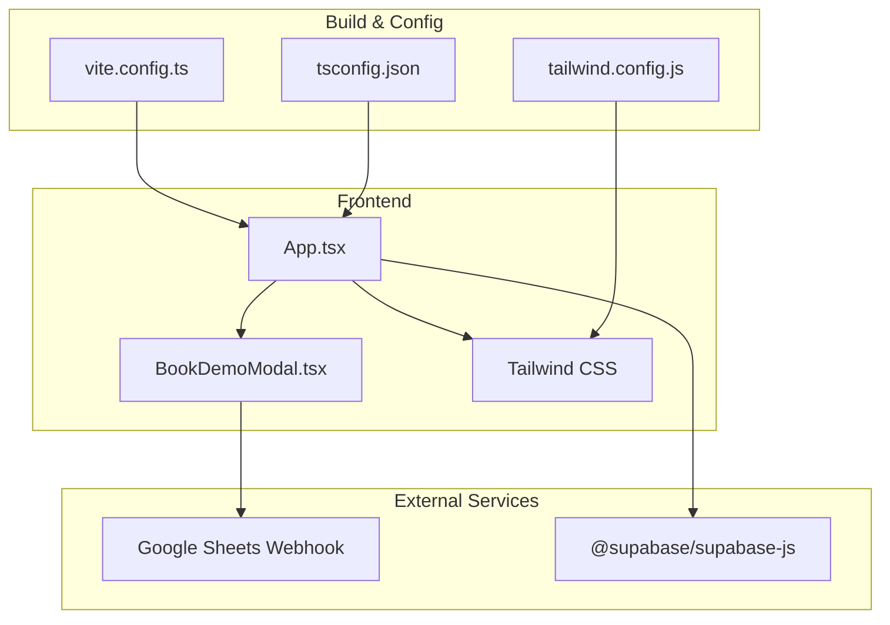
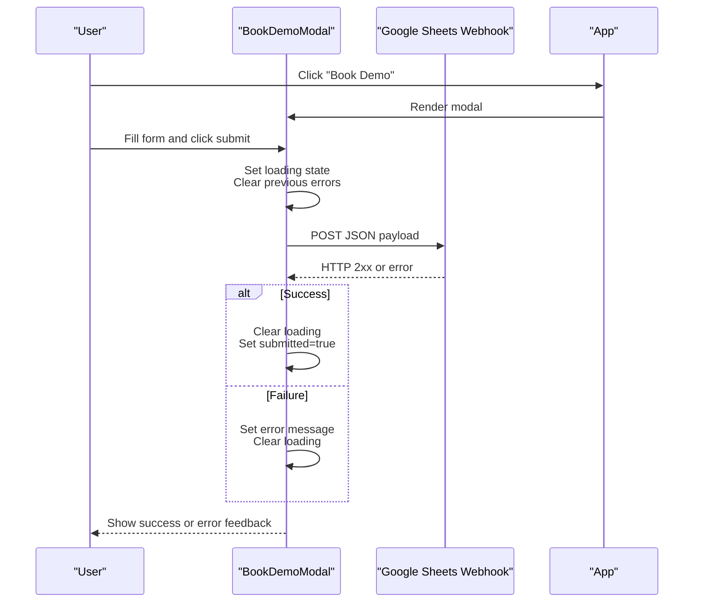
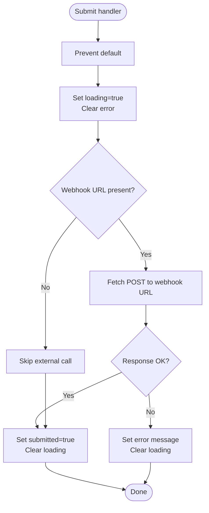
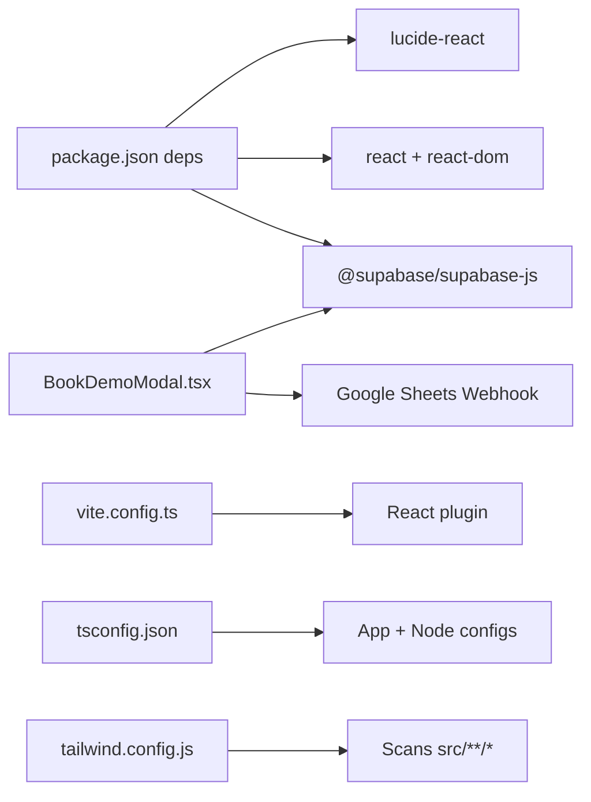

# Form Handling and External Integrations

<cite>
**Referenced Files in This Document**
- [BookDemoModal.tsx](file://src/components/BookDemoModal.tsx)
- [App.tsx](file://src/App.tsx)
- [package.json](file://package.json)
- [vite.config.ts](file://vite.config.ts)
- [tsconfig.json](file://tsconfig.json)
- [tailwind.config.js](file://tailwind.config.js)
- [README.md](file://README.md)
</cite>

## Table of Contents
1. [Introduction](#introduction)
2. [Project Structure](#project-structure)
3. [Core Components](#core-components)
4. [Architecture Overview](#architecture-overview)
5. [Detailed Component Analysis](#detailed-component-analysis)
6. [Dependency Analysis](#dependency-analysis)
7. [Performance Considerations](#performance-considerations)
8. [Troubleshooting Guide](#troubleshooting-guide)
9. [Conclusion](#conclusion)
10. [Appendices](#appendices)

## Introduction
This document explains the form handling and external integrations in Baerp-MW with a focus on the demo booking form. It covers form state management, validation, error handling, and submission processing. It also documents the Google Sheets webhook integration, environment variable configuration, and outlines how Supabase is integrated into the project. Guidance is provided for extending form functionality and integrating additional external services, along with diagrams that map to actual source files.

## Project Structure
The project is a React + TypeScript + Vite application styled with Tailwind CSS. The demo booking form is implemented as a modal component that integrates with a Google Sheets webhook endpoint. Environment variables are configured via Vite’s import.meta.env mechanism. Supabase is included as a dependency but is not currently used in the frontend code shown here.

**Diagram sources**
- [App.tsx:13-48](file://src/App.tsx#L13-L48)
- [BookDemoModal.tsx:14-63](file://src/components/BookDemoModal.tsx#L14-L63)
- [vite.config.ts:1-11](file://vite.config.ts#L1-L11)
- [tsconfig.json:1-8](file://tsconfig.json#L1-L8)
- [tailwind.config.js:1-9](file://tailwind.config.js#L1-L9)
- [package.json:13-18](file://package.json#L13-L18)

**Section sources**
- [App.tsx:13-48](file://src/App.tsx#L13-L48)
- [BookDemoModal.tsx:14-63](file://src/components/BookDemoModal.tsx#L14-L63)
- [vite.config.ts:1-11](file://vite.config.ts#L1-L11)
- [tsconfig.json:1-8](file://tsconfig.json#L1-L8)
- [tailwind.config.js:1-9](file://tailwind.config.js#L1-L9)
- [package.json:13-18](file://package.json#L13-L18)

## Core Components
- Demo Booking Modal: Implements form state, validation, submission, and user feedback.
- Application Shell: Controls modal visibility and renders page sections.

Key responsibilities:
- Manage form state with controlled inputs.
- Validate required fields at the UI level.
- Submit data to an external Google Sheets webhook.
- Provide loading, success, and error states.
- Integrate with Supabase dependency for potential future backend needs.

**Section sources**
- [BookDemoModal.tsx:6-24](file://src/components/BookDemoModal.tsx#L6-L24)
- [BookDemoModal.tsx:26-63](file://src/components/BookDemoModal.tsx#L26-L63)
- [App.tsx:14-45](file://src/App.tsx#L14-L45)

## Architecture Overview
The form submission workflow is client-driven. On submit, the modal posts structured data to a Google Sheets webhook endpoint. The app transitions to a success state upon completion. Supabase is present as a dependency and can be leveraged for server-side or database-backed integrations in the future.

**Diagram sources**
- [BookDemoModal.tsx:32-63](file://src/components/BookDemoModal.tsx#L32-L63)
- [App.tsx:45](file://src/App.tsx#L45)

## Detailed Component Analysis

### Demo Booking Modal
The modal encapsulates the booking form, state management, and submission logic.

- State model
  - submitted: toggles success view
  - loading: disables submit button and shows spinner
  - error: displays user-facing error messages
  - form: shape for name, email, company, phone, additionalInfo

- Validation and UX
  - Required fields enforced via HTML attributes.
  - Controlled inputs update state on change.
  - Loading state prevents duplicate submissions.
  - Error state surfaces network or HTTP errors.

- Submission flow
  - Prevents default form action.
  - Posts JSON payload to the Google Sheets webhook URL.
  - Handles non-OK responses by setting an error message.
  - On success, clears loading and switches to success view.

- Success and error UI
  - Success view shows a confirmation message and close action.
  - Error view shows a red text message below the form.

**Diagram sources**
- [BookDemoModal.tsx:32-63](file://src/components/BookDemoModal.tsx#L32-L63)

**Section sources**
- [BookDemoModal.tsx:6-24](file://src/components/BookDemoModal.tsx#L6-L24)
- [BookDemoModal.tsx:26-63](file://src/components/BookDemoModal.tsx#L26-L63)
- [BookDemoModal.tsx:81-102](file://src/components/BookDemoModal.tsx#L81-L102)
- [BookDemoModal.tsx:183-185](file://src/components/BookDemoModal.tsx#L183-L185)
- [BookDemoModal.tsx:187-200](file://src/components/BookDemoModal.tsx#L187-L200)

### Application Shell Integration
The App component controls modal visibility and composes page sections. It passes the open-demo callback to header and call-to-action components so users can trigger the modal.

- Modal lifecycle
  - showDemo state toggled by navigation actions.
  - Modal rendered conditionally with onClose callback.

- Navigation integration
  - Navbar and CTASection expose onOpenDemo callbacks.
  - Passing the same callback ensures consistent UX across sections.

**Section sources**
- [App.tsx:14-45](file://src/App.tsx#L14-L45)
- [App.tsx:36-45](file://src/App.tsx#L36-L45)

### Google Sheets Webhook Integration
- Endpoint configuration
  - The Google Sheets webhook URL is loaded from import.meta.env and defaults to a specific endpoint if not provided.
- Payload structure
  - Includes form fields plus a timestamp for audit.
- Error handling
  - Non-OK HTTP responses are treated as failures and surfaced to the user.

Security and reliability considerations:
- Keep the webhook URL secret and avoid exposing it in client logs.
- Consider adding CSRF protection or rate limiting at the endpoint.
- Validate and sanitize incoming data server-side before writing to sheets.

**Section sources**
- [BookDemoModal.tsx:4](file://src/components/BookDemoModal.tsx#L4)
- [BookDemoModal.tsx:39-50](file://src/components/BookDemoModal.tsx#L39-L50)
- [BookDemoModal.tsx:51-58](file://src/components/BookDemoModal.tsx#L51-L58)

### Supabase Integration Setup
- Dependency presence
  - The project includes @supabase/supabase-js as a runtime dependency.
- Potential usage
  - The dependency enables client-side database queries, auth, storage, and real-time features.
  - No current usage is visible in the provided files; it can be integrated for serverless backend functionality or data persistence.
- Recommended steps
  - Initialize Supabase client with project credentials.
  - Create a backend route or Edge Function to proxy sensitive operations.
  - Use Supabase Auth for user sessions and secure data access.

**Section sources**
- [package.json:14](file://package.json#L14)

## Dependency Analysis
- Build and runtime
  - Vite plugin for React enables JSX/TSX transpilation.
  - Tailwind scans templates and components for CSS generation.
- External integrations
  - Google Sheets webhook for form submissions.
  - Supabase SDK for potential backend/database features.

**Diagram sources**
- [package.json:13-18](file://package.json#L13-L18)
- [vite.config.ts:1-11](file://vite.config.ts#L1-L11)
- [tsconfig.json:1-8](file://tsconfig.json#L1-L8)
- [tailwind.config.js:1-9](file://tailwind.config.js#L1-L9)
- [BookDemoModal.tsx:4](file://src/components/BookDemoModal.tsx#L4)

**Section sources**
- [package.json:13-18](file://package.json#L13-L18)
- [vite.config.ts:1-11](file://vite.config.ts#L1-L11)
- [tsconfig.json:1-8](file://tsconfig.json#L1-L8)
- [tailwind.config.js:1-9](file://tailwind.config.js#L1-L9)

## Performance Considerations
- Minimize re-renders
  - Keep form state local to the modal component.
  - Use controlled inputs to avoid unnecessary DOM updates.
- Network efficiency
  - Send only required fields to reduce payload size.
  - Debounce submissions to prevent duplicate POSTs.
- UX responsiveness
  - Disable the submit button during fetch to prevent concurrent submissions.
  - Provide immediate visual feedback (spinner) while waiting for a response.

## Troubleshooting Guide
Common issues and resolutions:
- Missing webhook URL
  - Ensure VITE_GOOGLE_SHEET_WEBHOOK_URL is set in the environment.
  - Confirm the URL points to a valid Google Apps Script Web App endpoint.
- Network failures
  - Verify connectivity and CORS policies.
  - Check browser console for fetch errors.
- Non-OK HTTP responses
  - Inspect server logs for the webhook and surface actionable messages.
- Supabase integration
  - Initialize client with correct project URL and anon key.
  - Use environment variables for credentials and avoid committing secrets.

User-facing feedback:
- Error messages appear below the form when submission fails.
- Success view replaces the form after successful submission.

**Section sources**
- [BookDemoModal.tsx:4](file://src/components/BookDemoModal.tsx#L4)
- [BookDemoModal.tsx:54-58](file://src/components/BookDemoModal.tsx#L54-L58)
- [BookDemoModal.tsx:81-96](file://src/components/BookDemoModal.tsx#L81-L96)

## Conclusion
The demo booking form is a focused, client-driven component that posts data to a Google Sheets webhook and manages user feedback states. Supabase is available for future backend or database needs. The implementation emphasizes simplicity, clear state management, and user experience. Extending the form can involve adding validation rules, integrating additional external services, or migrating to a serverless backend while keeping the UI consistent.

## Appendices

### Environment Variables and Security
- Environment variable exposure
  - Vite exposes variables prefixed with VITE_ to the client.
  - Ensure sensitive keys are prefixed accordingly and not leaked to the client.
- Security recommendations
  - Store webhook URLs and Supabase credentials in environment files.
  - Restrict webhook permissions and validate payloads server-side.
  - Use HTTPS endpoints and consider rate limiting.

**Section sources**
- [BookDemoModal.tsx:4](file://src/components/BookDemoModal.tsx#L4)
- [vite.config.ts:1-11](file://vite.config.ts#L1-L11)

### Extending Form Functionality
- Add validation rules
  - Enforce field-specific checks (e.g., phone number format) before submission.
  - Show inline validation messages near affected fields.
- Integrate additional services
  - Add another fetch target (e.g., CRM or email service) after successful submission.
  - Use a queue or batch mode to send to multiple endpoints.
- Backend migration
  - Replace webhook with a private API endpoint backed by Supabase or a serverless function.
  - Centralize validation and sanitization server-side.

[No sources needed since this section provides general guidance]