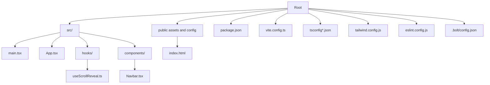

# Getting Started

<cite>
**Referenced Files in This Document**
- [package.json](file://package.json)
- [vite.config.ts](file://vite.config.ts)
- [tsconfig.json](file://tsconfig.json)
- [tsconfig.app.json](file://tsconfig.app.json)
- [tsconfig.node.json](file://tsconfig.node.json)
- [tailwind.config.js](file://tailwind.config.js)
- [eslint.config.js](file://eslint.config.js)
- [index.html](file://index.html)
- [src/main.tsx](file://src/main.tsx)
- [src/App.tsx](file://src/App.tsx)
- [src/hooks/useScrollReveal.ts](file://src/hooks/useScrollReveal.ts)
- [src/components/Navbar.tsx](file://src/components/Navbar.tsx)
- [.bolt/config.json](file://.bolt/config.json)
- [README.md](file://README.md)
</cite>

## Table of Contents
1. [Introduction](#introduction)
2. [Project Structure](#project-structure)
3. [Prerequisites](#prerequisites)
4. [Installation](#installation)
5. [Running Locally](#running-locally)
6. [Build Process](#build-process)
7. [Production Deployment](#production-deployment)
8. [Environment Variables and External Services](#environment-variables-and-external-services)
9. [Browser Compatibility](#browser-compatibility)
10. [Development Tools and Recommendations](#development-tools-and-recommendations)
11. [Troubleshooting](#troubleshooting)
12. [Conclusion](#conclusion)

## Introduction
This guide helps you quickly set up and run the Baerp-MW project locally, build it for production, and deploy it. The project is a modern React application written in TypeScript, bundled with Vite, styled with Tailwind CSS, and linted with ESLint. It uses Supabase client libraries for backend integration and Lucide React icons for UI elements.

## Project Structure
High-level overview of the repository layout and key files used by the build and development toolchain:

**Diagram sources**
- [package.json](file://package.json)
- [vite.config.ts](file://vite.config.ts)
- [tsconfig.json](file://tsconfig.json)
- [tsconfig.app.json](file://tsconfig.app.json)
- [tsconfig.node.json](file://tsconfig.node.json)
- [tailwind.config.js](file://tailwind.config.js)
- [eslint.config.js](file://eslint.config.js)
- [index.html](file://index.html)
- [src/main.tsx](file://src/main.tsx)
- [src/App.tsx](file://src/App.tsx)
- [src/hooks/useScrollReveal.ts](file://src/hooks/useScrollReveal.ts)
- [src/components/Navbar.tsx](file://src/components/Navbar.tsx)
- [.bolt/config.json](file://.bolt/config.json)

**Section sources**
- [package.json](file://package.json)
- [vite.config.ts](file://vite.config.ts)
- [tsconfig.json](file://tsconfig.json)
- [tsconfig.app.json](file://tsconfig.app.json)
- [tsconfig.node.json](file://tsconfig.node.json)
- [tailwind.config.js](file://tailwind.config.js)
- [eslint.config.js](file://eslint.config.js)
- [index.html](file://index.html)
- [src/main.tsx](file://src/main.tsx)
- [src/App.tsx](file://src/App.tsx)
- [src/hooks/useScrollReveal.ts](file://src/hooks/useScrollReveal.ts)
- [src/components/Navbar.tsx](file://src/components/Navbar.tsx)
- [.bolt/config.json](file://.bolt/config.json)

## Prerequisites
- Node.js and npm/yarn: The project uses Vite and TypeScript tooling. Install a current LTS or active Node.js version compatible with the dependencies declared in the project.
- Package manager: npm or yarn is fine; the scripts in package.json use npm-style commands.
- Basic knowledge:
  - React fundamentals (components, props, hooks)
  - TypeScript basics (types, interfaces)
  - Environment variables and build scripts
  - Optional: Tailwind CSS and Vite concepts

**Section sources**
- [package.json](file://package.json)
- [vite.config.ts](file://vite.config.ts)
- [tsconfig.app.json](file://tsconfig.app.json)
- [tsconfig.node.json](file://tsconfig.node.json)

## Installation
Follow these steps to install and prepare the project:

1. Install dependencies
   - Run your package manager’s install command:
     - npm: npm install
     - yarn: yarn install

2. Verify TypeScript configuration
   - The project uses a dual tsconfig setup: tsconfig.json references tsconfig.app.json and tsconfig.node.json. Ensure your editor recognizes these configurations.

3. Configure Tailwind CSS
   - Tailwind scans index.html and files under src/**/*.tsx for class usage. Ensure Tailwind is initialized and PostCSS is configured via the provided tailwind.config.js.

4. Optional: Setup ESLint
   - The project includes an ESLint configuration for TypeScript and React. Use your editor’s ESLint integration or run lint checks as defined in package.json.

**Section sources**
- [package.json](file://package.json)
- [tsconfig.json](file://tsconfig.json)
- [tsconfig.app.json](file://tsconfig.app.json)
- [tsconfig.node.json](file://tsconfig.node.json)
- [tailwind.config.js](file://tailwind.config.js)
- [eslint.config.js](file://eslint.config.js)

## Running Locally
Start the development server and preview the app:

- Start the dev server
  - npm run dev
  - The Vite dev server starts and serves the app at the port shown in the terminal.

- Preview the production build locally
  - npm run preview
  - This runs Vite’s static preview server after building.

- Type-check
  - npm run typecheck
  - Validates TypeScript types without emitting JS.

- Lint
  - npm run lint
  - Runs ESLint across the project.

- Notes
  - The HTML entry point defines the root element and script module path. The React root mounts App into the DOM in main.tsx.

**Section sources**
- [package.json](file://package.json)
- [vite.config.ts](file://vite.config.ts)
- [index.html](file://index.html)
- [src/main.tsx](file://src/main.tsx)

## Build Process
To produce an optimized production build:

- Build
  - npm run build
  - Vite compiles and bundles the app according to vite.config.ts and package.json scripts.

- Preview build locally
  - npm run preview
  - Serves the built assets statically for quick verification.

- Output artifacts
  - The build output goes to the dist folder (created by Vite). You can customize the output directory and public assets base in vite.config.ts if needed.

**Section sources**
- [package.json](file://package.json)
- [vite.config.ts](file://vite.config.ts)

## Production Deployment
Choose a hosting provider that serves static files:

- Static hosting
  - Deploy the dist directory produced by npm run build to any static host (e.g., GitHub Pages, Netlify, Vercel, AWS S3 with CloudFront).
  - Ensure the base path and asset URLs are correct if deploying under a subpath.

- Vercel or similar platforms
  - Configure the build command to npm run build and set the output directory to dist.
  - For environment variables, configure them in the platform’s dashboard.

- GitHub Pages
  - Use the gh-pages package or GitHub Actions to publish dist to a gh-pages branch or a dedicated pages deployment.

- Docker
  - Build a minimal Nginx image serving the dist directory, or use a multi-stage build with Vite.

[No sources needed since this section provides general guidance]

## Environment Variables and External Services
- Supabase integration
  - The project depends on @supabase/supabase-js. Configure your Supabase project credentials (project URL and anon key) as environment variables in your runtime environment or platform’s secret management.
  - Reference: Dependencies include @supabase/supabase-js.

- Environment variable configuration
  - Define variables in your platform’s environment settings or local .env files consumed by your build/CI process.
  - Example keys (adjust names and values as per your Supabase project):
    - VITE_SUPABASE_URL
    - VITE_SUPABASE_ANON_KEY

- External service setup
  - Provision a Supabase project and configure authentication, database, and storage as needed for your application logic.
  - Ensure CORS and authentication policies align with your frontend origin.

**Section sources**
- [package.json](file://package.json)

## Browser Compatibility
- Modern browsers
  - The project targets ES2020 and uses modern APIs. Ensure your deployment environment supports contemporary browsers.
- Polyfills
  - If you need to support legacy browsers, consider adding polyfills and adjusting the TypeScript target accordingly. This is optional and depends on your audience.

**Section sources**
- [tsconfig.app.json](file://tsconfig.app.json)

## Development Tools and Recommendations
- Recommended IDE/editor features
  - Enable TypeScript checking and ESLint integration in your editor.
  - Use Prettier or formatter settings aligned with the project’s lint rules.

- Useful scripts
  - npm run dev: Fast development server with hot reload.
  - npm run build: Production bundle.
  - npm run preview: Preview production build locally.
  - npm run lint: Enforce code quality.
  - npm run typecheck: Validate TypeScript types.

- Tooling notes
  - Vite handles bundling and dev server.
  - Tailwind CSS is configured to scan the project for class usage.
  - ESLint is configured for TypeScript and React.

**Section sources**
- [package.json](file://package.json)
- [vite.config.ts](file://vite.config.ts)
- [tailwind.config.js](file://tailwind.config.js)
- [eslint.config.js](file://eslint.config.js)

## Troubleshooting
Common setup and runtime issues:

- Missing dependencies
  - Symptom: Errors when running scripts or starting the dev server.
  - Resolution: Run npm install or yarn install to install all dependencies.

- Port conflicts
  - Symptom: Dev server fails to start due to port already in use.
  - Resolution: Change the port in vite.config.ts or stop the conflicting process.

- TypeScript errors
  - Symptom: Type-check failures.
  - Resolution: Run npm run typecheck to see detailed errors and fix type mismatches.

- ESLint errors/warnings
  - Symptom: Lint failures.
  - Resolution: Run npm run lint and address reported issues. Auto-fix may be available depending on your editor setup.

- Supabase client initialization
  - Symptom: Runtime errors related to Supabase client configuration.
  - Resolution: Ensure environment variables (e.g., VITE_SUPABASE_URL, VITE_SUPABASE_ANON_KEY) are set in your environment and accessible to the frontend.

- Optimizing dependencies
  - The Vite config excludes lucide-react from dependency optimization. If you encounter issues with other dependencies, review vite.config.ts and adjust as needed.

**Section sources**
- [package.json](file://package.json)
- [vite.config.ts](file://vite.config.ts)
- [eslint.config.js](file://eslint.config.js)
- [tsconfig.app.json](file://tsconfig.app.json)

## Conclusion
You now have the essentials to install, run, build, and deploy the Baerp-MW project. Use the provided scripts for development and production builds, configure environment variables for Supabase, and tailor the deployment to your hosting platform. For advanced customization, adjust Vite, TypeScript, Tailwind, and ESLint configurations as needed.