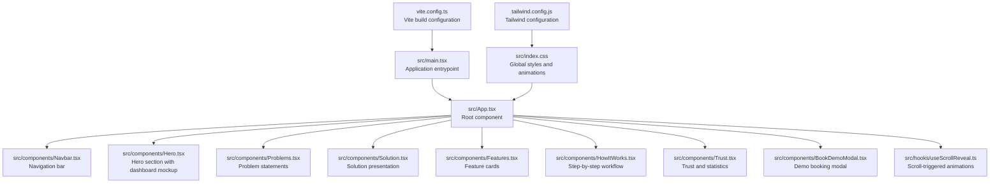
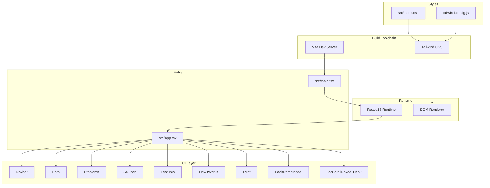
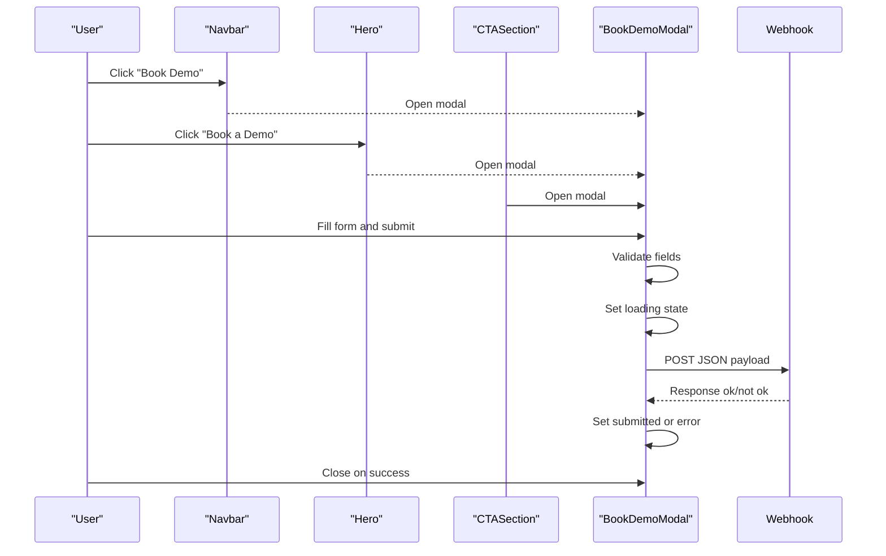
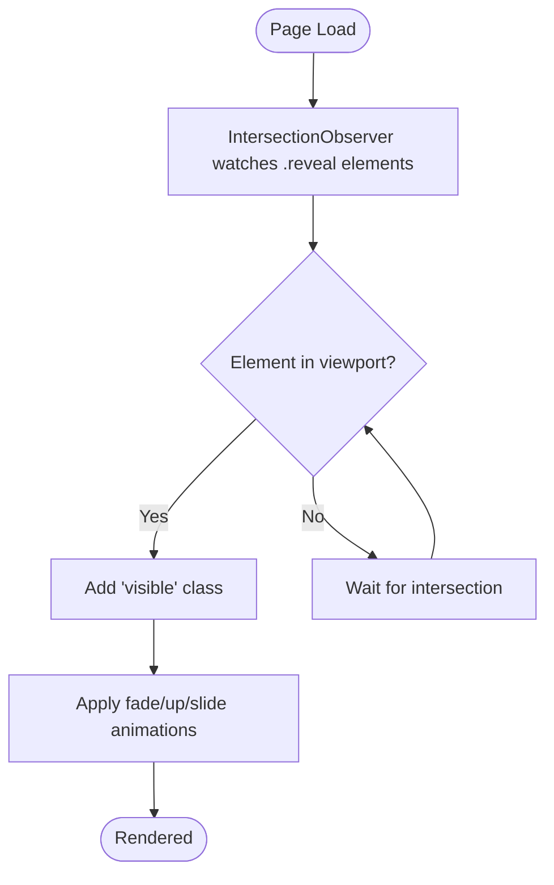
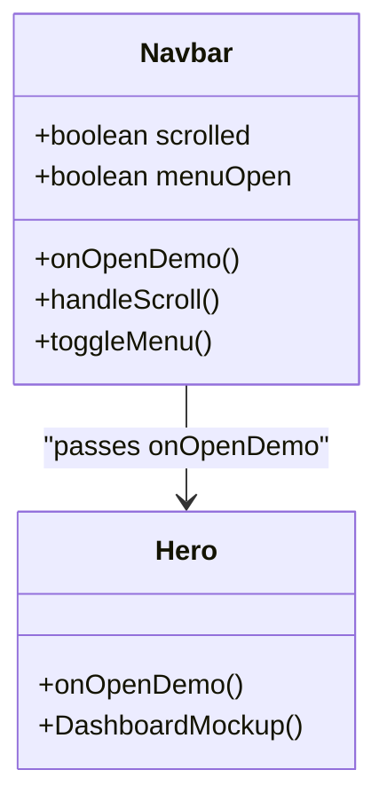
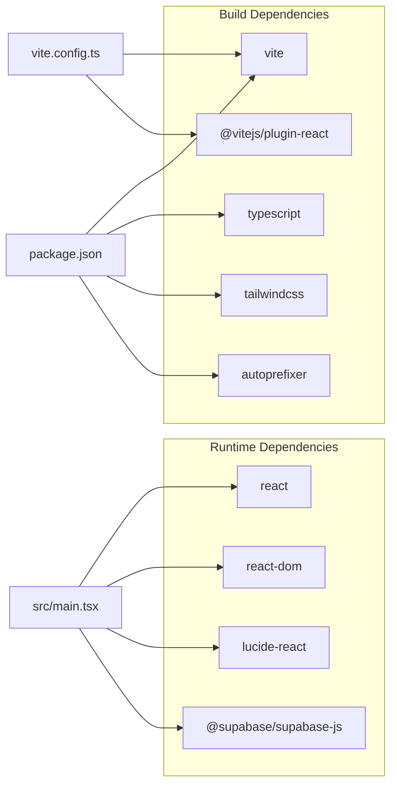

# Project Overview

<cite>
**Referenced Files in This Document**
- [README.md](file://README.md)
- [package.json](file://package.json)
- [vite.config.ts](file://vite.config.ts)
- [tailwind.config.js](file://tailwind.config.js)
- [src/main.tsx](file://src/main.tsx)
- [src/App.tsx](file://src/App.tsx)
- [src/index.css](file://src/index.css)
- [src/hooks/useScrollReveal.ts](file://src/hooks/useScrollReveal.ts)
- [src/components/Navbar.tsx](file://src/components/Navbar.tsx)
- [src/components/Hero.tsx](file://src/components/Hero.tsx)
- [src/components/Problems.tsx](file://src/components/Problems.tsx)
- [src/components/Solution.tsx](file://src/components/Solution.tsx)
- [src/components/Features.tsx](file://src/components/Features.tsx)
- [src/components/HowItWorks.tsx](file://src/components/HowItWorks.tsx)
- [src/components/Trust.tsx](file://src/components/Trust.tsx)
- [src/components/BookDemoModal.tsx](file://src/components/BookDemoModal.tsx)
</cite>

## Table of Contents
1. [Introduction](#introduction)
2. [Project Structure](#project-structure)
3. [Core Components](#core-components)
4. [Architecture Overview](#architecture-overview)
5. [Detailed Component Analysis](#detailed-component-analysis)
6. [Dependency Analysis](#dependency-analysis)
7. [Performance Considerations](#performance-considerations)
8. [Troubleshooting Guide](#troubleshooting-guide)
9. [Conclusion](#conclusion)

## Introduction
Baerp-MW is a professional ERP demonstration landing page designed to showcase a workflow-driven procurement solution. Its primary purpose is to communicate the value of enforcing strict procurement workflows, ensuring transparency, compliance, and efficiency across the end-to-end procurement lifecycle. The site targets procurement leaders, operations managers, and decision-makers who seek a structured, deterministic system that eliminates ambiguity and human error in purchasing processes.

Key value propositions demonstrated by the landing page include:
- Deterministic workflow enforcement with no skipped steps
- Role-based access control and audit-ready trails
- Budget compliance and supplier intelligence grounded in data
- Real-time notifications and comprehensive reporting/export capabilities
- Scalability and reliability for growing organizations

Technology stack highlights:
- React 18 with functional components and hooks
- TypeScript for type safety
- Vite for fast development and optimized builds
- Tailwind CSS for utility-first styling and responsive design
- Lucide React for crisp, consistent icons

The landing page also demonstrates procurement workflow automation capabilities conceptually through animated content transitions, interactive navigation, and a seamless demo booking experience powered by a Google Sheets webhook.

## Project Structure
The project follows a component-based structure typical of modern React applications. The entry point initializes the app and renders a series of purpose-built sections that guide visitors through problem identification, solution presentation, feature showcases, and a call-to-action to book a demo.

**Diagram sources**
- [src/main.tsx:1-11](file://src/main.tsx#L1-L11)
- [src/App.tsx:1-51](file://src/App.tsx#L1-L51)
- [src/index.css:1-125](file://src/index.css#L1-L125)
- [tailwind.config.js:1-9](file://tailwind.config.js#L1-L9)
- [vite.config.ts:1-11](file://vite.config.ts#L1-L11)

**Section sources**
- [src/main.tsx:1-11](file://src/main.tsx#L1-L11)
- [src/App.tsx:1-51](file://src/App.tsx#L1-L51)
- [src/index.css:1-125](file://src/index.css#L1-L125)
- [tailwind.config.js:1-9](file://tailwind.config.js#L1-L9)
- [vite.config.ts:1-11](file://vite.config.ts#L1-L11)

## Core Components
This section outlines the primary building blocks of the landing page and their roles in delivering a cohesive user experience.

- Navbar: Provides fixed-position navigation with responsive behavior, scroll-aware styling, and a “Book Demo” trigger.
- Hero: Presents the core value proposition with animated hero text, trust badges, and a dashboard mockup illustrating workflow progress.
- Problems: Identifies pain points in traditional procurement processes and reinforces the need for a structured system.
- Solution: Explains the deterministic workflow approach, role-based gates, and immutable audit trails.
- Features: Highlights core capabilities such as workflow engine, RBAC, budget enforcement, supplier intelligence, audit logs, notifications, and reporting.
- How It Works: Visualizes the seven-step procurement workflow with role assignments and contextual descriptions.
- Trust: Reinforces reliability, scalability, and security with statistics and testimonials.
- BookDemoModal: Handles demo requests via a form submission to a configured Google Sheets webhook, with loading and success states.

These components collectively demonstrate the ERP’s procurement automation capabilities while maintaining a clean, responsive UI.

**Section sources**
- [src/components/Navbar.tsx:1-106](file://src/components/Navbar.tsx#L1-L106)
- [src/components/Hero.tsx:1-191](file://src/components/Hero.tsx#L1-L191)
- [src/components/Problems.tsx:1-100](file://src/components/Problems.tsx#L1-L100)
- [src/components/Solution.tsx:1-131](file://src/components/Solution.tsx#L1-L131)
- [src/components/Features.tsx:1-146](file://src/components/Features.tsx#L1-L146)
- [src/components/HowItWorks.tsx:1-198](file://src/components/HowItWorks.tsx#L1-L198)
- [src/components/Trust.tsx:1-135](file://src/components/Trust.tsx#L1-L135)
- [src/components/BookDemoModal.tsx:1-208](file://src/components/BookDemoModal.tsx#L1-L208)

## Architecture Overview
The application architecture is a client-side React SPA orchestrated by Vite. Styling is handled via Tailwind CSS, with global animations and transitions defined in a centralized stylesheet. The root component composes reusable UI sections and manages a demo modal state. Scroll-triggered animations are implemented either via a dedicated hook or inline IntersectionObserver logic.

**Diagram sources**
- [src/main.tsx:1-11](file://src/main.tsx#L1-L11)
- [src/App.tsx:1-51](file://src/App.tsx#L1-L51)
- [src/index.css:1-125](file://src/index.css#L1-L125)
- [tailwind.config.js:1-9](file://tailwind.config.js#L1-L9)
- [vite.config.ts:1-11](file://vite.config.ts#L1-L11)

**Section sources**
- [src/main.tsx:1-11](file://src/main.tsx#L1-L11)
- [src/App.tsx:1-51](file://src/App.tsx#L1-L51)
- [src/index.css:1-125](file://src/index.css#L1-L125)
- [tailwind.config.js:1-9](file://tailwind.config.js#L1-L9)
- [vite.config.ts:1-11](file://vite.config.ts#L1-L11)

## Detailed Component Analysis

### Demo Booking Flow
The demo booking experience is implemented as a modal that captures user details and submits them to a configured Google Sheets webhook. The flow includes form validation, loading states, and a success confirmation screen.

Practical examples:
- Triggering the modal from multiple entry points (navigation, hero CTA, footer CTA).
- Using environment variables to configure the webhook endpoint.
- Providing immediate feedback with loading indicators and error messaging.

**Diagram sources**
- [src/components/Navbar.tsx:61-66](file://src/components/Navbar.tsx#L61-L66)
- [src/components/Hero.tsx:60-68](file://src/components/Hero.tsx#L60-L68)
- [src/components/BookDemoModal.tsx:32-63](file://src/components/BookDemoModal.tsx#L32-L63)

**Section sources**
- [src/components/BookDemoModal.tsx:1-208](file://src/components/BookDemoModal.tsx#L1-L208)
- [src/components/Navbar.tsx:1-106](file://src/components/Navbar.tsx#L1-L106)
- [src/components/Hero.tsx:1-191](file://src/components/Hero.tsx#L1-L191)

### Animated Content Transitions
The landing page employs scroll-triggered animations and CSS keyframe-based transitions to enhance perceived performance and engagement. Animations are applied to reveal sections as users scroll into view, and hover effects are used to emphasize interactivity.

Practical examples:
- Using the “reveal” class and delay variants to stagger animations.
- Applying fade-in and fade-in-up animations to headings and cards.
- Leveraging hover transforms and shadows for interactive cards.

**Diagram sources**
- [src/App.tsx:16-32](file://src/App.tsx#L16-L32)
- [src/hooks/useScrollReveal.ts:1-26](file://src/hooks/useScrollReveal.ts#L1-L26)
- [src/index.css:45-78](file://src/index.css#L45-L78)

**Section sources**
- [src/App.tsx:1-51](file://src/App.tsx#L1-L51)
- [src/hooks/useScrollReveal.ts:1-26](file://src/hooks/useScrollReveal.ts#L1-L26)
- [src/index.css:1-125](file://src/index.css#L1-L125)

### Responsive Design and Navigation
The navigation bar adapts to mobile and desktop contexts, toggling a collapsible menu and adjusting styles based on scroll position. The hero section includes a dashboard mockup that visually communicates workflow automation.

Practical examples:
- Fixed navbar with backdrop blur and subtle shadow on scroll.
- Mobile hamburger menu with nested links and a compact demo button.
- Hero dashboard mockup showcasing workflow steps and recent activity.

**Diagram sources**
- [src/components/Navbar.tsx:11-106](file://src/components/Navbar.tsx#L11-L106)
- [src/components/Hero.tsx:9-93](file://src/components/Hero.tsx#L9-L93)

**Section sources**
- [src/components/Navbar.tsx:1-106](file://src/components/Navbar.tsx#L1-L106)
- [src/components/Hero.tsx:1-191](file://src/components/Hero.tsx#L1-L191)

### Conceptual Overview for Stakeholders
- Purpose: Demonstrate how a workflow-driven ERP can eliminate chaos in procurement by enforcing every step from request to storage.
- Target audience: Procurement managers, operations directors, and procurement teams seeking visibility, compliance, and efficiency.
- Key messages: Deterministic workflows, role-based controls, audit readiness, and supplier intelligence.

### Technical Overview for Developers
- Technology stack: React 18, TypeScript, Vite, Tailwind CSS, Lucide React.
- Build and dev: Vite handles fast refresh and optimized bundling; Tailwind scans templates for purging unused styles.
- Styling: Utility-first classes with global animations and hover effects; responsive grids and spacing tokens.
- State management: Minimal local state with React hooks; modal visibility controlled at the root App level.

## Dependency Analysis
The project’s runtime dependencies center around React, DOM rendering, and a lightweight UI library for icons. Build-time dependencies include Vite, Tailwind CSS, and TypeScript tooling. The demo modal integrates with a Google Sheets webhook via environment configuration.

**Diagram sources**
- [package.json:13-34](file://package.json#L13-L34)
- [vite.config.ts:1-11](file://vite.config.ts#L1-L11)
- [src/main.tsx:1-11](file://src/main.tsx#L1-L11)

**Section sources**
- [package.json:1-36](file://package.json#L1-L36)
- [vite.config.ts:1-11](file://vite.config.ts#L1-L11)
- [src/main.tsx:1-11](file://src/main.tsx#L1-L11)

## Performance Considerations
- Bundle optimization: Vite’s pre-bundling and tree-shaking reduce initial payload sizes.
- CSS delivery: Tailwind’s JIT mode and selective purging minimize CSS footprint.
- Rendering: Functional components and minimal re-renders; avoid unnecessary state updates.
- Animations: Use transform and opacity for GPU-accelerated transitions; keep animation durations reasonable.
- Images and assets: Lazy-load non-critical assets; compress and serve modern formats.

## Troubleshooting Guide
Common issues and resolutions:
- Demo submission fails:
  - Verify the environment variable for the Google Sheets webhook is set and accessible.
  - Check network connectivity and server response codes during submission.
  - Confirm the modal displays appropriate error messages and resets loading state.
- Animations not triggering:
  - Ensure elements have the “reveal” class and are within the viewport thresholds.
  - Confirm IntersectionObserver is initialized and not disconnected prematurely.
- Styling inconsistencies:
  - Validate Tailwind content paths match the project structure.
  - Rebuild after adding new Tailwind classes to ensure they are generated.

**Section sources**
- [src/components/BookDemoModal.tsx:32-63](file://src/components/BookDemoModal.tsx#L32-L63)
- [src/App.tsx:16-32](file://src/App.tsx#L16-L32)
- [tailwind.config.js:1-9](file://tailwind.config.js#L1-L9)

## Conclusion
Baerp-MW presents a compelling, code-driven demonstration of a workflow-centric procurement ERP. Through a polished UI, scroll-triggered animations, and a seamless demo booking flow, it communicates the benefits of enforced workflows, role-based controls, and audit readiness. The technology stack—React 18, TypeScript, Vite, and Tailwind CSS—provides a solid foundation for maintainability and scalability, while the component architecture ensures clarity and modularity for both stakeholders and developers.