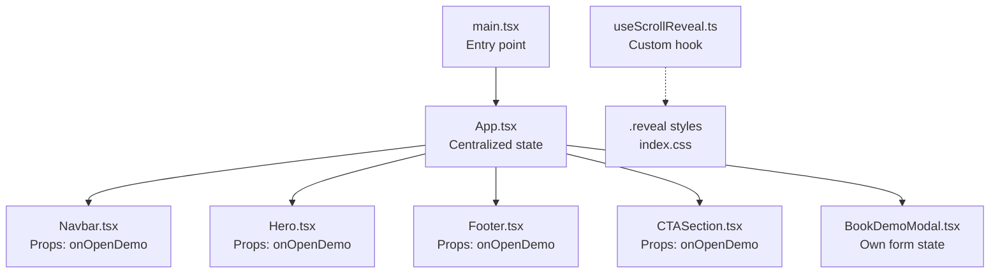
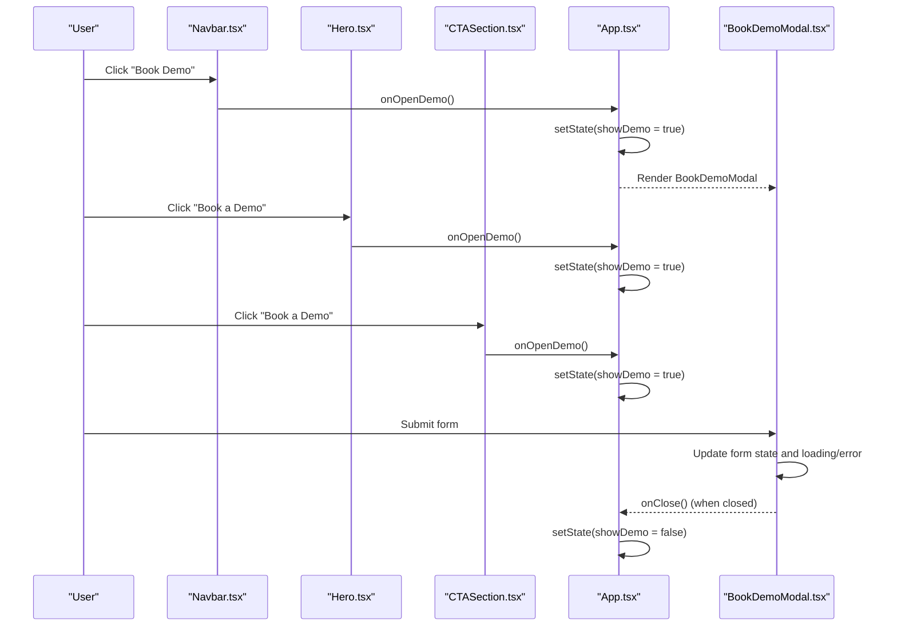
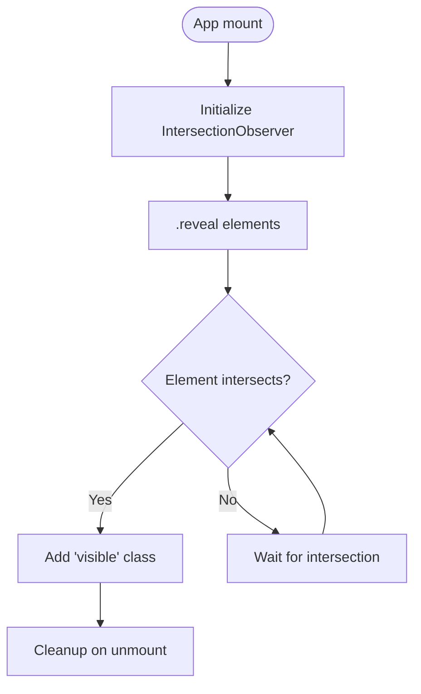
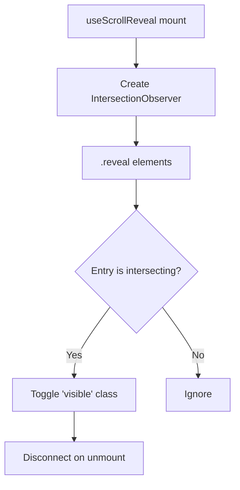
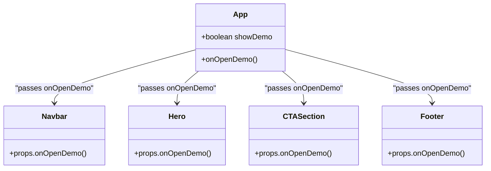
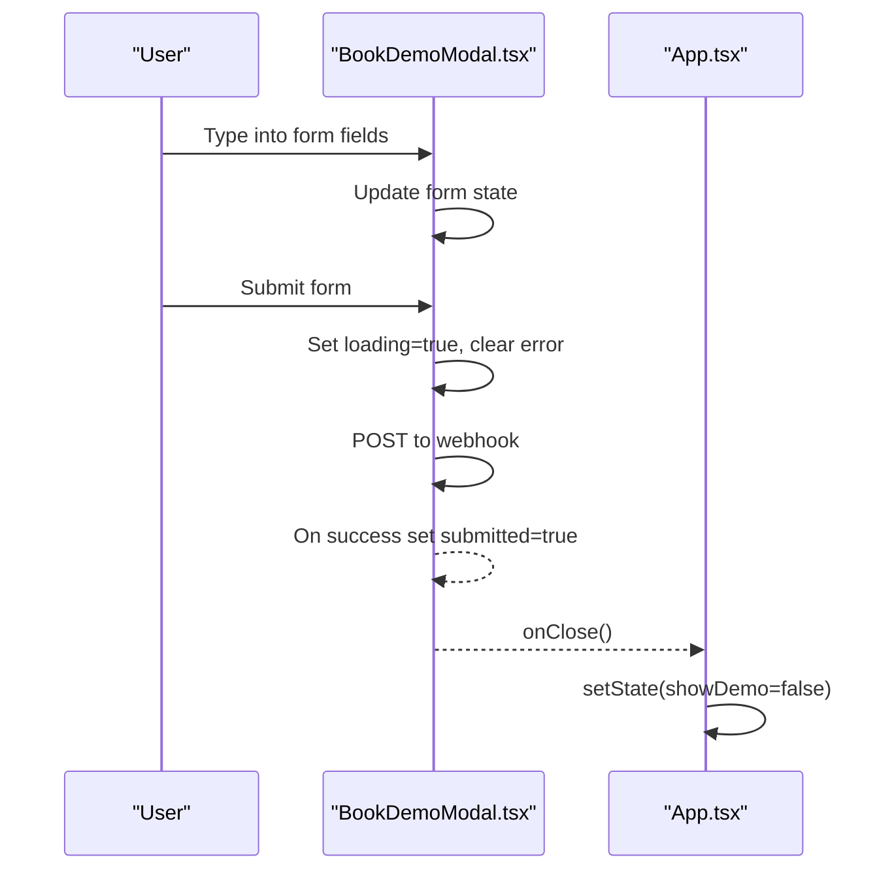
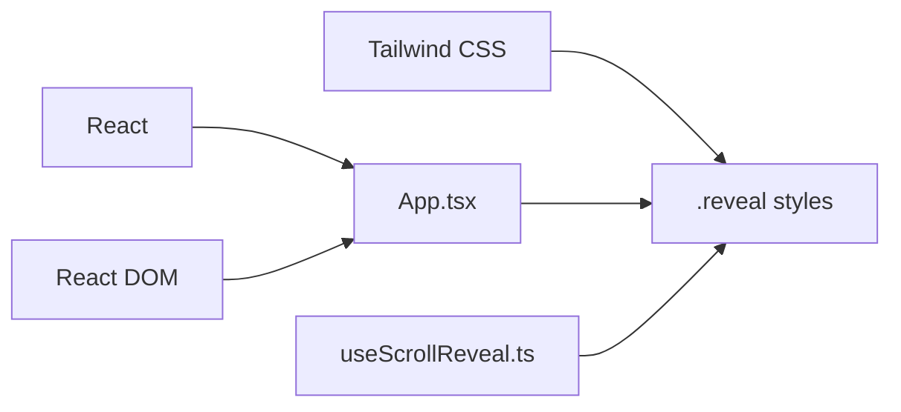

# State Management

<cite>
**Referenced Files in This Document**
- [App.tsx](file://src/App.tsx)
- [useScrollReveal.ts](file://src/hooks/useScrollReveal.ts)
- [BookDemoModal.tsx](file://src/components/BookDemoModal.tsx)
- [Navbar.tsx](file://src/components/Navbar.tsx)
- [Hero.tsx](file://src/components/Hero.tsx)
- [CTASection.tsx](file://src/components/CTASection.tsx)
- [Footer.tsx](file://src/components/Footer.tsx)
- [index.css](file://src/index.css)
- [main.tsx](file://src/main.tsx)
- [package.json](file://package.json)
</cite>

## Table of Contents
1. [Introduction](#introduction)
2. [Project Structure](#project-structure)
3. [Core Components](#core-components)
4. [Architecture Overview](#architecture-overview)
5. [Detailed Component Analysis](#detailed-component-analysis)
6. [Dependency Analysis](#dependency-analysis)
7. [Performance Considerations](#performance-considerations)
8. [Troubleshooting Guide](#troubleshooting-guide)
9. [Conclusion](#conclusion)
10. [Appendices](#appendices)

## Introduction
This document explains the centralized state management approach used in Baerp-MW. The application employs React hooks to manage UI state centrally in the App component and propagates state changes downward through props and callbacks. It also demonstrates scroll-triggered animations via a reusable custom hook and shows how user interactions, form submissions, and scroll events update state and trigger re-renders. Guidance is provided for extending the pattern and optimizing performance.

## Project Structure
The project is a Vite + React + TypeScript application with Tailwind CSS for styling. The entry point renders the App component, which orchestrates global state and passes callbacks to child components. A custom hook encapsulates scroll-based reveal animations.

**Diagram sources**
- [main.tsx:1-11](file://src/main.tsx#L1-L11)
- [App.tsx:13-51](file://src/App.tsx#L13-L51)
- [Navbar.tsx:11-106](file://src/components/Navbar.tsx#L11-L106)
- [Hero.tsx:9-93](file://src/components/Hero.tsx#L9-L93)
- [Footer.tsx:14-48](file://src/components/Footer.tsx#L14-L48)
- [CTASection.tsx:3-100](file://src/components/CTASection.tsx#L3-L100)
- [BookDemoModal.tsx:14-208](file://src/components/BookDemoModal.tsx#L14-L208)
- [useScrollReveal.ts:3-26](file://src/hooks/useScrollReveal.ts#L3-L26)
- [index.css:61-78](file://src/index.css#L61-L78)

**Section sources**
- [main.tsx:1-11](file://src/main.tsx#L1-L11)
- [App.tsx:13-51](file://src/App.tsx#L13-L51)
- [index.css:61-78](file://src/index.css#L61-L78)

## Core Components
- Centralized state in App:
  - Manages a single boolean flag to control the visibility of the demo modal.
  - Provides a callback to open the modal to any child component.
  - Implements a scroll observer to add a visibility class to DOM elements with a specific selector.
- Child components:
  - Navbar, Hero, CTASection, and Footer accept an onOpenDemo callback and trigger it on user actions.
  - BookDemoModal maintains its own internal form state and submission lifecycle.
- Custom hook:
  - useScrollReveal sets up an IntersectionObserver to toggle a visibility class on elements with a specific selector.

Key implementation references:
- Centralized state and effect: [App.tsx:13-32](file://src/App.tsx#L13-L32)
- Props propagation to children: [App.tsx:34-47](file://src/App.tsx#L34-L47)
- Modal state and submission: [BookDemoModal.tsx:14-63](file://src/components/BookDemoModal.tsx#L14-L63)
- Scroll reveal hook: [useScrollReveal.ts:3-26](file://src/hooks/useScrollReveal.ts#L3-L26)

**Section sources**
- [App.tsx:13-51](file://src/App.tsx#L13-L51)
- [BookDemoModal.tsx:14-63](file://src/components/BookDemoModal.tsx#L14-L63)
- [useScrollReveal.ts:3-26](file://src/hooks/useScrollReveal.ts#L3-L26)

## Architecture Overview
The state management pattern is centralized and unidirectional:
- App holds the single source of truth for modal visibility.
- App passes callbacks to child components via props.
- Child components trigger state changes by invoking the provided callbacks.
- useScrollReveal manages animation state independently by toggling a CSS class on intersection.

**Diagram sources**
- [App.tsx:34-47](file://src/App.tsx#L34-L47)
- [Navbar.tsx:61-66](file://src/components/Navbar.tsx#L61-L66)
- [Hero.tsx:61-67](file://src/components/Hero.tsx#L61-L67)
- [CTASection.tsx:32-39](file://src/components/CTASection.tsx#L32-L39)
- [BookDemoModal.tsx:14-63](file://src/components/BookDemoModal.tsx#L14-L63)

## Detailed Component Analysis

### App Component: Centralized State and Effects
- State:
  - A single boolean state controls modal visibility.
- Effects:
  - An IntersectionObserver adds a visibility class to elements with a specific selector when they intersect the viewport.
- Props:
  - Passes an onOpenDemo callback to child components.
- Rendering:
  - Conditionally renders the modal when the state indicates it should be shown.

**Diagram sources**
- [App.tsx:16-32](file://src/App.tsx#L16-L32)
- [index.css:61-70](file://src/index.css#L61-L70)

**Section sources**
- [App.tsx:13-51](file://src/App.tsx#L13-L51)
- [index.css:61-78](file://src/index.css#L61-L78)

### useScrollReveal Hook: Scroll Reveal Animation
- Purpose:
  - Encapsulates IntersectionObserver setup and teardown.
- Behavior:
  - Observes elements with a specific selector and toggles a visibility class when they intersect.
- Return:
  - Exposes a ref for attaching to elements (though the implementation currently observes elements globally).

**Diagram sources**
- [useScrollReveal.ts:6-22](file://src/hooks/useScrollReveal.ts#L6-L22)
- [index.css:61-70](file://src/index.css#L61-L70)

**Section sources**
- [useScrollReveal.ts:3-26](file://src/hooks/useScrollReveal.ts#L3-L26)
- [index.css:61-78](file://src/index.css#L61-L78)

### Child Components: Props and Callbacks
- Navbar:
  - Uses a prop to receive onOpenDemo and triggers it on button clicks.
- Hero:
  - Receives onOpenDemo and invokes it on demo buttons.
- CTASection:
  - Receives onOpenDemo and triggers it on call-to-action buttons.
- Footer:
  - Receives onOpenDemo and displays navigation links.

**Diagram sources**
- [App.tsx:34-47](file://src/App.tsx#L34-L47)
- [Navbar.tsx:11-106](file://src/components/Navbar.tsx#L11-L106)
- [Hero.tsx:9-93](file://src/components/Hero.tsx#L9-L93)
- [CTASection.tsx:3-100](file://src/components/CTASection.tsx#L3-L100)
- [Footer.tsx:14-48](file://src/components/Footer.tsx#L14-L48)

**Section sources**
- [App.tsx:34-47](file://src/App.tsx#L34-L47)
- [Navbar.tsx:11-106](file://src/components/Navbar.tsx#L11-L106)
- [Hero.tsx:9-93](file://src/components/Hero.tsx#L9-L93)
- [CTASection.tsx:3-100](file://src/components/CTASection.tsx#L3-L100)
- [Footer.tsx:14-48](file://src/components/Footer.tsx#L14-L48)

### BookDemoModal: Local Form State and Submission
- Internal state:
  - Tracks form values, submission status, loading state, and error messages.
- Interaction:
  - Updates form state on input changes.
  - Submits form data to an external webhook endpoint and handles success/error states.
- Lifecycle:
  - Uses a close callback to signal parent App to hide the modal.

**Diagram sources**
- [BookDemoModal.tsx:14-63](file://src/components/BookDemoModal.tsx#L14-L63)
- [App.tsx:45](file://src/App.tsx#L45)

**Section sources**
- [BookDemoModal.tsx:14-63](file://src/components/BookDemoModal.tsx#L14-L63)
- [App.tsx:45](file://src/App.tsx#L45)

## Dependency Analysis
- Runtime dependencies:
  - React and React DOM for rendering.
  - Tailwind CSS for styling and animation classes.
- Build-time dependencies:
  - Vite, TypeScript, ESLint, and Tailwind plugin.
- Hook and CSS:
  - useScrollReveal depends on IntersectionObserver and Tailwind’s .reveal/.visible classes.

**Diagram sources**
- [package.json:13-18](file://package.json#L13-L18)
- [index.css:61-70](file://src/index.css#L61-L70)
- [useScrollReveal.ts:3-26](file://src/hooks/useScrollReveal.ts#L3-L26)

**Section sources**
- [package.json:13-36](file://package.json#L13-L36)
- [index.css:61-78](file://src/index.css#L61-L78)

## Performance Considerations
- Minimize re-renders:
  - Keep state minimal and colocated. App centralizes only modal visibility, avoiding unnecessary state churn.
- Event handlers:
  - Prefer passing lightweight callbacks instead of recreating functions inside render. The current implementation passes memoized callbacks via props.
- Effects:
  - Clean up observers and event listeners in useEffect return functions to prevent leaks. Both App and child components demonstrate proper cleanup.
- Scroll animations:
  - IntersectionObserver is efficient for scroll-based animations. Avoid excessive DOM queries by targeting elements with a shared selector.
- CSS transitions:
  - Use CSS classes for animations to leverage GPU acceleration and reduce JavaScript overhead.

[No sources needed since this section provides general guidance]

## Troubleshooting Guide
- Modal does not open:
  - Verify that onOpenDemo is passed to child components and invoked on user actions.
  - Confirm that App state updates and the modal renders conditionally.
- Scroll animations not triggering:
  - Ensure elements have the expected selector and that the CSS class is present.
  - Confirm that the IntersectionObserver is initialized and observing the correct elements.
- Form submission errors:
  - Check network connectivity and endpoint availability.
  - Inspect error handling and ensure the modal displays appropriate feedback.

**Section sources**
- [App.tsx:34-47](file://src/App.tsx#L34-L47)
- [index.css:61-78](file://src/index.css#L61-L78)
- [BookDemoModal.tsx:32-63](file://src/components/BookDemoModal.tsx#L32-L63)

## Conclusion
Baerp-MW uses a clean, centralized state management pattern with React hooks. The App component holds the single source of truth for modal visibility and propagates callbacks to child components. Scroll reveal animations are handled by a dedicated custom hook that toggles CSS classes. This approach keeps state updates predictable, improves maintainability, and enables straightforward extension for new features.

[No sources needed since this section summarizes without analyzing specific files]

## Appendices

### State Update Examples
- User interaction:
  - Clicking “Book Demo” in Navbar, Hero, or CTASection triggers the onOpenDemo callback, updating App state and rendering the modal.
- Form submission:
  - Submitting the demo form in BookDemoModal updates local form state, loading, and error states, then signals completion via onClose.
- Scroll events:
  - IntersectionObserver in App or useScrollReveal toggles a visibility class on elements when they enter the viewport.

**Section sources**
- [App.tsx:34-47](file://src/App.tsx#L34-L47)
- [BookDemoModal.tsx:14-63](file://src/components/BookDemoModal.tsx#L14-L63)
- [useScrollReveal.ts:3-26](file://src/hooks/useScrollReveal.ts#L3-L26)

### Guidelines for Extending State Management
- Add new state in App only when it affects multiple components or requires coordination.
- Pass callbacks via props to keep state near where it is used.
- For component-local state (e.g., forms), keep state within the component to avoid unnecessary re-renders in parents.
- Use custom hooks for cross-cutting concerns like scroll animations or analytics.
- Maintain a single source of truth to prevent inconsistent UI states.

[No sources needed since this section provides general guidance]