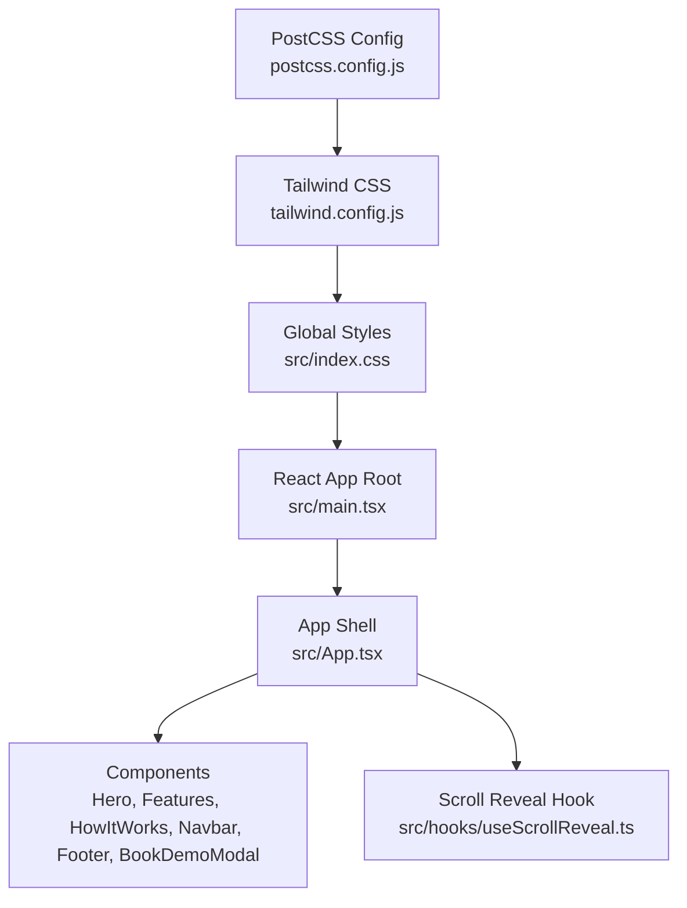
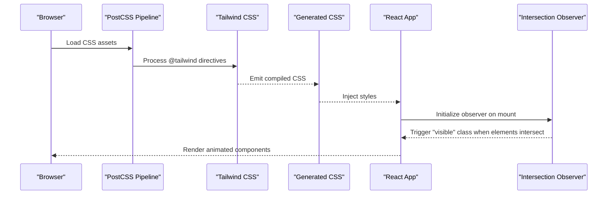
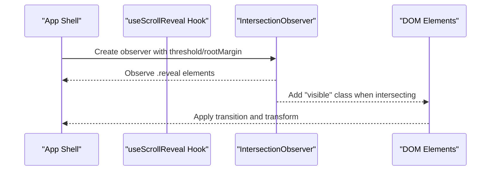
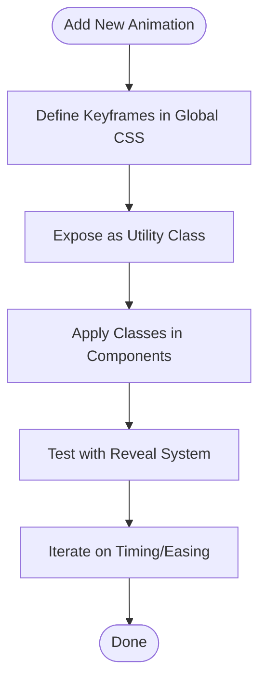
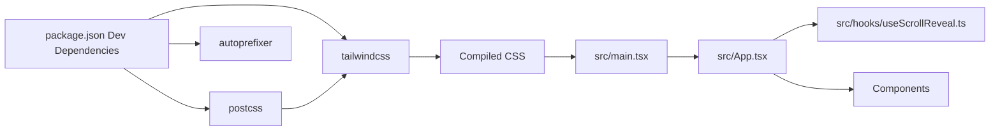

# Styling and Design System

<cite>
**Referenced Files in This Document**
- [tailwind.config.js](file://tailwind.config.js)
- [postcss.config.js](file://postcss.config.js)
- [src/index.css](file://src/index.css)
- [package.json](file://package.json)
- [src/main.tsx](file://src/main.tsx)
- [src/App.tsx](file://src/App.tsx)
- [src/hooks/useScrollReveal.ts](file://src/hooks/useScrollReveal.ts)
- [src/components/Hero.tsx](file://src/components/Hero.tsx)
- [src/components/Features.tsx](file://src/components/Features.tsx)
- [src/components/HowItWorks.tsx](file://src/components/HowItWorks.tsx)
- [src/components/Navbar.tsx](file://src/components/Navbar.tsx)
- [src/components/Footer.tsx](file://src/components/Footer.tsx)
- [src/components/BookDemoModal.tsx](file://src/components/BookDemoModal.tsx)
</cite>

## Table of Contents
1. [Introduction](#introduction)
2. [Project Structure](#project-structure)
3. [Core Components](#core-components)
4. [Architecture Overview](#architecture-overview)
5. [Detailed Component Analysis](#detailed-component-analysis)
6. [Dependency Analysis](#dependency-analysis)
7. [Performance Considerations](#performance-considerations)
8. [Troubleshooting Guide](#troubleshooting-guide)
9. [Conclusion](#conclusion)
10. [Appendices](#appendices)

## Introduction
This document describes the styling and design system of Baerp-MW, focusing on Tailwind CSS configuration, utility class usage patterns, custom animations, responsive design, and component-level styling approaches. It explains how scroll-triggered animations integrate with the Intersection Observer API, how custom CSS animations are defined and applied, and how the color scheme, typography, and spacing conventions are consistently applied across components. It also provides guidelines for maintaining design consistency, extending the animation library, and optimizing CSS performance.

## Project Structure
The styling pipeline is configured via PostCSS and Tailwind CSS, with global CSS and component-level Tailwind utilities. Animation helpers are implemented using Intersection Observer and custom CSS keyframes. The application is structured as a React app with a small set of focused components that demonstrate consistent design patterns.

**Diagram sources**
- [postcss.config.js:1-7](file://postcss.config.js#L1-L7)
- [tailwind.config.js:1-9](file://tailwind.config.js#L1-L9)
- [src/index.css:1-125](file://src/index.css#L1-L125)
- [src/main.tsx:1-11](file://src/main.tsx#L1-L11)
- [src/App.tsx:1-51](file://src/App.tsx#L1-L51)
- [src/hooks/useScrollReveal.ts:1-26](file://src/hooks/useScrollReveal.ts#L1-L26)

**Section sources**
- [postcss.config.js:1-7](file://postcss.config.js#L1-L7)
- [tailwind.config.js:1-9](file://tailwind.config.js#L1-L9)
- [src/index.css:1-125](file://src/index.css#L1-L125)
- [src/main.tsx:1-11](file://src/main.tsx#L1-L11)
- [src/App.tsx:1-51](file://src/App.tsx#L1-L51)

## Core Components
- Tailwind CSS configuration defines content scanning and theme extensions. Currently, the theme extension is empty, indicating that the design system relies primarily on default Tailwind utilities with custom additions in global CSS.
- Global CSS defines typography defaults, smooth scrolling, custom keyframes, reusable animation classes, reveal transitions, gradient text effects, hover card transforms, step connectors, and scrollbar styling.
- PostCSS pipeline enables Tailwind and Autoprefixer, ensuring modern CSS is generated and prefixed appropriately.
- The application integrates scroll-triggered animations via Intersection Observer in both the App shell and a dedicated hook.

Key design tokens and patterns:
- Color palette: slate shades dominate backgrounds and text, with accent colors including blue, cyan, amber, orange, and teal for highlights and gradients.
- Typography: Inter is the primary font family; headings use bold weights and tight line heights; body text emphasizes readability with moderate sizes and spacing.
- Spacing: Consistent padding and margin scales are applied using Tailwind utilities; custom spacing is used sparingly for specific components.
- Animations: Fade-in, slide-in-left, and slow pulse are defined as keyframes and exposed as utility classes. Reveal transitions are controlled via CSS transitions and Intersection Observer.

**Section sources**
- [tailwind.config.js:1-9](file://tailwind.config.js#L1-L9)
- [src/index.css:1-125](file://src/index.css#L1-L125)
- [postcss.config.js:1-7](file://postcss.config.js#L1-L7)
- [src/App.tsx:16-32](file://src/App.tsx#L16-L32)
- [src/hooks/useScrollReveal.ts:1-26](file://src/hooks/useScrollReveal.ts#L1-L26)

## Architecture Overview
The styling architecture combines:
- Build-time processing: PostCSS compiles Tailwind and applies Autoprefixer.
- Runtime behavior: Intersection Observer triggers reveal animations on scroll.
- Component-level styling: Tailwind utilities and global CSS classes compose layouts and interactions.

**Diagram sources**
- [postcss.config.js:1-7](file://postcss.config.js#L1-L7)
- [tailwind.config.js:1-9](file://tailwind.config.js#L1-L9)
- [src/index.css:1-125](file://src/index.css#L1-L125)
- [src/App.tsx:16-32](file://src/App.tsx#L16-L32)
- [src/hooks/useScrollReveal.ts:1-26](file://src/hooks/useScrollReveal.ts#L1-L26)

## Detailed Component Analysis

### Tailwind Configuration and Build Pipeline
- Tailwind content scanning targets HTML and TS/TSX files under src, ensuring purge-safe utility classes are generated.
- Theme extension is currently empty; customizations are centralized in global CSS.
- PostCSS enables Tailwind and Autoprefixer, ensuring cross-browser compatibility and clean CSS output.

Best practices:
- Keep content globs aligned with component locations to prevent purged utilities.
- Extend theme only when necessary; prefer global CSS for brand-specific animations and effects.

**Section sources**
- [tailwind.config.js:1-9](file://tailwind.config.js#L1-L9)
- [postcss.config.js:1-7](file://postcss.config.js#L1-L7)

### Global CSS and Custom Animations
- Typography: A global font stack ensures consistent rendering across platforms.
- Smooth scrolling: Improves navigation experience.
- Keyframes and animation classes: fadeInUp, fadeIn, slideInLeft, pulse-slow provide reusable motion primitives.
- Reveal transitions: A pair of classes define opacity and transform states with transition delays for staggered reveals.
- Visual effects: Gradient text, card hover transforms, step connector gradients, and custom scrollbar styling enhance the UI.

Guidelines for extending:
- Define keyframes in global CSS and expose them as utility classes for reuse.
- Prefer transition-delay classes for staggered animations to maintain performance.
- Keep animation durations and easing consistent across the design system.

**Section sources**
- [src/index.css:1-125](file://src/index.css#L1-L125)

### Scroll-Reveal Integration
Two implementations demonstrate the same pattern:
- App-level observer initializes on mount and adds a “visible” class when elements enter the viewport.
- A dedicated hook encapsulates the observer logic and returns a ref for attaching to elements.

Implementation details:
- Threshold and root margin are tuned to trigger animations as elements come into view.
- Elements with the “reveal” class animate into place; delay classes stagger the entrance timing.

**Diagram sources**
- [src/App.tsx:16-32](file://src/App.tsx#L16-L32)
- [src/hooks/useScrollReveal.ts:1-26](file://src/hooks/useScrollReveal.ts#L1-L26)

**Section sources**
- [src/App.tsx:16-32](file://src/App.tsx#L16-L32)
- [src/hooks/useScrollReveal.ts:1-26](file://src/hooks/useScrollReveal.ts#L1-L26)

### Component-Level Styling Patterns
- Hero: Uses gradient overlays, radial gradients, and animation utilities for hero content. Demonstrates gradient text and staggered fade-ins.
- Features: Grid layout with reveal transitions and hover effects. Tag badges and icon backgrounds use consistent color tokens.
- How It Works: Step indicators with color-coded roles and a gradient connector. Mobile-first responsive layout switches to stacked cards on smaller screens.
- Navbar: Dynamic background and text color based on scroll state; responsive menu toggles.
- Footer: Dark theme with subtle borders and links styled for contrast.
- BookDemoModal: Modal overlay with backdrop blur, dark theme, and form controls using consistent spacing and focus states.

Consistency patterns:
- Color tokens: slate for backgrounds/text, blue/cyan accents, and role-specific colors for steps.
- Typography: Bold headings, readable body sizes, and uppercase tags for metadata.
- Spacing: Consistent padding/margin scales using Tailwind utilities; custom spacing for specific components.
- Motion: Reveal transitions and hover transforms are applied uniformly across interactive elements.

**Section sources**
- [src/components/Hero.tsx:1-191](file://src/components/Hero.tsx#L1-L191)
- [src/components/Features.tsx:1-146](file://src/components/Features.tsx#L1-L146)
- [src/components/HowItWorks.tsx:1-198](file://src/components/HowItWorks.tsx#L1-L198)
- [src/components/Navbar.tsx:1-106](file://src/components/Navbar.tsx#L1-L106)
- [src/components/Footer.tsx:1-48](file://src/components/Footer.tsx#L1-L48)
- [src/components/BookDemoModal.tsx:1-208](file://src/components/BookDemoModal.tsx#L1-L208)

### Responsive Design and Breakpoints
- Mobile-first approach: Base styles target small screens; lg and xl breakpoints refine layouts for larger viewports.
- Grids and spacing: Responsive grids adapt from single column to multi-column layouts at lg and above.
- Navigation: Desktop navigation collapses into a mobile menu with a backdrop panel.
- Content density: Headings and paragraphs scale with screen size; interactive elements adjust padding and font sizes.

Breakpoint usage:
- lg: Used for major layout shifts (e.g., grid columns, hero content alignment).
- md: Used for mobile menu toggle and responsive adjustments.

**Section sources**
- [src/components/Hero.tsx:27-91](file://src/components/Hero.tsx#L27-L91)
- [src/components/Features.tsx:77-145](file://src/components/Features.tsx#L77-L145)
- [src/components/HowItWorks.tsx:91-198](file://src/components/HowItWorks.tsx#L91-L198)
- [src/components/Navbar.tsx:11-106](file://src/components/Navbar.tsx#L11-L106)

### Animation Library and Extension Guidelines
Current animations:
- fadeInUp: Smooth fade-in with upward translation.
- fadeIn: Simple fade-in.
- slideInLeft: Left-to-right entrance.
- pulse-slow: Subtle pulsing effect.

Reveal system:
- CSS classes define initial hidden state and visible state with transitions.
- Delay classes enable staggered entrances.

Extension guidelines:
- Add keyframes in global CSS and expose them as utility classes.
- Use delay classes to create rhythm; avoid excessive delays that reduce perceived performance.
- Keep easing and duration consistent with existing animations.

**Diagram sources**
- [src/index.css:13-59](file://src/index.css#L13-L59)
- [src/index.css:61-78](file://src/index.css#L61-L78)

**Section sources**
- [src/index.css:13-59](file://src/index.css#L13-L59)
- [src/index.css:61-78](file://src/index.css#L61-L78)

## Dependency Analysis
The styling system depends on:
- Tailwind CSS for utility classes and responsive design.
- PostCSS for compilation and autoprefixing.
- React components for runtime integration of animations and dynamic states.

**Diagram sources**
- [package.json:19-34](file://package.json#L19-L34)
- [postcss.config.js:1-7](file://postcss.config.js#L1-L7)
- [tailwind.config.js:1-9](file://tailwind.config.js#L1-L9)
- [src/main.tsx:1-11](file://src/main.tsx#L1-L11)
- [src/App.tsx:1-51](file://src/App.tsx#L1-L51)
- [src/hooks/useScrollReveal.ts:1-26](file://src/hooks/useScrollReveal.ts#L1-L26)

**Section sources**
- [package.json:19-34](file://package.json#L19-L34)
- [postcss.config.js:1-7](file://postcss.config.js#L1-L7)
- [tailwind.config.js:1-9](file://tailwind.config.js#L1-L9)
- [src/main.tsx:1-11](file://src/main.tsx#L1-L11)
- [src/App.tsx:1-51](file://src/App.tsx#L1-L51)
- [src/hooks/useScrollReveal.ts:1-26](file://src/hooks/useScrollReveal.ts#L1-L26)

## Performance Considerations
- Minimize custom keyframes: Prefer Tailwind utilities where possible to reduce CSS bloat.
- Use transition-delay judiciously: Staggered animations improve perceived performance but can increase layout work; keep delays short and consistent.
- Intersection Observer thresholds: Tune thresholds and root margins to balance responsiveness and performance.
- Purge configuration: Ensure content globs include all component files to avoid unnecessary CSS.
- Scrollbar styling: Custom scrollbars are lightweight but ensure they do not introduce layout thrashing.

[No sources needed since this section provides general guidance]

## Troubleshooting Guide
Common issues and resolutions:
- Animations not triggering: Verify elements have the “reveal” class and Intersection Observer is initialized. Check thresholds and root margins.
- Utilities missing after build: Confirm Tailwind content globs include the relevant files and rebuild the project.
- Hover effects not applying: Ensure hover variants are available in the build; Tailwind’s default utilities should suffice.
- Scrollbar visibility: Adjust custom scrollbar styles if they conflict with OS-level preferences.

**Section sources**
- [src/App.tsx:16-32](file://src/App.tsx#L16-L32)
- [tailwind.config.js:3](file://tailwind.config.js#L3)
- [src/index.css:113-125](file://src/index.css#L113-L125)

## Conclusion
Baerp-MW employs a clean, mobile-first design system powered by Tailwind CSS and PostCSS. Custom animations and reveal transitions are implemented with Intersection Observer and carefully crafted keyframes. The color palette, typography, and spacing are consistently applied across components, enabling rapid iteration while maintaining visual coherence. By following the extension guidelines and performance recommendations, teams can safely add new animations and maintain design consistency.

[No sources needed since this section summarizes without analyzing specific files]

## Appendices

### Color Scheme Reference
- Backgrounds: slate-50, white, slate-950
- Text: slate-900, slate-600, slate-500, slate-400, slate-700
- Accents: blue-600, blue-50, blue-700, cyan-600, cyan-500, amber-500, orange-500, teal-600, slate-600
- Gradients: blue-to-cyan for hero and step connectors

**Section sources**
- [src/components/Hero.tsx:12-91](file://src/components/Hero.tsx#L12-L91)
- [src/components/Features.tsx:77-145](file://src/components/Features.tsx#L77-L145)
- [src/components/HowItWorks.tsx:105-136](file://src/components/HowItWorks.tsx#L105-L136)
- [src/components/Navbar.tsx:11-106](file://src/components/Navbar.tsx#L11-L106)
- [src/components/Footer.tsx:14-47](file://src/components/Footer.tsx#L14-L47)
- [src/components/BookDemoModal.tsx:66-205](file://src/components/BookDemoModal.tsx#L66-L205)

### Typography and Spacing Conventions
- Font family: Inter for consistent rendering.
- Headings: Bold weights with tight line heights for emphasis.
- Body text: Moderate sizes with relaxed line heights for readability.
- Spacing: Consistent padding and margin scales; custom spacing for specific components.

**Section sources**
- [src/index.css:5-11](file://src/index.css#L5-L11)
- [src/components/Hero.tsx:35-68](file://src/components/Hero.tsx#L35-L68)
- [src/components/Features.tsx:77-112](file://src/components/Features.tsx#L77-L112)
- [src/components/HowItWorks.tsx:91-162](file://src/components/HowItWorks.tsx#L91-L162)

### Adding New Styles and Maintaining Consistency
- Define new animations in global CSS and expose them as utility classes.
- Use consistent color tokens and spacing scales across components.
- Prefer Tailwind utilities for common patterns; reserve custom CSS for unique effects.
- Keep animation durations and easing aligned with existing motion primitives.

**Section sources**
- [src/index.css:13-59](file://src/index.css#L13-L59)
- [src/index.css:61-78](file://src/index.css#L61-L78)
- [tailwind.config.js:4-6](file://tailwind.config.js#L4-L6)